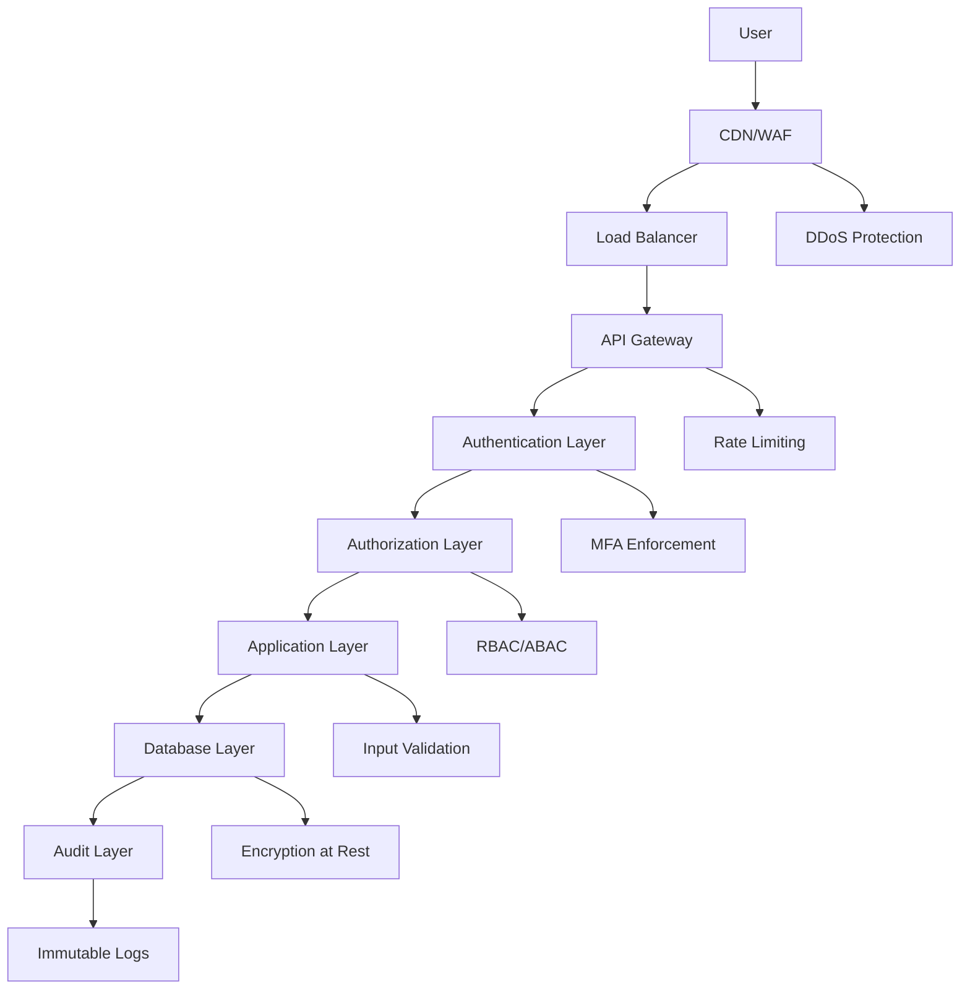

# Security & Authentication Framework

## Overview

Comprehensive security and authentication framework for the political donation platform, designed to protect sensitive financial data, ensure regulatory compliance, and maintain user privacy while providing a seamless user experience.

## Security Architecture

### Defense in Depth Strategy



### Security Layers

1. **Network Security**
   - VPC with private subnets
   - Web Application Firewall (Cloud Armor)
   - DDoS protection
   - SSL/TLS termination

2. **Application Security**
   - Authentication & Authorization
   - Input validation & sanitization
   - CORS configuration
   - Rate limiting

3. **Data Security**
   - Encryption at rest and in transit
   - Field-level encryption for sensitive data
   - Key rotation and management
   - Secure backup procedures

4. **Compliance Security**
   - Audit logging
   - Access controls
   - Data retention policies
   - Privacy controls (GDPR, CCPA)

## Authentication Framework

### Multi-Factor Authentication System

```typescript
// lib/auth/mfa.ts
import { authenticator } from 'otplib';
import QRCode from 'qrcode';

interface MFAConfig {
  serviceName: string;
  issuer: string;
  secretLength: number;
}

class MFAService {
  private config: MFAConfig;

  constructor(config: MFAConfig) {
    this.config = config;
  }

  async generateSecret(userEmail: string): Promise<MFASetup> {
    const secret = authenticator.generateSecret();
    const label = `${this.config.serviceName}:${userEmail}`;
    const otpauth = authenticator.keyuri(
      userEmail,
      this.config.issuer,
      secret
    );

    const qrCode = await QRCode.toDataURL(otpauth);

    return {
      secret,
      qrCode,
      manualEntryKey: this.formatSecretForDisplay(secret),
      backupCodes: await this.generateBackupCodes()
    };
  }

  verifyToken(token: string, secret: string): boolean {
    return authenticator.verify({ token, secret });
  }

  private async generateBackupCodes(): Promise<string[]> {
    const codes: string[] = [];
    for (let i = 0; i < 8; i++) {
      const code = crypto.randomBytes(4).toString('hex').toUpperCase();
      codes.push(`${code.slice(0, 4)}-${code.slice(4)}`);
    }
    return codes;
  }

  private formatSecretForDisplay(secret: string): string {
    return secret.match(/.{4}/g)?.join(' ') || secret;
  }
}

interface MFASetup {
  secret: string;
  qrCode: string;
  manualEntryKey: string;
  backupCodes: string[];
}
```

### JWT Token Management

```typescript
// lib/auth/jwt.ts
import { SignJWT, jwtVerify, JWTPayload } from 'jose';
import { cookies } from 'next/headers';

interface UserPayload {
  userId: string;
  email: string;
  role: string;
  kycStatus: string;
  organizations: string[];
  permissions: string[];
}

interface TokenPair {
  accessToken: string;
  refreshToken: string;
  expiresIn: number;
}

class JWTService {
  private accessTokenSecret: Uint8Array;
  private refreshTokenSecret: Uint8Array;
  private accessTokenExpiry = '15m';
  private refreshTokenExpiry = '7d';

  constructor() {
    this.accessTokenSecret = new TextEncoder().encode(
      process.env.JWT_ACCESS_SECRET || 'fallback-secret'
    );
    this.refreshTokenSecret = new TextEncoder().encode(
      process.env.JWT_REFRESH_SECRET || 'fallback-refresh-secret'
    );
  }

  async generateTokenPair(payload: UserPayload): Promise<TokenPair> {
    const accessToken = await new SignJWT({ ...payload, type: 'access' })
      .setProtectedHeader({ alg: 'HS256' })
      .setIssuedAt()
      .setExpirationTime(this.accessTokenExpiry)
      .setIssuer('donation-platform')
      .setAudience('donation-platform-api')
      .sign(this.accessTokenSecret);

    const refreshToken = await new SignJWT({
      userId: payload.userId,
      type: 'refresh',
      version: 1
    })
      .setProtectedHeader({ alg: 'HS256' })
      .setIssuedAt()
      .setExpirationTime(this.refreshTokenExpiry)
      .setIssuer('donation-platform')
      .setAudience('donation-platform-api')
      .sign(this.refreshTokenSecret);

    return {
      accessToken,
      refreshToken,
      expiresIn: 15 * 60 // 15 minutes in seconds
    };
  }

  async verifyAccessToken(token: string): Promise<UserPayload | null> {
    try {
      const { payload } = await jwtVerify(token, this.accessTokenSecret, {
        issuer: 'donation-platform',
        audience: 'donation-platform-api'
      });

      if (payload.type !== 'access') {
        throw new Error('Invalid token type');
      }

      return payload as UserPayload;
    } catch (error) {
      console.error('Token verification failed:', error);
      return null;
    }
  }

  async verifyRefreshToken(token: string): Promise<{ userId: string } | null> {
    try {
      const { payload } = await jwtVerify(token, this.refreshTokenSecret, {
        issuer: 'donation-platform',
        audience: 'donation-platform-api'
      });

      if (payload.type !== 'refresh') {
        throw new Error('Invalid token type');
      }

      return { userId: payload.userId as string };
    } catch (error) {
      console.error('Refresh token verification failed:', error);
      return null;
    }
  }

  setTokenCookies(tokenPair: TokenPair): void {
    const cookieOptions = {
      httpOnly: true,
      secure: process.env.NODE_ENV === 'production',
      sameSite: 'strict' as const,
      path: '/'
    };

    cookies().set('access_token', tokenPair.accessToken, {
      ...cookieOptions,
      maxAge: 15 * 60 // 15 minutes
    });

    cookies().set('refresh_token', tokenPair.refreshToken, {
      ...cookieOptions,
      maxAge: 7 * 24 * 60 * 60 // 7 days
    });
  }

  clearTokenCookies(): void {
    cookies().delete('access_token');
    cookies().delete('refresh_token');
  }
}

export const jwtService = new JWTService();
```

### Password Security

```typescript
// lib/auth/password.ts
import { scrypt, randomBytes } from 'crypto';
import { promisify } from 'util';
import { z } from 'zod';

const scryptAsync = promisify(scrypt);

// Strong password requirements
export const passwordSchema = z.string()
  .min(8, 'Password must be at least 8 characters long')
  .max(128, 'Password must not exceed 128 characters')
  .regex(/[a-z]/, 'Password must contain at least one lowercase letter')
  .regex(/[A-Z]/, 'Password must contain at least one uppercase letter')
  .regex(/\d/, 'Password must contain at least one number')
  .regex(/[@$!%*?&]/, 'Password must contain at least one special character')
  .refine((password) => !isCommonPassword(password), 'Password is too common');

interface PasswordHash {
  hash: string;
  salt: string;
}

class PasswordService {
  private readonly keyLength = 64;

  async hashPassword(password: string): Promise<PasswordHash> {
    // Validate password strength
    passwordSchema.parse(password);

    const salt = randomBytes(32).toString('hex');
    const hash = await scryptAsync(password, salt, this.keyLength) as Buffer;

    return {
      hash: hash.toString('hex'),
      salt
    };
  }

  async verifyPassword(
    password: string,
    hashedPassword: string,
    salt: string
  ): Promise<boolean> {
    try {
      const hash = await scryptAsync(password, salt, this.keyLength) as Buffer;
      const hashHex = hash.toString('hex');

      // Use crypto.timingSafeEqual to prevent timing attacks
      return crypto.timingSafeEqual(
        Buffer.from(hashHex, 'hex'),
        Buffer.from(hashedPassword, 'hex')
      );
    } catch (error) {
      console.error('Password verification failed:', error);
      return false;
    }
  }

  generateSecureToken(length: number = 32): string {
    return randomBytes(length).toString('hex');
  }

  checkPasswordStrength(password: string): PasswordStrength {
    const result = passwordSchema.safeParse(password);

    if (result.success) {
      return {
        isStrong: true,
        score: this.calculatePasswordScore(password),
        suggestions: []
      };
    }

    return {
      isStrong: false,
      score: this.calculatePasswordScore(password),
      suggestions: result.error.errors.map(err => err.message)
    };
  }

  private calculatePasswordScore(password: string): number {
    let score = 0;

    // Length bonus
    score += Math.min(password.length * 2, 20);

    // Character variety
    if (/[a-z]/.test(password)) score += 10;
    if (/[A-Z]/.test(password)) score += 10;
    if (/\d/.test(password)) score += 10;
    if (/[@$!%*?&]/.test(password)) score += 10;

    // Bonus for additional special characters
    const specialChars = password.match(/[^a-zA-Z\d]/g);
    if (specialChars && specialChars.length > 1) {
      score += Math.min((specialChars.length - 1) * 5, 20);
    }

    // Penalty for common patterns
    if (/(.)\1{2,}/.test(password)) score -= 10; // Repeated characters
    if (/123|abc|qwerty/i.test(password)) score -= 20; // Common sequences

    return Math.max(0, Math.min(100, score));
  }
}

interface PasswordStrength {
  isStrong: boolean;
  score: number;
  suggestions: string[];
}

// Common password check (simplified - in production use a comprehensive list)
function isCommonPassword(password: string): boolean {
  const commonPasswords = [
    'password', '123456', 'password123', 'admin', 'letmein',
    'welcome', 'monkey', '1234567890', 'qwerty', 'abc123'
  ];

  return commonPasswords.includes(password.toLowerCase());
}

export const passwordService = new PasswordService();
```

## Authorization Framework

### Role-Based Access Control (RBAC)

```typescript
// lib/auth/rbac.ts
interface Permission {
  resource: string;
  action: string;
  conditions?: Record<string, any>;
}

interface Role {
  name: string;
  permissions: Permission[];
  inherits?: string[];
}

interface User {
  id: string;
  roles: string[];
  organizations: string[];
  customPermissions?: Permission[];
}

class RBACService {
  private roles: Map<string, Role> = new Map();

  constructor() {
    this.initializeDefaultRoles();
  }

  private initializeDefaultRoles(): void {
    // Super Admin - full system access
    this.addRole({
      name: 'super_admin',
      permissions: [
        { resource: '*', action: '*' }
      ]
    });

    // Organization Admin - manage their organization
    this.addRole({
      name: 'org_admin',
      permissions: [
        { resource: 'organization', action: 'read', conditions: { own: true } },
        { resource: 'organization', action: 'update', conditions: { own: true } },
        { resource: 'fundraiser', action: '*', conditions: { own_org: true } },
        { resource: 'donation', action: 'read', conditions: { own_org: true } },
        { resource: 'report', action: '*', conditions: { own_org: true } },
        { resource: 'user', action: 'invite', conditions: { to_own_org: true } }
      ]
    });

    // Org Staff - limited organization access
    this.addRole({
      name: 'org_staff',
      permissions: [
        { resource: 'organization', action: 'read', conditions: { own: true } },
        { resource: 'fundraiser', action: 'read', conditions: { own_org: true } },
        { resource: 'fundraiser', action: 'update', conditions: { own_org: true } },
        { resource: 'donation', action: 'read', conditions: { own_org: true } }
      ]
    });

    // Donor - basic user permissions
    this.addRole({
      name: 'donor',
      permissions: [
        { resource: 'user', action: 'read', conditions: { own: true } },
        { resource: 'user', action: 'update', conditions: { own: true } },
        { resource: 'donation', action: 'create' },
        { resource: 'donation', action: 'read', conditions: { own: true } },
        { resource: 'fundraiser', action: 'read' },
        { resource: 'organization', action: 'read' }
      ]
    });
  }

  addRole(role: Role): void {
    this.roles.set(role.name, role);
  }

  async hasPermission(
    user: User,
    resource: string,
    action: string,
    context?: Record<string, any>
  ): Promise<boolean> {
    // Check custom permissions first
    if (user.customPermissions) {
      const hasCustomPermission = this.checkPermissions(
        user.customPermissions,
        resource,
        action,
        context,
        user
      );
      if (hasCustomPermission) return true;
    }

    // Check role-based permissions
    for (const roleName of user.roles) {
      const role = this.roles.get(roleName);
      if (!role) continue;

      const allPermissions = await this.expandRolePermissions(role);
      const hasPermission = this.checkPermissions(
        allPermissions,
        resource,
        action,
        context,
        user
      );

      if (hasPermission) return true;
    }

    return false;
  }

  private async expandRolePermissions(role: Role): Promise<Permission[]> {
    let permissions = [...role.permissions];

    // Handle role inheritance
    if (role.inherits) {
      for (const inheritedRoleName of role.inherits) {
        const inheritedRole = this.roles.get(inheritedRoleName);
        if (inheritedRole) {
          const inheritedPermissions = await this.expandRolePermissions(inheritedRole);
          permissions = [...permissions, ...inheritedPermissions];
        }
      }
    }

    return permissions;
  }

  private checkPermissions(
    permissions: Permission[],
    resource: string,
    action: string,
    context?: Record<string, any>,
    user?: User
  ): boolean {
    return permissions.some(permission => {
      // Check resource match
      if (permission.resource !== '*' && permission.resource !== resource) {
        return false;
      }

      // Check action match
      if (permission.action !== '*' && permission.action !== action) {
        return false;
      }

      // Check conditions
      if (permission.conditions && context && user) {
        return this.evaluateConditions(permission.conditions, context, user);
      }

      return true;
    });
  }

  private evaluateConditions(
    conditions: Record<string, any>,
    context: Record<string, any>,
    user: User
  ): boolean {
    for (const [key, value] of Object.entries(conditions)) {
      switch (key) {
        case 'own':
          if (value && context.userId !== user.id) return false;
          break;

        case 'own_org':
          if (value && !user.organizations.includes(context.organizationId)) {
            return false;
          }
          break;

        case 'to_own_org':
          if (value && !user.organizations.includes(context.targetOrganizationId)) {
            return false;
          }
          break;

        default:
          if (context[key] !== value) return false;
      }
    }

    return true;
  }
}

export const rbacService = new RBACService();
```

### Authorization Middleware

```typescript
// lib/auth/middleware.ts
import { NextRequest, NextResponse } from 'next/server';
import { jwtService } from './jwt';
import { rbacService } from './rbac';

interface AuthOptions {
  requiredRole?: string;
  requiredPermission?: {
    resource: string;
    action: string;
  };
  allowAnonymous?: boolean;
}

export function withAuth(
  handler: (req: NextRequest, user?: UserPayload) => Promise<NextResponse>,
  options: AuthOptions = {}
) {
  return async (req: NextRequest): Promise<NextResponse> => {
    try {
      // Extract token from Authorization header or cookies
      const token = extractToken(req);

      if (!token && !options.allowAnonymous) {
        return NextResponse.json(
          { error: 'Authentication required' },
          { status: 401 }
        );
      }

      let user: UserPayload | null = null;

      if (token) {
        user = await jwtService.verifyAccessToken(token);

        if (!user) {
          return NextResponse.json(
            { error: 'Invalid or expired token' },
            { status: 401 }
          );
        }

        // Check role requirements
        if (options.requiredRole && !user.role.includes(options.requiredRole)) {
          return NextResponse.json(
            { error: 'Insufficient permissions' },
            { status: 403 }
          );
        }

        // Check specific permissions
        if (options.requiredPermission) {
          const hasPermission = await rbacService.hasPermission(
            {
              id: user.userId,
              roles: [user.role],
              organizations: user.organizations
            },
            options.requiredPermission.resource,
            options.requiredPermission.action,
            extractContextFromRequest(req)
          );

          if (!hasPermission) {
            return NextResponse.json(
              { error: 'Insufficient permissions' },
              { status: 403 }
            );
          }
        }
      }

      return await handler(req, user || undefined);
    } catch (error) {
      console.error('Auth middleware error:', error);
      return NextResponse.json(
        { error: 'Internal server error' },
        { status: 500 }
      );
    }
  };
}

function extractToken(req: NextRequest): string | null {
  // Check Authorization header
  const authHeader = req.headers.get('authorization');
  if (authHeader && authHeader.startsWith('Bearer ')) {
    return authHeader.substring(7);
  }

  // Check cookies
  return req.cookies.get('access_token')?.value || null;
}

function extractContextFromRequest(req: NextRequest): Record<string, any> {
  const url = new URL(req.url);
  const pathSegments = url.pathname.split('/').filter(Boolean);

  const context: Record<string, any> = {};

  // Extract common parameters from URL
  if (pathSegments.includes('organizations') && pathSegments.length > 2) {
    const orgIndex = pathSegments.indexOf('organizations');
    context.organizationId = pathSegments[orgIndex + 1];
  }

  if (pathSegments.includes('users') && pathSegments.length > 2) {
    const userIndex = pathSegments.indexOf('users');
    context.userId = pathSegments[userIndex + 1];
  }

  if (pathSegments.includes('donations') && pathSegments.length > 2) {
    const donationIndex = pathSegments.indexOf('donations');
    context.donationId = pathSegments[donationIndex + 1];
  }

  return context;
}
```

## Data Encryption

### Field-Level Encryption

```typescript
// lib/security/encryption.ts
import { createCipher, createDecipher, randomBytes } from 'crypto';
import { KMSKeyRing } from '@google-cloud/kms';

interface EncryptionConfig {
  algorithm: string;
  keyRingId: string;
  keyId: string;
  locationId: string;
  projectId: string;
}

class EncryptionService {
  private kms: KMSKeyRing;
  private config: EncryptionConfig;

  constructor(config: EncryptionConfig) {
    this.config = config;
    this.kms = new KMSKeyRing({
      projectId: config.projectId,
      keyRingId: config.keyRingId,
      locationId: config.locationId
    });
  }

  async encryptSensitiveField(plaintext: string): Promise<string> {
    try {
      const key = await this.getDataEncryptionKey();
      const iv = randomBytes(16);
      const cipher = createCipher('aes-256-gcm', key);

      cipher.update(plaintext, 'utf8');
      const encrypted = cipher.final();
      const tag = cipher.getAuthTag();

      // Combine IV, encrypted data, and auth tag
      const combined = Buffer.concat([iv, encrypted, tag]);
      return combined.toString('base64');
    } catch (error) {
      console.error('Encryption failed:', error);
      throw new Error('Failed to encrypt sensitive data');
    }
  }

  async decryptSensitiveField(encryptedData: string): Promise<string> {
    try {
      const key = await this.getDataEncryptionKey();
      const combined = Buffer.from(encryptedData, 'base64');

      const iv = combined.slice(0, 16);
      const encrypted = combined.slice(16, -16);
      const tag = combined.slice(-16);

      const decipher = createDecipher('aes-256-gcm', key);
      decipher.setAuthTag(tag);

      const decrypted = Buffer.concat([
        decipher.update(encrypted),
        decipher.final()
      ]);

      return decrypted.toString('utf8');
    } catch (error) {
      console.error('Decryption failed:', error);
      throw new Error('Failed to decrypt sensitive data');
    }
  }

  private async getDataEncryptionKey(): Promise<Buffer> {
    const keyName = this.kms.cryptoKey(this.config.keyId).name;

    // In production, implement proper key caching and rotation
    const [result] = await this.kms.cryptoKey(this.config.keyId).encrypt({
      plaintext: Buffer.from('data-encryption-key-material')
    });

    return Buffer.from(result.ciphertext as string, 'base64');
  }

  async rotateDataEncryptionKey(): Promise<void> {
    // Implement key rotation logic
    console.log('Rotating data encryption keys...');
    // 1. Generate new key version
    // 2. Re-encrypt data with new key
    // 3. Update key references
    // 4. Securely delete old keys after transition period
  }
}

// Database model with automatic encryption/decryption
class EncryptedModel {
  private encryption: EncryptionService;
  private sensitiveFields: string[];

  constructor(encryption: EncryptionService, sensitiveFields: string[]) {
    this.encryption = encryption;
    this.sensitiveFields = sensitiveFields;
  }

  async save(data: Record<string, any>): Promise<Record<string, any>> {
    const processedData = { ...data };

    // Encrypt sensitive fields
    for (const field of this.sensitiveFields) {
      if (processedData[field]) {
        processedData[field] = await this.encryption.encryptSensitiveField(
          processedData[field]
        );
      }
    }

    return processedData;
  }

  async load(data: Record<string, any>): Promise<Record<string, any>> {
    const processedData = { ...data };

    // Decrypt sensitive fields
    for (const field of this.sensitiveFields) {
      if (processedData[field]) {
        try {
          processedData[field] = await this.encryption.decryptSensitiveField(
            processedData[field]
          );
        } catch (error) {
          console.error(`Failed to decrypt field ${field}:`, error);
          // Handle decryption failure gracefully
          processedData[field] = '[ENCRYPTED]';
        }
      }
    }

    return processedData;
  }
}
```

## Security Headers & CORS

```typescript
// lib/security/headers.ts
import { NextResponse } from 'next/server';

export function setSecurityHeaders(response: NextResponse): NextResponse {
  // Content Security Policy
  response.headers.set(
    'Content-Security-Policy',
    [
      "default-src 'self'",
      "script-src 'self' 'unsafe-inline' https://js.fluidpay.com",
      "style-src 'self' 'unsafe-inline' https://fonts.googleapis.com",
      "font-src 'self' https://fonts.gstatic.com",
      "img-src 'self' data: https://storage.googleapis.com",
      "connect-src 'self' https://api.fluidpay.com https://sandbox-api.fluidpay.com",
      "frame-src 'none'",
      "base-uri 'self'",
      "form-action 'self'",
      "upgrade-insecure-requests"
    ].join('; ')
  );

  // Additional security headers
  response.headers.set('X-DNS-Prefetch-Control', 'off');
  response.headers.set('X-Frame-Options', 'DENY');
  response.headers.set('X-Content-Type-Options', 'nosniff');
  response.headers.set('Referrer-Policy', 'strict-origin-when-cross-origin');
  response.headers.set('X-Permitted-Cross-Domain-Policies', 'none');

  // HSTS (only in production with HTTPS)
  if (process.env.NODE_ENV === 'production') {
    response.headers.set(
      'Strict-Transport-Security',
      'max-age=31536000; includeSubDomains; preload'
    );
  }

  return response;
}

export function setCORSHeaders(
  response: NextResponse,
  allowedOrigins: string[] = []
): NextResponse {
  const origin = response.headers.get('origin');

  if (origin && allowedOrigins.includes(origin)) {
    response.headers.set('Access-Control-Allow-Origin', origin);
  }

  response.headers.set(
    'Access-Control-Allow-Methods',
    'GET, POST, PUT, DELETE, OPTIONS'
  );

  response.headers.set(
    'Access-Control-Allow-Headers',
    'Content-Type, Authorization, X-Requested-With'
  );

  response.headers.set('Access-Control-Max-Age', '86400');

  return response;
}
```

## Rate Limiting

```typescript
// lib/security/rate-limit.ts
interface RateLimitConfig {
  windowMs: number;
  maxRequests: number;
  skipSuccessfulRequests?: boolean;
  skipFailedRequests?: boolean;
}

interface RateLimitStore {
  get(key: string): Promise<number>;
  set(key: string, value: number, ttl: number): Promise<void>;
  increment(key: string): Promise<number>;
}

class RedisRateLimitStore implements RateLimitStore {
  private redis: any; // Redis client

  constructor(redis: any) {
    this.redis = redis;
  }

  async get(key: string): Promise<number> {
    const value = await this.redis.get(key);
    return parseInt(value) || 0;
  }

  async set(key: string, value: number, ttl: number): Promise<void> {
    await this.redis.setex(key, ttl, value);
  }

  async increment(key: string): Promise<number> {
    return await this.redis.incr(key);
  }
}

class RateLimiter {
  private store: RateLimitStore;
  private config: RateLimitConfig;

  constructor(store: RateLimitStore, config: RateLimitConfig) {
    this.store = store;
    this.config = config;
  }

  async isAllowed(identifier: string): Promise<{
    allowed: boolean;
    remaining: number;
    resetTime: number;
  }> {
    const key = `rate_limit:${identifier}`;
    const now = Date.now();
    const windowStart = Math.floor(now / this.config.windowMs) * this.config.windowMs;
    const windowKey = `${key}:${windowStart}`;

    const current = await this.store.get(windowKey);

    if (current >= this.config.maxRequests) {
      return {
        allowed: false,
        remaining: 0,
        resetTime: windowStart + this.config.windowMs
      };
    }

    await this.store.increment(windowKey);

    // Set expiration on first increment
    if (current === 0) {
      await this.store.set(
        windowKey,
        1,
        Math.ceil(this.config.windowMs / 1000)
      );
    }

    return {
      allowed: true,
      remaining: this.config.maxRequests - current - 1,
      resetTime: windowStart + this.config.windowMs
    };
  }
}

// Different rate limits for different user types
export const rateLimiters = {
  anonymous: new RateLimiter(store, {
    windowMs: 60 * 60 * 1000, // 1 hour
    maxRequests: 100
  }),

  authenticated: new RateLimiter(store, {
    windowMs: 60 * 60 * 1000, // 1 hour
    maxRequests: 1000
  }),

  admin: new RateLimiter(store, {
    windowMs: 60 * 60 * 1000, // 1 hour
    maxRequests: 5000
  }),

  // Stricter limits for sensitive operations
  login: new RateLimiter(store, {
    windowMs: 15 * 60 * 1000, // 15 minutes
    maxRequests: 5
  }),

  donation: new RateLimiter(store, {
    windowMs: 60 * 60 * 1000, // 1 hour
    maxRequests: 10
  })
};
```

## Security Monitoring

```typescript
// lib/security/monitoring.ts
interface SecurityEvent {
  type: 'login_failure' | 'suspicious_activity' | 'rate_limit_exceeded' | 'unauthorized_access';
  userId?: string;
  ip: string;
  userAgent: string;
  timestamp: Date;
  details: Record<string, any>;
}

class SecurityMonitor {
  private alertThresholds = {
    failedLogins: 5,
    suspiciousIPs: 10,
    rateLimit: 3
  };

  async logSecurityEvent(event: SecurityEvent): Promise<void> {
    // Log to security audit log
    console.log('Security Event:', {
      ...event,
      timestamp: event.timestamp.toISOString()
    });

    // Check for alert conditions
    await this.checkAlertConditions(event);

    // Store in database for analysis
    await this.storeSecurityEvent(event);
  }

  private async checkAlertConditions(event: SecurityEvent): Promise<void> {
    switch (event.type) {
      case 'login_failure':
        await this.checkFailedLoginThreshold(event.ip);
        break;

      case 'rate_limit_exceeded':
        await this.checkRateLimitAbuse(event.ip);
        break;

      case 'unauthorized_access':
        await this.handleUnauthorizedAccess(event);
        break;
    }
  }

  private async checkFailedLoginThreshold(ip: string): Promise<void> {
    const recentFailures = await this.getRecentFailures(ip, 15 * 60 * 1000); // 15 minutes

    if (recentFailures >= this.alertThresholds.failedLogins) {
      await this.sendSecurityAlert({
        type: 'multiple_failed_logins',
        ip,
        count: recentFailures,
        action: 'Consider IP blocking'
      });
    }
  }

  private async handleUnauthorizedAccess(event: SecurityEvent): Promise<void> {
    // Immediate alert for unauthorized access attempts
    await this.sendSecurityAlert({
      type: 'unauthorized_access',
      userId: event.userId,
      ip: event.ip,
      details: event.details,
      severity: 'high'
    });
  }

  private async sendSecurityAlert(alert: any): Promise<void> {
    // Send to monitoring service (e.g., PagerDuty, Slack)
    console.log('SECURITY ALERT:', alert);

    // In production, integrate with alerting service
    // await alertingService.send(alert);
  }

  private async storeSecurityEvent(event: SecurityEvent): Promise<void> {
    // Store in secure audit database
    // Implementation depends on your audit storage solution
  }

  private async getRecentFailures(ip: string, timeWindow: number): Promise<number> {
    // Query recent failed login attempts from the same IP
    // Implementation depends on your storage solution
    return 0; // Placeholder
  }
}

export const securityMonitor = new SecurityMonitor();
```

## Session Management

```typescript
// lib/auth/session.ts
interface SessionData {
  userId: string;
  email: string;
  role: string;
  organizations: string[];
  lastActivity: Date;
  ipAddress: string;
  userAgent: string;
  mfaVerified: boolean;
  sessionFlags: string[];
}

class SessionManager {
  private readonly sessionTTL = 24 * 60 * 60; // 24 hours in seconds
  private redis: any; // Redis client

  constructor(redis: any) {
    this.redis = redis;
  }

  async createSession(sessionData: Omit<SessionData, 'lastActivity'>): Promise<string> {
    const sessionId = this.generateSessionId();
    const session: SessionData = {
      ...sessionData,
      lastActivity: new Date()
    };

    await this.redis.setex(
      `session:${sessionId}`,
      this.sessionTTL,
      JSON.stringify(session)
    );

    return sessionId;
  }

  async getSession(sessionId: string): Promise<SessionData | null> {
    const sessionData = await this.redis.get(`session:${sessionId}`);

    if (!sessionData) return null;

    const session: SessionData = JSON.parse(sessionData);

    // Check if session is still valid
    const timeSinceActivity = Date.now() - new Date(session.lastActivity).getTime();
    const maxInactivity = 2 * 60 * 60 * 1000; // 2 hours

    if (timeSinceActivity > maxInactivity) {
      await this.destroySession(sessionId);
      return null;
    }

    return session;
  }

  async updateSessionActivity(sessionId: string): Promise<void> {
    const session = await this.getSession(sessionId);
    if (!session) return;

    session.lastActivity = new Date();

    await this.redis.setex(
      `session:${sessionId}`,
      this.sessionTTL,
      JSON.stringify(session)
    );
  }

  async destroySession(sessionId: string): Promise<void> {
    await this.redis.del(`session:${sessionId}`);
  }

  async destroyAllUserSessions(userId: string): Promise<void> {
    // Find all sessions for user
    const pattern = 'session:*';
    const keys = await this.redis.keys(pattern);

    for (const key of keys) {
      const sessionData = await this.redis.get(key);
      if (sessionData) {
        const session = JSON.parse(sessionData);
        if (session.userId === userId) {
          await this.redis.del(key);
        }
      }
    }
  }

  private generateSessionId(): string {
    return crypto.randomBytes(32).toString('hex');
  }

  async getActiveSessions(userId: string): Promise<SessionData[]> {
    const pattern = 'session:*';
    const keys = await this.redis.keys(pattern);
    const sessions: SessionData[] = [];

    for (const key of keys) {
      const sessionData = await this.redis.get(key);
      if (sessionData) {
        const session = JSON.parse(sessionData);
        if (session.userId === userId) {
          sessions.push(session);
        }
      }
    }

    return sessions;
  }
}

export const sessionManager = new SessionManager(redisClient);
```

## Security Checklist

### Pre-Deployment Security Checklist

- [ ] **Authentication**
  - [ ] Strong password requirements enforced
  - [ ] Multi-factor authentication implemented
  - [ ] Account lockout after failed attempts
  - [ ] Secure session management

- [ ] **Authorization**
  - [ ] Role-based access control implemented
  - [ ] Principle of least privilege enforced
  - [ ] Resource-level permissions checked
  - [ ] Admin functions properly protected

- [ ] **Data Protection**
  - [ ] Sensitive data encrypted at rest
  - [ ] Encryption in transit (TLS 1.3)
  - [ ] Field-level encryption for PII
  - [ ] Secure key management

- [ ] **API Security**
  - [ ] Input validation on all endpoints
  - [ ] Rate limiting implemented
  - [ ] CORS properly configured
  - [ ] Security headers set

- [ ] **Infrastructure Security**
  - [ ] Network segmentation implemented
  - [ ] WAF configured and tested
  - [ ] DDoS protection enabled
  - [ ] Security monitoring in place

- [ ] **Compliance**
  - [ ] Audit logging implemented
  - [ ] Data retention policies defined
  - [ ] Privacy controls implemented
  - [ ] Regulatory requirements met

This comprehensive security framework ensures that your political donation platform meets the highest security standards while maintaining usability and regulatory compliance.