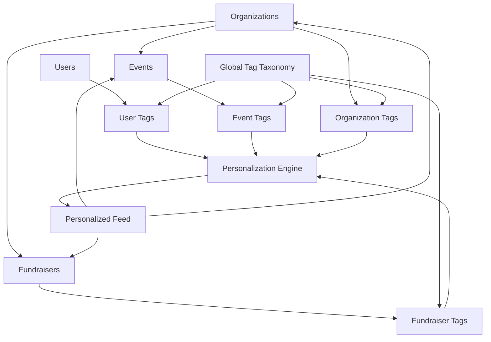

# Social Feed Architecture - Events, Fundraisers, Organizations

## Overview

Comprehensive social feed architecture that transforms the political donation platform into an engaging discovery experience, featuring personalized feeds of Events, Fundraisers, and Organizations with sophisticated tag-based personalization and content recommendation algorithms.

## Core Content Objects

### Content Entity Hierarchy



### Enhanced Database Schema

```sql
-- Events table
CREATE TABLE events (
    id UUID PRIMARY KEY DEFAULT gen_random_uuid(),
    organization_id UUID NOT NULL REFERENCES organizations(id) ON DELETE CASCADE,

    -- Basic information
    title VARCHAR(255) NOT NULL,
    description TEXT,
    slug VARCHAR(255) UNIQUE NOT NULL,

    -- Event details
    event_type VARCHAR(50) NOT NULL CHECK (event_type IN (
        'rally', 'town_hall', 'fundraising_gala', 'debate_watch_party',
        'volunteer_drive', 'phone_bank', 'canvassing', 'protest', 'march',
        'conference', 'webinar', 'meeting', 'endorsement_event'
    )),

    -- Location
    venue_name VARCHAR(255),
    street_address TEXT,
    city VARCHAR(100),
    state VARCHAR(2),
    postal_code VARCHAR(10),
    country VARCHAR(2) DEFAULT 'US',
    is_virtual BOOLEAN DEFAULT false,
    virtual_link VARCHAR(500),

    -- Timing
    start_date TIMESTAMP NOT NULL,
    end_date TIMESTAMP,
    timezone VARCHAR(50) DEFAULT 'America/New_York',

    -- Capacity and registration
    max_capacity INTEGER,
    registration_required BOOLEAN DEFAULT false,
    registration_url VARCHAR(500),
    registration_deadline TIMESTAMP,

    -- Media
    image_url VARCHAR(500),
    video_url VARCHAR(500),
    live_stream_url VARCHAR(500),

    -- Engagement metrics
    view_count INTEGER DEFAULT 0,
    interested_count INTEGER DEFAULT 0,
    attending_count INTEGER DEFAULT 0,
    share_count INTEGER DEFAULT 0,

    -- Content flags
    is_featured BOOLEAN DEFAULT false,
    is_public BOOLEAN DEFAULT true,
    requires_approval BOOLEAN DEFAULT false,

    -- Status
    status VARCHAR(20) DEFAULT 'draft' CHECK (status IN (
        'draft', 'published', 'cancelled', 'completed', 'postponed'
    )),

    -- SEO and discovery
    meta_title VARCHAR(255),
    meta_description VARCHAR(500),
    search_keywords TEXT[],

    -- Audit fields
    created_at TIMESTAMP DEFAULT CURRENT_TIMESTAMP,
    updated_at TIMESTAMP DEFAULT CURRENT_TIMESTAMP,
    created_by UUID REFERENCES users(id),
    updated_by UUID REFERENCES users(id),

    -- Indexes
    INDEX idx_events_org (organization_id),
    INDEX idx_events_date (start_date, end_date),
    INDEX idx_events_location (city, state),
    INDEX idx_events_status (status),
    INDEX idx_events_featured (is_featured, created_at),
    INDEX idx_events_search (search_keywords),
    INDEX idx_events_engagement (view_count, interested_count)
);

-- Enhanced fundraisers table (building on existing)
ALTER TABLE fundraisers ADD COLUMN IF NOT EXISTS event_id UUID REFERENCES events(id);
ALTER TABLE fundraisers ADD COLUMN IF NOT EXISTS fundraiser_type VARCHAR(50) DEFAULT 'general'
    CHECK (fundraiser_type IN ('general', 'emergency', 'milestone', 'matching', 'peer_to_peer'));
ALTER TABLE fundraisers ADD COLUMN IF NOT EXISTS view_count INTEGER DEFAULT 0;
ALTER TABLE fundraisers ADD COLUMN IF NOT EXISTS share_count INTEGER DEFAULT 0;
ALTER TABLE fundraisers ADD COLUMN IF NOT EXISTS is_featured BOOLEAN DEFAULT false;
ALTER TABLE fundraisers ADD COLUMN IF NOT EXISTS meta_title VARCHAR(255);
ALTER TABLE fundraisers ADD COLUMN IF NOT EXISTS meta_description VARCHAR(500);
ALTER TABLE fundraisers ADD COLUMN IF NOT EXISTS search_keywords TEXT[];

-- Enhanced organizations table (building on existing)
ALTER TABLE organizations ADD COLUMN IF NOT EXISTS description TEXT;
ALTER TABLE organizations ADD COLUMN IF NOT EXISTS mission_statement TEXT;
ALTER TABLE organizations ADD COLUMN IF NOT EXISTS logo_url VARCHAR(500);
ALTER TABLE organizations ADD COLUMN IF NOT EXISTS banner_url VARCHAR(500);
ALTER TABLE organizations ADD COLUMN IF NOT EXISTS social_media JSONB;
ALTER TABLE organizations ADD COLUMN IF NOT EXISTS follower_count INTEGER DEFAULT 0;
ALTER TABLE organizations ADD COLUMN IF NOT EXISTS is_verified BOOLEAN DEFAULT false;
ALTER TABLE organizations ADD COLUMN IF NOT EXISTS is_featured BOOLEAN DEFAULT false;
ALTER TABLE organizations ADD COLUMN IF NOT EXISTS activity_score INTEGER DEFAULT 0;
ALTER TABLE organizations ADD COLUMN IF NOT EXISTS search_keywords TEXT[];

-- Global tag taxonomy
CREATE TABLE tag_categories (
    id UUID PRIMARY KEY DEFAULT gen_random_uuid(),
    name VARCHAR(100) NOT NULL UNIQUE,
    description TEXT,
    parent_id UUID REFERENCES tag_categories(id),
    level INTEGER DEFAULT 0, -- 0 = top level, 1 = subcategory, etc.
    display_order INTEGER DEFAULT 0,
    is_active BOOLEAN DEFAULT true,

    created_at TIMESTAMP DEFAULT CURRENT_TIMESTAMP,
    updated_at TIMESTAMP DEFAULT CURRENT_TIMESTAMP,

    INDEX idx_tag_categories_parent (parent_id),
    INDEX idx_tag_categories_level (level, display_order)
);

-- Tags table
CREATE TABLE tags (
    id UUID PRIMARY KEY DEFAULT gen_random_uuid(),
    category_id UUID NOT NULL REFERENCES tag_categories(id),

    name VARCHAR(100) NOT NULL,
    slug VARCHAR(100) NOT NULL UNIQUE,
    description TEXT,
    color VARCHAR(7), -- Hex color for UI display
    icon VARCHAR(50), -- Icon identifier

    -- Usage statistics
    usage_count INTEGER DEFAULT 0,
    trending_score FLOAT DEFAULT 0,

    -- Visibility
    is_active BOOLEAN DEFAULT true,
    is_featured BOOLEAN DEFAULT false,

    created_at TIMESTAMP DEFAULT CURRENT_TIMESTAMP,
    updated_at TIMESTAMP DEFAULT CURRENT_TIMESTAMP,

    INDEX idx_tags_category (category_id),
    INDEX idx_tags_slug (slug),
    INDEX idx_tags_usage (usage_count DESC),
    INDEX idx_tags_trending (trending_score DESC),
    UNIQUE(category_id, name)
);

-- Content tagging (polymorphic relationship)
CREATE TABLE content_tags (
    id UUID PRIMARY KEY DEFAULT gen_random_uuid(),
    tag_id UUID NOT NULL REFERENCES tags(id) ON DELETE CASCADE,

    -- Polymorphic content reference
    content_type VARCHAR(50) NOT NULL CHECK (content_type IN ('event', 'fundraiser', 'organization', 'user')),
    content_id UUID NOT NULL,

    -- Tag relevance and context
    relevance_score FLOAT DEFAULT 1.0, -- 0.0 to 1.0
    context VARCHAR(100), -- 'primary', 'secondary', 'related'

    -- Who applied the tag
    tagged_by UUID REFERENCES users(id),
    tagged_at TIMESTAMP DEFAULT CURRENT_TIMESTAMP,

    -- Validation
    is_verified BOOLEAN DEFAULT false,
    verified_by UUID REFERENCES users(id),
    verified_at TIMESTAMP,

    INDEX idx_content_tags_content (content_type, content_id),
    INDEX idx_content_tags_tag (tag_id),
    INDEX idx_content_tags_relevance (relevance_score DESC),
    UNIQUE(tag_id, content_type, content_id)
);

-- User preferences and interests
CREATE TABLE user_preferences (
    id UUID PRIMARY KEY DEFAULT gen_random_uuid(),
    user_id UUID NOT NULL REFERENCES users(id) ON DELETE CASCADE,

    -- Content preferences
    preferred_content_types VARCHAR(50)[] DEFAULT ARRAY['event', 'fundraiser', 'organization'],
    feed_algorithm_preference VARCHAR(20) DEFAULT 'balanced' CHECK (
        feed_algorithm_preference IN ('chronological', 'algorithmic', 'balanced')
    ),

    -- Geographic preferences
    local_radius_miles INTEGER DEFAULT 50,
    include_national_content BOOLEAN DEFAULT true,
    preferred_locations JSONB, -- Cities/states of interest

    -- Engagement preferences
    email_notifications BOOLEAN DEFAULT true,
    push_notifications BOOLEAN DEFAULT true,
    sms_notifications BOOLEAN DEFAULT false,

    -- Privacy settings
    profile_visibility VARCHAR(20) DEFAULT 'public' CHECK (
        profile_visibility IN ('private', 'friends', 'public')
    ),
    show_donations BOOLEAN DEFAULT false,
    show_activity BOOLEAN DEFAULT true,

    created_at TIMESTAMP DEFAULT CURRENT_TIMESTAMP,
    updated_at TIMESTAMP DEFAULT CURRENT_TIMESTAMP,

    UNIQUE(user_id)
);

-- User interactions for personalization
CREATE TABLE user_interactions (
    id UUID PRIMARY KEY DEFAULT gen_random_uuid(),
    user_id UUID NOT NULL REFERENCES users(id) ON DELETE CASCADE,

    -- Content reference
    content_type VARCHAR(50) NOT NULL CHECK (content_type IN ('event', 'fundraiser', 'organization')),
    content_id UUID NOT NULL,

    -- Interaction details
    interaction_type VARCHAR(30) NOT NULL CHECK (interaction_type IN (
        'view', 'like', 'share', 'comment', 'bookmark', 'attend', 'interest',
        'follow', 'donate', 'register', 'click_through'
    )),

    -- Context
    session_id VARCHAR(100),
    referrer VARCHAR(500),
    device_type VARCHAR(20),

    -- Engagement metrics
    time_spent INTEGER, -- seconds
    scroll_depth FLOAT, -- percentage

    -- Metadata
    metadata JSONB,

    created_at TIMESTAMP DEFAULT CURRENT_TIMESTAMP,

    INDEX idx_user_interactions_user (user_id, created_at),
    INDEX idx_user_interactions_content (content_type, content_id),
    INDEX idx_user_interactions_type (interaction_type, created_at)
);

-- Feed generation cache
CREATE TABLE user_feed_cache (
    id UUID PRIMARY KEY DEFAULT gen_random_uuid(),
    user_id UUID NOT NULL REFERENCES users(id) ON DELETE CASCADE,

    -- Feed content
    content_items JSONB NOT NULL, -- Array of content with scores
    algorithm_version VARCHAR(10) NOT NULL,

    -- Cache metadata
    generated_at TIMESTAMP DEFAULT CURRENT_TIMESTAMP,
    expires_at TIMESTAMP NOT NULL,

    -- Performance metrics
    generation_time_ms INTEGER,
    item_count INTEGER,

    UNIQUE(user_id),
    INDEX idx_feed_cache_expires (expires_at)
);

-- Event attendance tracking
CREATE TABLE event_attendances (
    id UUID PRIMARY KEY DEFAULT gen_random_uuid(),
    event_id UUID NOT NULL REFERENCES events(id) ON DELETE CASCADE,
    user_id UUID NOT NULL REFERENCES users(id) ON DELETE CASCADE,

    status VARCHAR(20) NOT NULL DEFAULT 'interested' CHECK (status IN (
        'interested', 'attending', 'not_attending', 'attended', 'no_show'
    )),

    -- Registration details
    registration_date TIMESTAMP DEFAULT CURRENT_TIMESTAMP,
    check_in_time TIMESTAMP,
    check_out_time TIMESTAMP,

    -- Metadata
    registration_source VARCHAR(50), -- 'website', 'mobile_app', 'social'
    notes TEXT,

    created_at TIMESTAMP DEFAULT CURRENT_TIMESTAMP,
    updated_at TIMESTAMP DEFAULT CURRENT_TIMESTAMP,

    UNIQUE(event_id, user_id),
    INDEX idx_attendance_event (event_id, status),
    INDEX idx_attendance_user (user_id, status)
);

-- Organization following
CREATE TABLE organization_follows (
    id UUID PRIMARY KEY DEFAULT gen_random_uuid(),
    organization_id UUID NOT NULL REFERENCES organizations(id) ON DELETE CASCADE,
    user_id UUID NOT NULL REFERENCES users(id) ON DELETE CASCADE,

    -- Follow details
    followed_at TIMESTAMP DEFAULT CURRENT_TIMESTAMP,
    notification_preferences JSONB DEFAULT '{"new_events": true, "new_fundraisers": true, "updates": false}',

    -- Engagement
    last_interaction_at TIMESTAMP,

    UNIQUE(organization_id, user_id),
    INDEX idx_org_follows_org (organization_id),
    INDEX idx_org_follows_user (user_id)
);
```

## Content Management System

### TypeScript Models

```typescript
// types/content.ts
export interface Event {
  id: string;
  organizationId: string;
  organization?: Organization;

  // Basic information
  title: string;
  description?: string;
  slug: string;

  // Event details
  eventType: EventType;

  // Location
  venueName?: string;
  address?: Address;
  isVirtual: boolean;
  virtualLink?: string;

  // Timing
  startDate: Date;
  endDate?: Date;
  timezone: string;

  // Capacity
  maxCapacity?: number;
  registrationRequired: boolean;
  registrationUrl?: string;
  registrationDeadline?: Date;

  // Media
  imageUrl?: string;
  videoUrl?: string;
  liveStreamUrl?: string;

  // Engagement
  viewCount: number;
  interestedCount: number;
  attendingCount: number;
  shareCount: number;

  // Content flags
  isFeatured: boolean;
  isPublic: boolean;
  requiresApproval: boolean;

  status: EventStatus;

  // SEO
  metaTitle?: string;
  metaDescription?: string;
  searchKeywords: string[];

  // Tags
  tags: Tag[];

  // Timestamps
  createdAt: Date;
  updatedAt: Date;
  createdBy: string;
}

export type EventType =
  | 'rally' | 'town_hall' | 'fundraising_gala' | 'debate_watch_party'
  | 'volunteer_drive' | 'phone_bank' | 'canvassing' | 'protest' | 'march'
  | 'conference' | 'webinar' | 'meeting' | 'endorsement_event';

export type EventStatus = 'draft' | 'published' | 'cancelled' | 'completed' | 'postponed';

export interface EnhancedFundraiser extends Fundraiser {
  eventId?: string;
  event?: Event;
  fundraiserType: FundraiserType;
  viewCount: number;
  shareCount: number;
  isFeatured: boolean;
  metaTitle?: string;
  metaDescription?: string;
  searchKeywords: string[];
  tags: Tag[];
}

export type FundraiserType = 'general' | 'emergency' | 'milestone' | 'matching' | 'peer_to_peer';

export interface EnhancedOrganization extends Organization {
  description?: string;
  missionStatement?: string;
  logoUrl?: string;
  bannerUrl?: string;
  socialMedia: SocialMediaLinks;
  followerCount: number;
  isVerified: boolean;
  isFeatured: boolean;
  activityScore: number;
  searchKeywords: string[];
  tags: Tag[];

  // Aggregated content
  events?: Event[];
  fundraisers?: EnhancedFundraiser[];
  upcomingEventsCount: number;
  activeFundraisersCount: number;
}

export interface SocialMediaLinks {
  twitter?: string;
  facebook?: string;
  instagram?: string;
  linkedin?: string;
  tiktok?: string;
  youtube?: string;
  website?: string;
}

// Tag system
export interface TagCategory {
  id: string;
  name: string;
  description?: string;
  parentId?: string;
  level: number;
  displayOrder: number;
  isActive: boolean;
  children?: TagCategory[];
}

export interface Tag {
  id: string;
  categoryId: string;
  category?: TagCategory;
  name: string;
  slug: string;
  description?: string;
  color?: string;
  icon?: string;
  usageCount: number;
  trendingScore: number;
  isActive: boolean;
  isFeatured: boolean;
}

export interface ContentTag {
  id: string;
  tagId: string;
  tag?: Tag;
  contentType: ContentType;
  contentId: string;
  relevanceScore: number;
  context: TagContext;
  taggedBy?: string;
  taggedAt: Date;
  isVerified: boolean;
}

export type ContentType = 'event' | 'fundraiser' | 'organization' | 'user';
export type TagContext = 'primary' | 'secondary' | 'related';

// User preferences and interactions
export interface UserPreferences {
  id: string;
  userId: string;
  preferredContentTypes: ContentType[];
  feedAlgorithmPreference: FeedAlgorithm;
  localRadiusMiles: number;
  includeNationalContent: boolean;
  preferredLocations: Location[];
  emailNotifications: boolean;
  pushNotifications: boolean;
  smsNotifications: boolean;
  profileVisibility: ProfileVisibility;
  showDonations: boolean;
  showActivity: boolean;
}

export type FeedAlgorithm = 'chronological' | 'algorithmic' | 'balanced';
export type ProfileVisibility = 'private' | 'friends' | 'public';

export interface UserInteraction {
  id: string;
  userId: string;
  contentType: ContentType;
  contentId: string;
  interactionType: InteractionType;
  sessionId?: string;
  referrer?: string;
  deviceType?: string;
  timeSpent?: number;
  scrollDepth?: number;
  metadata?: Record<string, any>;
  createdAt: Date;
}

export type InteractionType =
  | 'view' | 'like' | 'share' | 'comment' | 'bookmark' | 'attend'
  | 'interest' | 'follow' | 'donate' | 'register' | 'click_through';

// Feed system
export interface FeedItem {
  id: string;
  contentType: ContentType;
  content: Event | EnhancedFundraiser | EnhancedOrganization;
  score: number;
  reason: string; // Why this item was selected
  insertedAt: Date;
}

export interface UserFeed {
  items: FeedItem[];
  hasMore: boolean;
  nextCursor?: string;
  algorithmVersion: string;
  generatedAt: Date;
  totalItems: number;
}
```

### Content Services

```typescript
// services/content.service.ts
import { Pool } from 'pg';
import { Event, EnhancedFundraiser, EnhancedOrganization, ContentType, Tag } from '../types/content';

export class ContentService {
  constructor(private pool: Pool) {}

  async getEvent(id: string, userId?: string): Promise<Event | null> {
    const query = `
      SELECT
        e.*,
        o.name as organization_name,
        o.logo_url as organization_logo,
        ARRAY_AGG(DISTINCT jsonb_build_object(
          'id', t.id,
          'name', t.name,
          'slug', t.slug,
          'color', t.color,
          'icon', t.icon,
          'relevanceScore', ct.relevance_score
        )) FILTER (WHERE t.id IS NOT NULL) as tags,
        CASE WHEN ea.user_id IS NOT NULL THEN ea.status ELSE NULL END as user_attendance_status
      FROM events e
      JOIN organizations o ON e.organization_id = o.id
      LEFT JOIN content_tags ct ON ct.content_type = 'event' AND ct.content_id = e.id
      LEFT JOIN tags t ON ct.tag_id = t.id AND t.is_active = true
      LEFT JOIN event_attendances ea ON e.id = ea.event_id AND ea.user_id = $2
      WHERE e.id = $1 AND e.status = 'published'
      GROUP BY e.id, o.name, o.logo_url, ea.status
    `;

    const { rows } = await this.pool.query(query, [id, userId]);

    if (rows.length === 0) return null;

    // Record view interaction if user provided
    if (userId) {
      await this.recordInteraction(userId, 'event', id, 'view');
    }

    // Increment view count
    await this.pool.query(
      'UPDATE events SET view_count = view_count + 1 WHERE id = $1',
      [id]
    );

    return this.mapRowToEvent(rows[0]);
  }

  async searchContent(
    query: string,
    contentTypes: ContentType[] = ['event', 'fundraiser', 'organization'],
    filters: SearchFilters = {},
    limit: number = 20,
    offset: number = 0
  ): Promise<SearchResults> {
    const searchQuery = `
      WITH search_events AS (
        SELECT
          'event' as content_type,
          e.id,
          e.title,
          e.description,
          e.image_url,
          e.created_at,
          e.view_count,
          o.name as organization_name,
          ts_rank(
            setweight(to_tsvector('english', e.title), 'A') ||
            setweight(to_tsvector('english', e.description), 'B') ||
            setweight(array_to_tsvector(e.search_keywords), 'C'),
            plainto_tsquery('english', $1)
          ) as rank
        FROM events e
        JOIN organizations o ON e.organization_id = o.id
        WHERE ($2::text[] IS NULL OR 'event' = ANY($2))
          AND e.status = 'published'
          AND ($3::timestamp IS NULL OR e.start_date >= $3)
          AND ($4::text[] IS NULL OR e.city = ANY($4) OR e.state = ANY($4))
          AND (
            to_tsvector('english', e.title || ' ' || coalesce(e.description, ''))
            @@ plainto_tsquery('english', $1)
            OR array_to_tsvector(e.search_keywords) @@ plainto_tsquery('english', $1)
          )
      ),
      search_fundraisers AS (
        SELECT
          'fundraiser' as content_type,
          f.id,
          f.title,
          f.description,
          f.image_url,
          f.created_at,
          f.view_count,
          o.name as organization_name,
          ts_rank(
            setweight(to_tsvector('english', f.title), 'A') ||
            setweight(to_tsvector('english', f.description), 'B') ||
            setweight(array_to_tsvector(f.search_keywords), 'C'),
            plainto_tsquery('english', $1)
          ) as rank
        FROM fundraisers f
        JOIN organizations o ON f.organization_id = o.id
        WHERE ($2::text[] IS NULL OR 'fundraiser' = ANY($2))
          AND f.status = 'active'
          AND (
            to_tsvector('english', f.title || ' ' || coalesce(f.description, ''))
            @@ plainto_tsquery('english', $1)
            OR array_to_tsvector(f.search_keywords) @@ plainto_tsquery('english', $1)
          )
      ),
      search_organizations AS (
        SELECT
          'organization' as content_type,
          o.id,
          o.name as title,
          o.description,
          o.logo_url as image_url,
          o.created_at,
          0 as view_count,
          o.name as organization_name,
          ts_rank(
            setweight(to_tsvector('english', o.name), 'A') ||
            setweight(to_tsvector('english', coalesce(o.description, '')), 'B') ||
            setweight(array_to_tsvector(o.search_keywords), 'C'),
            plainto_tsquery('english', $1)
          ) as rank
        FROM organizations o
        WHERE ($2::text[] IS NULL OR 'organization' = ANY($2))
          AND o.status = 'active'
          AND o.verification_status = 'verified'
          AND (
            to_tsvector('english', o.name || ' ' || coalesce(o.description, ''))
            @@ plainto_tsquery('english', $1)
            OR array_to_tsvector(o.search_keywords) @@ plainto_tsquery('english', $1)
          )
      )
      SELECT * FROM (
        SELECT * FROM search_events
        UNION ALL
        SELECT * FROM search_fundraisers
        UNION ALL
        SELECT * FROM search_organizations
      ) combined
      ORDER BY rank DESC, view_count DESC, created_at DESC
      LIMIT $5 OFFSET $6
    `;

    const { rows } = await this.pool.query(searchQuery, [
      query,
      contentTypes.length > 0 ? contentTypes : null,
      filters.startDate || null,
      filters.locations || null,
      limit,
      offset
    ]);

    return {
      results: rows.map(row => ({
        contentType: row.content_type,
        id: row.id,
        title: row.title,
        description: row.description,
        imageUrl: row.image_url,
        organizationName: row.organization_name,
        createdAt: row.created_at,
        relevanceScore: parseFloat(row.rank)
      })),
      total: rows.length,
      hasMore: rows.length === limit
    };
  }

  async getContentByTags(
    tagIds: string[],
    contentTypes: ContentType[] = ['event', 'fundraiser', 'organization'],
    limit: number = 20,
    offset: number = 0
  ): Promise<any[]> {
    const query = `
      WITH tagged_content AS (
        SELECT
          ct.content_type,
          ct.content_id,
          AVG(ct.relevance_score) as avg_relevance,
          COUNT(*) as matching_tags
        FROM content_tags ct
        WHERE ct.tag_id = ANY($1)
          AND ct.content_type = ANY($2)
        GROUP BY ct.content_type, ct.content_id
      ),
      content_with_details AS (
        SELECT
          tc.content_type,
          tc.content_id,
          tc.avg_relevance,
          tc.matching_tags,
          CASE
            WHEN tc.content_type = 'event' THEN
              (SELECT row_to_json(e.*) FROM events e WHERE e.id = tc.content_id AND e.status = 'published')
            WHEN tc.content_type = 'fundraiser' THEN
              (SELECT row_to_json(f.*) FROM fundraisers f WHERE f.id = tc.content_id AND f.status = 'active')
            WHEN tc.content_type = 'organization' THEN
              (SELECT row_to_json(o.*) FROM organizations o WHERE o.id = tc.content_id AND o.status = 'active')
          END as content_data
        FROM tagged_content tc
      )
      SELECT *
      FROM content_with_details
      WHERE content_data IS NOT NULL
      ORDER BY
        matching_tags DESC,
        avg_relevance DESC,
        (content_data->>'created_at')::timestamp DESC
      LIMIT $3 OFFSET $4
    `;

    const { rows } = await this.pool.query(query, [tagIds, contentTypes, limit, offset]);
    return rows.filter(row => row.content_data);
  }

  async recordInteraction(
    userId: string,
    contentType: ContentType,
    contentId: string,
    interactionType: InteractionType,
    metadata?: Record<string, any>
  ): Promise<void> {
    await this.pool.query(`
      INSERT INTO user_interactions (
        user_id, content_type, content_id, interaction_type, metadata
      ) VALUES ($1, $2, $3, $4, $5)
    `, [userId, contentType, contentId, interactionType, metadata]);

    // Update content engagement metrics
    switch (interactionType) {
      case 'view':
        await this.incrementViewCount(contentType, contentId);
        break;
      case 'share':
        await this.incrementShareCount(contentType, contentId);
        break;
      case 'interest':
        if (contentType === 'event') {
          await this.incrementInterestedCount(contentId);
        }
        break;
      case 'attend':
        if (contentType === 'event') {
          await this.incrementAttendingCount(contentId);
        }
        break;
    }
  }

  private async incrementViewCount(contentType: ContentType, contentId: string): Promise<void> {
    const table = contentType === 'event' ? 'events' :
                 contentType === 'fundraiser' ? 'fundraisers' :
                 'organizations';

    await this.pool.query(
      `UPDATE ${table} SET view_count = view_count + 1 WHERE id = $1`,
      [contentId]
    );
  }

  private async incrementShareCount(contentType: ContentType, contentId: string): Promise<void> {
    if (contentType === 'organization') return; // Organizations don't track shares

    const table = contentType === 'event' ? 'events' : 'fundraisers';
    await this.pool.query(
      `UPDATE ${table} SET share_count = share_count + 1 WHERE id = $1`,
      [contentId]
    );
  }

  private async incrementInterestedCount(eventId: string): Promise<void> {
    await this.pool.query(
      'UPDATE events SET interested_count = interested_count + 1 WHERE id = $1',
      [eventId]
    );
  }

  private async incrementAttendingCount(eventId: string): Promise<void> {
    await this.pool.query(
      'UPDATE events SET attending_count = attending_count + 1 WHERE id = $1',
      [eventId]
    );
  }

  private mapRowToEvent(row: any): Event {
    return {
      id: row.id,
      organizationId: row.organization_id,
      title: row.title,
      description: row.description,
      slug: row.slug,
      eventType: row.event_type,
      venueName: row.venue_name,
      address: row.street_address ? {
        streetAddress: row.street_address,
        city: row.city,
        state: row.state,
        postalCode: row.postal_code,
        country: row.country
      } : undefined,
      isVirtual: row.is_virtual,
      virtualLink: row.virtual_link,
      startDate: row.start_date,
      endDate: row.end_date,
      timezone: row.timezone,
      maxCapacity: row.max_capacity,
      registrationRequired: row.registration_required,
      registrationUrl: row.registration_url,
      registrationDeadline: row.registration_deadline,
      imageUrl: row.image_url,
      videoUrl: row.video_url,
      liveStreamUrl: row.live_stream_url,
      viewCount: row.view_count,
      interestedCount: row.interested_count,
      attendingCount: row.attending_count,
      shareCount: row.share_count,
      isFeatured: row.is_featured,
      isPublic: row.is_public,
      requiresApproval: row.requires_approval,
      status: row.status,
      metaTitle: row.meta_title,
      metaDescription: row.meta_description,
      searchKeywords: row.search_keywords || [],
      tags: row.tags || [],
      createdAt: row.created_at,
      updatedAt: row.updated_at,
      createdBy: row.created_by
    };
  }
}

interface SearchFilters {
  startDate?: Date;
  endDate?: Date;
  locations?: string[];
  organizationIds?: string[];
  tagIds?: string[];
}

interface SearchResults {
  results: SearchResult[];
  total: number;
  hasMore: boolean;
}

interface SearchResult {
  contentType: ContentType;
  id: string;
  title: string;
  description?: string;
  imageUrl?: string;
  organizationName: string;
  createdAt: Date;
  relevanceScore: number;
}
```

## Frontend Components

### Feed Component Architecture

```tsx
// components/feed/social-feed.tsx
'use client';

import { useState, useEffect, useCallback } from 'react';
import { useInfiniteQuery } from '@tanstack/react-query';
import { useFeedStore } from '@/store/feed-store';
import { FeedItem, ContentType, FeedAlgorithm } from '@/types/content';
import { EventCard } from './cards/event-card';
import { FundraiserCard } from './cards/fundraiser-card';
import { OrganizationCard } from './cards/organization-card';
import { FeedFilters } from './feed-filters';
import { FeedSkeleton } from './feed-skeleton';

interface SocialFeedProps {
  userId?: string;
  contentTypes?: ContentType[];
  algorithm?: FeedAlgorithm;
  className?: string;
}

export function SocialFeed({
  userId,
  contentTypes = ['event', 'fundraiser', 'organization'],
  algorithm = 'balanced',
  className
}: SocialFeedProps) {
  const {
    filters,
    setFilters,
    preferences,
    updatePreference
  } = useFeedStore();

  const {
    data,
    fetchNextPage,
    hasNextPage,
    isFetchingNextPage,
    isLoading,
    isError,
    error,
    refetch
  } = useInfiniteQuery({
    queryKey: ['feed', userId, contentTypes, algorithm, filters],
    queryFn: async ({ pageParam = null }) => {
      const response = await fetch('/api/feed', {
        method: 'POST',
        headers: {
          'Content-Type': 'application/json',
          'Authorization': `Bearer ${getAuthToken()}`
        },
        body: JSON.stringify({
          cursor: pageParam,
          contentTypes,
          algorithm,
          filters,
          limit: 10
        })
      });

      if (!response.ok) {
        throw new Error('Failed to fetch feed');
      }

      return response.json();
    },
    getNextPageParam: (lastPage) => lastPage.nextCursor,
    staleTime: 5 * 60 * 1000, // 5 minutes
    refetchOnWindowFocus: false
  });

  const allItems = data?.pages.flatMap(page => page.items) ?? [];

  const handleInteraction = useCallback(async (
    contentType: ContentType,
    contentId: string,
    interactionType: string,
    metadata?: Record<string, any>
  ) => {
    try {
      await fetch('/api/interactions', {
        method: 'POST',
        headers: {
          'Content-Type': 'application/json',
          'Authorization': `Bearer ${getAuthToken()}`
        },
        body: JSON.stringify({
          contentType,
          contentId,
          interactionType,
          metadata
        })
      });

      // Update local state optimistically
      // This could trigger feed re-ranking
    } catch (error) {
      console.error('Failed to record interaction:', error);
    }
  }, []);

  if (isLoading) {
    return <FeedSkeleton className={className} />;
  }

  if (isError) {
    return (
      <div className="text-center p-8">
        <p className="text-red-600 mb-4">Failed to load feed</p>
        <button
          onClick={() => refetch()}
          className="px-4 py-2 bg-blue-600 text-white rounded hover:bg-blue-700"
        >
          Retry
        </button>
      </div>
    );
  }

  return (
    <div className={`space-y-6 ${className}`}>
      {/* Feed Controls */}
      <div className="sticky top-0 bg-white/95 backdrop-blur-sm z-10 pb-4">
        <FeedFilters
          filters={filters}
          onFiltersChange={setFilters}
          contentTypes={contentTypes}
          algorithm={algorithm}
          onAlgorithmChange={(alg) => updatePreference('feedAlgorithmPreference', alg)}
        />
      </div>

      {/* Feed Items */}
      <div className="space-y-6">
        {allItems.length === 0 ? (
          <EmptyFeedState
            contentTypes={contentTypes}
            onExplore={() => {
              // Navigate to discovery page or adjust filters
            }}
          />
        ) : (
          allItems.map((item) => (
            <FeedItemRenderer
              key={`${item.contentType}-${item.id}`}
              item={item}
              onInteraction={handleInteraction}
              userId={userId}
            />
          ))
        )}

        {/* Load More */}
        {hasNextPage && (
          <div className="text-center py-8">
            <button
              onClick={() => fetchNextPage()}
              disabled={isFetchingNextPage}
              className="px-6 py-3 bg-blue-600 text-white rounded-lg hover:bg-blue-700 disabled:opacity-50"
            >
              {isFetchingNextPage ? (
                <div className="flex items-center space-x-2">
                  <div className="w-4 h-4 border-2 border-white border-t-transparent rounded-full animate-spin" />
                  <span>Loading...</span>
                </div>
              ) : (
                'Load More'
              )}
            </button>
          </div>
        )}
      </div>
    </div>
  );
}

// Individual feed item renderer
function FeedItemRenderer({
  item,
  onInteraction,
  userId
}: {
  item: FeedItem;
  onInteraction: (type: ContentType, id: string, interaction: string, meta?: any) => void;
  userId?: string;
}) {
  const handleCardClick = () => {
    onInteraction(item.contentType, item.content.id, 'view', {
      source: 'feed',
      score: item.score,
      reason: item.reason
    });
  };

  switch (item.contentType) {
    case 'event':
      return (
        <EventCard
          event={item.content as Event}
          onInteraction={(type) => onInteraction('event', item.content.id, type)}
          onClick={handleCardClick}
          showRecommendationReason={true}
          recommendationReason={item.reason}
        />
      );

    case 'fundraiser':
      return (
        <FundraiserCard
          fundraiser={item.content as EnhancedFundraiser}
          onInteraction={(type) => onInteraction('fundraiser', item.content.id, type)}
          onClick={handleCardClick}
          showRecommendationReason={true}
          recommendationReason={item.reason}
        />
      );

    case 'organization':
      return (
        <OrganizationCard
          organization={item.content as EnhancedOrganization}
          onInteraction={(type) => onInteraction('organization', item.content.id, type)}
          onClick={handleCardClick}
          showRecommendationReason={true}
          recommendationReason={item.reason}
          isFollowed={false} // TODO: Check if user follows this org
        />
      );

    default:
      return null;
  }
}

function EmptyFeedState({
  contentTypes,
  onExplore
}: {
  contentTypes: ContentType[];
  onExplore: () => void;
}) {
  return (
    <div className="text-center py-12">
      <div className="mb-6">
        <div className="w-24 h-24 bg-gray-100 rounded-full mx-auto mb-4 flex items-center justify-center">
          <span className="text-4xl">📋</span>
        </div>
        <h3 className="text-xl font-semibold text-gray-900 mb-2">
          Your feed is empty
        </h3>
        <p className="text-gray-600 max-w-md mx-auto">
          We're still learning about your interests. Follow some organizations or
          interact with content to personalize your feed.
        </p>
      </div>

      <div className="space-y-3">
        <button
          onClick={onExplore}
          className="px-6 py-3 bg-blue-600 text-white rounded-lg hover:bg-blue-700"
        >
          Explore Content
        </button>

        <div className="text-sm text-gray-500">
          <p>Showing: {contentTypes.join(', ')}</p>
        </div>
      </div>
    </div>
  );
}

function getAuthToken(): string {
  // Implementation depends on your auth system
  return localStorage.getItem('auth_token') || '';
}
```

This social feed architecture transforms your political donation platform into an engaging discovery experience with personalized content, sophisticated tagging, and rich user interactions. The system is designed to scale and can easily accommodate the tag taxonomy you'll be sharing.

Would you like me to continue with the personalization algorithms and recommendation engine, or would you prefer to share the tag categories first so I can incorporate them into the documentation?