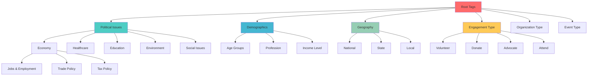

# Tag Taxonomy & Personalization System

## Overview

Sophisticated tag-based personalization system that powers content discovery, user matching, and feed personalization across Events, Fundraisers, Organizations, and Users using a hierarchical tag taxonomy with machine learning-driven recommendations.

## Tag Taxonomy Architecture

### Hierarchical Tag Structure



### Core Tag Categories Implementation

```sql
-- Initial tag category structure
INSERT INTO tag_categories (id, name, description, parent_id, level, display_order, is_active) VALUES
-- Root categories (level 0)
('cat-political-issues', 'Political Issues', 'Core political topics and policy areas', NULL, 0, 1, true),
('cat-demographics', 'Demographics', 'Demographic and identity-based categories', NULL, 0, 2, true),
('cat-geography', 'Geography', 'Geographic scope and location-based tags', NULL, 0, 3, true),
('cat-engagement', 'Engagement Type', 'Types of political engagement and participation', NULL, 0, 4, true),
('cat-org-type', 'Organization Type', 'Categories of political organizations', NULL, 0, 5, true),
('cat-event-type', 'Event Type', 'Types of political events and activities', NULL, 0, 6, true),
('cat-fundraiser-type', 'Fundraiser Type', 'Categories of fundraising campaigns', NULL, 0, 7, true),

-- Political Issues Categories (level 1) - Based on actual taxonomy
('cat-environment-climate', 'Environment & Climate', 'Environmental policy and climate action', 'cat-political-issues', 1, 1, true),
('cat-healthcare-public-health', 'Healthcare & Public Health', 'Healthcare access and public health initiatives', 'cat-political-issues', 1, 2, true),
('cat-justice-civil-rights', 'Justice & Civil Rights', 'Civil rights and criminal justice reform', 'cat-political-issues', 1, 3, true),
('cat-economy-labor', 'Economy & Labor', 'Economic policy and workers rights', 'cat-political-issues', 1, 4, true),
('cat-democracy-governance', 'Democracy & Governance', 'Democratic processes and government reform', 'cat-political-issues', 1, 5, true),
('cat-education', 'Education', 'Education policy and school-related issues', 'cat-political-issues', 1, 6, true),
('cat-housing-community', 'Housing & Community', 'Housing policy and community development', 'cat-political-issues', 1, 7, true),
('cat-technology-privacy', 'Technology & Privacy', 'Technology policy and digital rights', 'cat-political-issues', 1, 8, true),
('cat-foreign-policy-security', 'Foreign Policy & Security', 'International relations and defense', 'cat-political-issues', 1, 9, true),
('cat-civil-society-culture', 'Civil Society & Culture', 'Arts, culture and civil society', 'cat-political-issues', 1, 10, true),
('cat-identity-social-equity', 'Identity & Social Equity', 'Social equity and identity-based rights', 'cat-political-issues', 1, 11, true),

-- Demographics (level 1)
('cat-age', 'Age Groups', 'Different age demographics', 'cat-demographics', 1, 1, true),
('cat-profession', 'Profession', 'Professional and occupational categories', 'cat-demographics', 1, 2, true),
('cat-income', 'Income Level', 'Economic status categories', 'cat-demographics', 1, 3, true),
('cat-identity', 'Identity Groups', 'Identity-based communities', 'cat-demographics', 1, 4, true),

-- Geography (level 1)
('cat-national', 'National', 'National-level politics', 'cat-geography', 1, 1, true),
('cat-state', 'State', 'State and regional politics', 'cat-geography', 1, 2, true),
('cat-local', 'Local', 'Local and municipal politics', 'cat-geography', 1, 3, true),

-- Engagement Type (level 1)
('cat-volunteer', 'Volunteer', 'Volunteer opportunities and activities', 'cat-engagement', 1, 1, true),
('cat-donate', 'Donate', 'Donation and fundraising activities', 'cat-engagement', 1, 2, true),
('cat-advocate', 'Advocate', 'Advocacy and lobbying activities', 'cat-engagement', 1, 3, true),
('cat-attend', 'Attend', 'Event attendance and participation', 'cat-engagement', 1, 4, true),
('cat-learn', 'Learn', 'Educational and informational content', 'cat-engagement', 1, 5, true);

-- Comprehensive tags based on actual political taxonomy (level 2)
INSERT INTO tags (id, category_id, name, slug, description, color, icon) VALUES
-- Environment & Climate subcategories
('tag-climate-action', 'cat-environment-climate', 'Climate Action', 'climate-action', 'Climate policy and global warming action', '#059669', 'thermometer'),
('tag-renewable-energy', 'cat-environment-climate', 'Renewable Energy', 'renewable-energy', 'Clean energy and renewable power', '#eab308', 'zap'),
('tag-green-jobs', 'cat-environment-climate', 'Green Jobs', 'green-jobs', 'Environmental job creation and training', '#84cc16', 'briefcase'),
('tag-conservation-wildlife', 'cat-environment-climate', 'Conservation & Wildlife', 'conservation-wildlife', 'Wildlife and habitat conservation', '#16a34a', 'leaf'),
('tag-environmental-justice', 'cat-environment-climate', 'Environmental Justice', 'environmental-justice', 'Environmental equity and justice', '#dc2626', 'scale'),
('tag-pollution-control', 'cat-environment-climate', 'Pollution Control', 'pollution-control', 'Air, water, and environmental pollution', '#0891b2', 'wind'),
('tag-clean-air-water', 'cat-environment-climate', 'Clean Air & Water', 'clean-air-water', 'Clean air and water initiatives', '#06b6d4', 'droplet'),
('tag-climate-resilience', 'cat-environment-climate', 'Climate Resilience', 'climate-resilience', 'Climate adaptation and resilience', '#8b5cf6', 'shield'),
('tag-disaster-relief', 'cat-environment-climate', 'Disaster Relief', 'disaster-relief', 'Natural disaster response and relief', '#ef4444', 'alert-triangle'),
('tag-public-transit-mobility', 'cat-environment-climate', 'Public Transit & Mobility', 'public-transit-mobility', 'Public transportation and sustainable mobility', '#3b82f6', 'train'),
('tag-sustainable-agriculture', 'cat-environment-climate', 'Sustainable Agriculture', 'sustainable-agriculture', 'Sustainable farming and agriculture', '#65a30d', 'sprout'),
('tag-carbon-pricing', 'cat-environment-climate', 'Carbon Pricing', 'carbon-pricing', 'Carbon tax and pricing mechanisms', '#7c3aed', 'trending-up'),
('tag-energy-transition', 'cat-environment-climate', 'Energy Transition', 'energy-transition', 'Transition to clean energy systems', '#f59e0b', 'battery'),

-- Healthcare & Public Health subcategories
('tag-healthcare-access', 'cat-healthcare-public-health', 'Healthcare Access', 'healthcare-access', 'Healthcare accessibility and affordability', '#dc2626', 'heart'),
('tag-mental-health', 'cat-healthcare-public-health', 'Mental Health', 'mental-health', 'Mental health services and policy', '#7c3aed', 'brain'),
('tag-prescription-drug-prices', 'cat-healthcare-public-health', 'Prescription Drug Prices', 'prescription-drug-prices', 'Drug pricing and pharmaceutical policy', '#059669', 'pill'),
('tag-medicare-medicaid', 'cat-healthcare-public-health', 'Medicare & Medicaid', 'medicare-medicaid', 'Medicare and Medicaid policy', '#2563eb', 'shield'),
('tag-reproductive-rights', 'cat-healthcare-public-health', 'Reproductive Rights', 'reproductive-rights', 'Reproductive health and rights', '#ec4899', 'heart'),
('tag-public-health-preparedness', 'cat-healthcare-public-health', 'Public Health Preparedness', 'public-health-preparedness', 'Public health emergency preparedness', '#ea580c', 'shield-check'),
('tag-disability-rights', 'cat-healthcare-public-health', 'Disability Rights', 'disability-rights', 'Disability rights and accessibility', '#8b5cf6', 'accessibility'),
('tag-universal-coverage', 'cat-healthcare-public-health', 'Universal Coverage', 'universal-coverage', 'Universal healthcare coverage', '#10b981', 'umbrella'),
('tag-opioid-addiction-crisis', 'cat-healthcare-public-health', 'Opioid & Addiction Crisis', 'opioid-addiction-crisis', 'Opioid and substance abuse crisis', '#dc2626', 'alert-circle'),
('tag-aging-senior-care', 'cat-healthcare-public-health', 'Aging & Senior Care', 'aging-senior-care', 'Aging and elder care services', '#6b7280', 'users'),
('tag-healthcare-workforce', 'cat-healthcare-public-health', 'Healthcare Workforce', 'healthcare-workforce', 'Healthcare worker support and training', '#3b82f6', 'user-plus'),
('tag-nutrition-food-security', 'cat-healthcare-public-health', 'Nutrition & Food Security', 'nutrition-food-security', 'Nutrition and food access', '#84cc16', 'apple'),

-- Justice & Civil Rights subcategories
('tag-racial-justice', 'cat-justice-civil-rights', 'Racial Justice', 'racial-justice', 'Racial equity and justice reform', '#dc2626', 'scale'),
('tag-criminal-justice-reform', 'cat-justice-civil-rights', 'Criminal Justice Reform', 'criminal-justice-reform', 'Prison and criminal justice reform', '#7c3aed', 'shield-alert'),
('tag-voting-rights', 'cat-justice-civil-rights', 'Voting Rights', 'voting-rights', 'Voter access and election integrity', '#2563eb', 'vote'),
('tag-immigration-reform', 'cat-justice-civil-rights', 'Immigration Reform', 'immigration-reform', 'Immigration policy and reform', '#059669', 'globe'),
('tag-lgbtq-rights', 'cat-justice-civil-rights', 'LGBTQ+ Rights', 'lgbtq-rights', 'LGBTQ+ equality and protection', '#8b5cf6', 'rainbow'),
('tag-gender-equality', 'cat-justice-civil-rights', 'Gender Equality', 'gender-equality', 'Gender equality and womens rights', '#ec4899', 'users'),
('tag-disability-inclusion', 'cat-justice-civil-rights', 'Disability Inclusion', 'disability-inclusion', 'Disability rights and inclusion', '#6366f1', 'accessibility'),
('tag-indigenous-rights', 'cat-justice-civil-rights', 'Indigenous Rights', 'indigenous-rights', 'Indigenous peoples rights and sovereignty', '#a3a3a3', 'mountain'),
('tag-police-reform', 'cat-justice-civil-rights', 'Police Reform', 'police-reform', 'Police accountability and reform', '#ef4444', 'shield'),
('tag-prison-reform', 'cat-justice-civil-rights', 'Prison Reform', 'prison-reform', 'Prison system reform and rehabilitation', '#737373', 'lock'),
('tag-free-speech-expression', 'cat-justice-civil-rights', 'Free Speech & Expression', 'free-speech-expression', 'Freedom of speech and expression', '#3b82f6', 'message-circle'),
('tag-religious-freedom', 'cat-justice-civil-rights', 'Religious Freedom', 'religious-freedom', 'Religious liberty and freedom', '#f59e0b', 'star'),
('tag-privacy-rights', 'cat-justice-civil-rights', 'Privacy Rights', 'privacy-rights', 'Privacy and civil liberties', '#8b5cf6', 'eye-off'),
('tag-reproductive-freedom', 'cat-justice-civil-rights', 'Reproductive Freedom', 'reproductive-freedom', 'Reproductive choice and freedom', '#ec4899', 'heart'),
('tag-civil-liberties', 'cat-justice-civil-rights', 'Civil Liberties', 'civil-liberties', 'Constitutional rights and civil liberties', '#2563eb', 'book-open'),

-- Economy & Labor subcategories
('tag-workers-rights', 'cat-economy-labor', 'Workers Rights', 'workers-rights', 'Labor rights and worker protection', '#2563eb', 'briefcase'),
('tag-minimum-wage', 'cat-economy-labor', 'Minimum Wage', 'minimum-wage', 'Minimum wage and living wage policies', '#ea580c', 'dollar-sign'),
('tag-union-organizing', 'cat-economy-labor', 'Union Organizing', 'union-organizing', 'Labor union rights and organizing', '#dc2626', 'users'),
('tag-wealth-inequality', 'cat-economy-labor', 'Wealth Inequality', 'wealth-inequality', 'Income inequality and wealth distribution', '#7c3aed', 'trending-up'),
('tag-tax-reform', 'cat-economy-labor', 'Tax Reform', 'tax-reform', 'Tax policy and reform', '#059669', 'calculator'),
('tag-small-business-support', 'cat-economy-labor', 'Small Business Support', 'small-business-support', 'Small business support and entrepreneurship', '#f59e0b', 'store'),
('tag-universal-basic-income', 'cat-economy-labor', 'Universal Basic Income', 'universal-basic-income', 'UBI and income support programs', '#10b981', 'banknote'),
('tag-job-training', 'cat-economy-labor', 'Job Training', 'job-training', 'Workforce development and job training', '#3b82f6', 'graduation-cap'),
('tag-antitrust-monopolies', 'cat-economy-labor', 'Antitrust & Monopolies', 'antitrust-monopolies', 'Antitrust enforcement and monopoly regulation', '#ef4444', 'building-2'),
('tag-corporate-accountability', 'cat-economy-labor', 'Corporate Accountability', 'corporate-accountability', 'Corporate responsibility and accountability', '#6b7280', 'shield-check'),
('tag-gig-economy-worker-classification', 'cat-economy-labor', 'Gig Economy & Worker Classification', 'gig-economy-worker-classification', 'Gig worker rights and classification', '#8b5cf6', 'smartphone'),
('tag-trade-policy-globalization', 'cat-economy-labor', 'Trade Policy & Globalization', 'trade-policy-globalization', 'International trade and globalization', '#06b6d4', 'globe'),

-- Democracy & Governance subcategories
('tag-campaign-finance-reform', 'cat-democracy-governance', 'Campaign Finance Reform', 'campaign-finance-reform', 'Campaign finance and money in politics', '#ef4444', 'dollar-sign'),
('tag-government-transparency', 'cat-democracy-governance', 'Government Transparency', 'government-transparency', 'Government accountability and transparency', '#3b82f6', 'eye'),
('tag-anti-corruption', 'cat-democracy-governance', 'Anti-Corruption', 'anti-corruption', 'Anti-corruption measures and ethics', '#dc2626', 'shield-check'),
('tag-election-reform', 'cat-democracy-governance', 'Election Reform', 'election-reform', 'Election system and voting reform', '#2563eb', 'vote'),
('tag-redistricting-gerrymandering', 'cat-democracy-governance', 'Redistricting & Gerrymandering', 'redistricting-gerrymandering', 'Fair redistricting and gerrymandering', '#7c3aed', 'map'),
('tag-civic-engagement', 'cat-democracy-governance', 'Civic Engagement', 'civic-engagement', 'Citizen participation and civic engagement', '#10b981', 'users'),
('tag-statehood-representation', 'cat-democracy-governance', 'Statehood & Representation', 'statehood-representation', 'Statehood and political representation', '#f59e0b', 'flag'),
('tag-judicial-reform', 'cat-democracy-governance', 'Judicial Reform', 'judicial-reform', 'Court system and judicial reform', '#6b7280', 'scale'),
('tag-supreme-court-reform', 'cat-democracy-governance', 'Supreme Court Reform', 'supreme-court-reform', 'Supreme Court structure and reform', '#8b5cf6', 'building-2'),
('tag-executive-power-oversight', 'cat-democracy-governance', 'Executive Power & Oversight', 'executive-power-oversight', 'Executive branch powers and oversight', '#059669', 'shield'),
('tag-ethics-in-government', 'cat-democracy-governance', 'Ethics in Government', 'ethics-in-government', 'Government ethics and standards', '#ec4899', 'check-circle'),

-- Education subcategories
('tag-public-education-funding', 'cat-education', 'Public Education Funding', 'public-education-funding', 'Funding for public schools and education', '#2563eb', 'school'),
('tag-higher-education-affordability', 'cat-education', 'Higher Education Affordability', 'higher-education-affordability', 'College and university affordability', '#7c3aed', 'graduation-cap'),
('tag-student-debt-relief', 'cat-education', 'Student Debt Relief', 'student-debt-relief', 'Student loan forgiveness and debt relief', '#dc2626', 'credit-card'),
('tag-curriculum-equity', 'cat-education', 'Curriculum Equity', 'curriculum-equity', 'Equitable and inclusive curriculum', '#059669', 'book-open'),
('tag-universal-pre-k', 'cat-education', 'Universal Pre-K', 'universal-pre-k', 'Universal pre-kindergarten programs', '#10b981', 'baby'),
('tag-childcare', 'cat-education', 'Childcare', 'childcare', 'Childcare access and affordability', '#f59e0b', 'heart'),
('tag-teachers-rights', 'cat-education', 'Teachers Rights', 'teachers-rights', 'Teacher pay, training, and support', '#ea580c', 'user-check'),
('tag-school-safety', 'cat-education', 'School Safety', 'school-safety', 'School security and student safety', '#ef4444', 'shield'),
('tag-stem-technology-education', 'cat-education', 'STEM & Technology Education', 'stem-technology-education', 'Science, technology, and STEM education', '#06b6d4', 'cpu'),
('tag-civics-education', 'cat-education', 'Civics Education', 'civics-education', 'Civic education and citizenship', '#3b82f6', 'flag'),
('tag-school-choice-vouchers', 'cat-education', 'School Choice & Vouchers', 'school-choice-vouchers', 'School choice and voucher programs', '#8b5cf6', 'map'),

-- Housing & Community subcategories
('tag-affordable-housing', 'cat-housing-community', 'Affordable Housing', 'affordable-housing', 'Affordable housing development and access', '#2563eb', 'home'),
('tag-homelessness', 'cat-housing-community', 'Homelessness', 'homelessness', 'Homelessness prevention and services', '#dc2626', 'users'),
('tag-gentrification', 'cat-housing-community', 'Gentrification', 'gentrification', 'Gentrification and displacement issues', '#7c3aed', 'building'),
('tag-community-development', 'cat-housing-community', 'Community Development', 'community-development', 'Community development and revitalization', '#10b981', 'map-pin'),
('tag-public-transit', 'cat-housing-community', 'Public Transit', 'public-transit', 'Public transportation systems', '#3b82f6', 'train'),
('tag-urban-planning', 'cat-housing-community', 'Urban Planning', 'urban-planning', 'City planning and urban development', '#059669', 'layout'),
('tag-rural-development', 'cat-housing-community', 'Rural Development', 'rural-development', 'Rural community development', '#84cc16', 'tree'),
('tag-infrastructure-investment', 'cat-housing-community', 'Infrastructure Investment', 'infrastructure-investment', 'Infrastructure projects and investment', '#6b7280', 'wrench'),
('tag-disaster-recovery-housing', 'cat-housing-community', 'Disaster Recovery Housing', 'disaster-recovery-housing', 'Housing recovery after disasters', '#ef4444', 'home'),
('tag-zoning-land-use-reform', 'cat-housing-community', 'Zoning & Land Use Reform', 'zoning-land-use-reform', 'Zoning laws and land use planning', '#f59e0b', 'map'),

-- Technology & Privacy subcategories
('tag-consumer-data-privacy', 'cat-technology-privacy', 'Consumer Data Privacy', 'consumer-data-privacy', 'Personal data protection and privacy', '#8b5cf6', 'shield'),
('tag-ai-accountability', 'cat-technology-privacy', 'AI Accountability', 'ai-accountability', 'Artificial intelligence regulation', '#06b6d4', 'cpu'),
('tag-broadband-access', 'cat-technology-privacy', 'Broadband Access', 'broadband-access', 'Internet access and digital infrastructure', '#3b82f6', 'wifi'),
('tag-digital-equity', 'cat-technology-privacy', 'Digital Equity', 'digital-equity', 'Digital divide and technology equity', '#10b981', 'smartphone'),
('tag-cybersecurity', 'cat-technology-privacy', 'Cybersecurity', 'cybersecurity', 'Cybersecurity and digital protection', '#dc2626', 'lock'),
('tag-net-neutrality', 'cat-technology-privacy', 'Net Neutrality', 'net-neutrality', 'Internet neutrality and access', '#2563eb', 'globe'),
('tag-online-harassment-safety', 'cat-technology-privacy', 'Online Harassment & Safety', 'online-harassment-safety', 'Online safety and harassment prevention', '#ef4444', 'shield-check'),
('tag-surveillance-civil-liberties', 'cat-technology-privacy', 'Surveillance & Civil Liberties', 'surveillance-civil-liberties', 'Government surveillance and privacy', '#7c3aed', 'eye-off'),
('tag-big-tech-regulation', 'cat-technology-privacy', 'Big Tech Regulation', 'big-tech-regulation', 'Technology company regulation', '#059669', 'building-2'),

-- Foreign Policy & Security subcategories
('tag-military-spending', 'cat-foreign-policy-security', 'Military Spending', 'military-spending', 'Defense budget and military spending', '#6b7280', 'shield'),
('tag-human-rights-abroad', 'cat-foreign-policy-security', 'Human Rights Abroad', 'human-rights-abroad', 'International human rights advocacy', '#ec4899', 'heart'),
('tag-refugee-asylum-policy', 'cat-foreign-policy-security', 'Refugee & Asylum Policy', 'refugee-asylum-policy', 'Refugee and asylum policies', '#3b82f6', 'users'),
('tag-trade-policy', 'cat-foreign-policy-security', 'Trade Policy', 'trade-policy', 'International trade agreements', '#f59e0b', 'globe'),
('tag-peace-anti-war-advocacy', 'cat-foreign-policy-security', 'Peace & Anti-War Advocacy', 'peace-anti-war-advocacy', 'Peace advocacy and anti-war efforts', '#10b981', 'dove'),
('tag-nato-alliances', 'cat-foreign-policy-security', 'NATO & Alliances', 'nato-alliances', 'International alliances and partnerships', '#2563eb', 'handshake'),
('tag-war-powers-congressional-oversight', 'cat-foreign-policy-security', 'War Powers & Congressional Oversight', 'war-powers-congressional-oversight', 'Congressional oversight of military action', '#7c3aed', 'eye'),
('tag-defense-industry-oversight', 'cat-foreign-policy-security', 'Defense Industry Oversight', 'defense-industry-oversight', 'Defense contractor accountability', '#8b5cf6', 'factory'),
('tag-nuclear-policy', 'cat-foreign-policy-security', 'Nuclear Policy', 'nuclear-policy', 'Nuclear weapons and energy policy', '#dc2626', 'zap'),
('tag-counterterrorism', 'cat-foreign-policy-security', 'Counterterrorism', 'counterterrorism', 'Counterterrorism policies and strategies', '#ef4444', 'shield-alert'),
('tag-humanitarian-aid', 'cat-foreign-policy-security', 'Humanitarian Aid', 'humanitarian-aid', 'International humanitarian assistance', '#059669', 'heart'),

-- Civil Society & Culture subcategories
('tag-freedom-of-the-press', 'cat-civil-society-culture', 'Freedom of the Press', 'freedom-of-the-press', 'Press freedom and media rights', '#2563eb', 'newspaper'),
('tag-arts-culture-funding', 'cat-civil-society-culture', 'Arts & Culture Funding', 'arts-culture-funding', 'Arts and cultural program funding', '#ec4899', 'palette'),
('tag-religious-organizations-faith', 'cat-civil-society-culture', 'Religious Organizations & Faith', 'religious-organizations-faith', 'Religious freedom and faith-based organizations', '#f59e0b', 'star'),
('tag-nonprofit-philanthropy-policy', 'cat-civil-society-culture', 'Nonprofit & Philanthropy Policy', 'nonprofit-philanthropy-policy', 'Nonprofit sector and charitable giving', '#10b981', 'gift'),
('tag-community-organizing', 'cat-civil-society-culture', 'Community Organizing', 'community-organizing', 'Grassroots organizing and activism', '#7c3aed', 'users'),
('tag-free-assembly-protest-rights', 'cat-civil-society-culture', 'Free Assembly & Protest Rights', 'free-assembly-protest-rights', 'Right to assembly and peaceful protest', '#dc2626', 'flag'),

-- Identity & Social Equity subcategories
('tag-womens-rights', 'cat-identity-social-equity', 'Womens Rights', 'womens-rights', 'Gender equality and womens rights', '#ec4899', 'users'),
('tag-lgbtq-rights-equity', 'cat-identity-social-equity', 'LGBTQ+ Rights', 'lgbtq-rights-equity', 'LGBTQ+ equality and civil rights', '#8b5cf6', 'rainbow'),
('tag-racial-ethnic-equity', 'cat-identity-social-equity', 'Racial & Ethnic Equity', 'racial-ethnic-equity', 'Racial justice and ethnic equity', '#dc2626', 'users'),
('tag-immigrant-rights', 'cat-identity-social-equity', 'Immigrant Rights', 'immigrant-rights', 'Rights and protections for immigrants', '#059669', 'globe'),
('tag-disability-justice', 'cat-identity-social-equity', 'Disability Justice', 'disability-justice', 'Disability rights and justice', '#6366f1', 'accessibility'),
('tag-indigenous-sovereignty', 'cat-identity-social-equity', 'Indigenous Sovereignty', 'indigenous-sovereignty', 'Indigenous rights and tribal sovereignty', '#a3a3a3', 'mountain'),
('tag-youth-rights', 'cat-identity-social-equity', 'Youth Rights', 'youth-rights', 'Rights and advocacy for young people', '#3b82f6', 'users'),
('tag-senior-aging-rights', 'cat-identity-social-equity', 'Senior & Aging Rights', 'senior-aging-rights', 'Rights and services for older adults', '#6b7280', 'users'),
('tag-veterans-rights', 'cat-identity-social-equity', 'Veterans Rights', 'veterans-rights', 'Veterans services and benefits', '#10b981', 'award'),

-- Demographics - Age Groups
('tag-young-adults', 'cat-age', 'Young Adults (18-29)', 'young-adults', 'Young adult voters and issues', '#3b82f6', 'users'),
('tag-millennials', 'cat-age', 'Millennials (30-44)', 'millennials', 'Millennial generation concerns', '#10b981', 'users'),
('tag-gen-x', 'cat-age', 'Gen X (45-59)', 'gen-x', 'Generation X priorities', '#f59e0b', 'users'),
('tag-baby-boomers', 'cat-age', 'Baby Boomers (60+)', 'baby-boomers', 'Senior citizen issues', '#ef4444', 'users'),

-- Demographics - Profession
('tag-teachers', 'cat-profession', 'Teachers', 'teachers', 'Education professionals', '#3b82f6', 'academic-cap'),
('tag-healthcare-workers', 'cat-profession', 'Healthcare Workers', 'healthcare-workers', 'Medical professionals', '#10b981', 'heart'),
('tag-tech-workers', 'cat-profession', 'Tech Workers', 'tech-workers', 'Technology industry professionals', '#8b5cf6', 'computer'),
('tag-farmers', 'cat-profession', 'Farmers', 'farmers', 'Agricultural workers', '#84cc16', 'leaf'),
('tag-union-members', 'cat-profession', 'Union Members', 'union-members', 'Labor union members', '#ef4444', 'users'),

-- Geography
('tag-urban', 'cat-local', 'Urban', 'urban', 'City and urban area issues', '#6b7280', 'building'),
('tag-suburban', 'cat-local', 'Suburban', 'suburban', 'Suburban community concerns', '#10b981', 'home'),
('tag-rural', 'cat-local', 'Rural', 'rural', 'Rural and small-town issues', '#84cc16', 'tree');
```

### Tag Taxonomy Service

```typescript
// services/tag.service.ts
import { Pool } from 'pg';
import { TagCategory, Tag, ContentTag, ContentType } from '../types/content';

export class TagService {
  constructor(private pool: Pool) {}

  async getTagTaxonomy(): Promise<TagCategory[]> {
    const query = `
      WITH RECURSIVE category_tree AS (
        -- Base case: root categories
        SELECT
          id, name, description, parent_id, level, display_order, is_active,
          ARRAY[name] as path,
          name as root_name
        FROM tag_categories
        WHERE parent_id IS NULL AND is_active = true

        UNION ALL

        -- Recursive case: child categories
        SELECT
          c.id, c.name, c.description, c.parent_id, c.level, c.display_order, c.is_active,
          ct.path || c.name,
          ct.root_name
        FROM tag_categories c
        JOIN category_tree ct ON c.parent_id = ct.id
        WHERE c.is_active = true
      )
      SELECT
        ct.*,
        COUNT(t.id) as tag_count,
        COALESCE(AVG(t.usage_count), 0) as avg_usage
      FROM category_tree ct
      LEFT JOIN tags t ON ct.id = t.category_id AND t.is_active = true
      GROUP BY ct.id, ct.name, ct.description, ct.parent_id, ct.level, ct.display_order, ct.is_active, ct.path, ct.root_name
      ORDER BY ct.level, ct.display_order, ct.name
    `;

    const { rows } = await this.pool.query(query);

    // Build hierarchical structure
    const categoryMap = new Map<string, TagCategory>();
    const rootCategories: TagCategory[] = [];

    // First pass: create all categories
    rows.forEach(row => {
      const category: TagCategory = {
        id: row.id,
        name: row.name,
        description: row.description,
        parentId: row.parent_id,
        level: row.level,
        displayOrder: row.display_order,
        isActive: row.is_active,
        children: []
      };
      categoryMap.set(row.id, category);
    });

    // Second pass: build hierarchy
    rows.forEach(row => {
      const category = categoryMap.get(row.id)!;
      if (row.parent_id) {
        const parent = categoryMap.get(row.parent_id);
        if (parent) {
          parent.children = parent.children || [];
          parent.children.push(category);
        }
      } else {
        rootCategories.push(category);
      }
    });

    return rootCategories;
  }

  async getTagsByCategory(categoryId: string, includeSubcategories: boolean = true): Promise<Tag[]> {
    let categoryIds = [categoryId];

    if (includeSubcategories) {
      // Get all descendant categories
      const descendantQuery = `
        WITH RECURSIVE category_descendants AS (
          SELECT id FROM tag_categories WHERE id = $1
          UNION ALL
          SELECT c.id
          FROM tag_categories c
          JOIN category_descendants cd ON c.parent_id = cd.id
        )
        SELECT id FROM category_descendants WHERE id != $1
      `;

      const { rows: descendants } = await this.pool.query(descendantQuery, [categoryId]);
      categoryIds = [categoryId, ...descendants.map(row => row.id)];
    }

    const query = `
      SELECT
        t.*,
        tc.name as category_name,
        tc.level as category_level
      FROM tags t
      JOIN tag_categories tc ON t.category_id = tc.id
      WHERE t.category_id = ANY($1)
        AND t.is_active = true
      ORDER BY t.usage_count DESC, t.name
    `;

    const { rows } = await this.pool.query(query, [categoryIds]);

    return rows.map(row => ({
      id: row.id,
      categoryId: row.category_id,
      name: row.name,
      slug: row.slug,
      description: row.description,
      color: row.color,
      icon: row.icon,
      usageCount: row.usage_count,
      trendingScore: row.trending_score,
      isActive: row.is_active,
      isFeatured: row.is_featured
    }));
  }

  async searchTags(query: string, limit: number = 20): Promise<Tag[]> {
    const searchQuery = `
      SELECT
        t.*,
        tc.name as category_name,
        ts_rank(
          setweight(to_tsvector('english', t.name), 'A') ||
          setweight(to_tsvector('english', coalesce(t.description, '')), 'B'),
          plainto_tsquery('english', $1)
        ) as rank
      FROM tags t
      JOIN tag_categories tc ON t.category_id = tc.id
      WHERE t.is_active = true
        AND (
          to_tsvector('english', t.name || ' ' || coalesce(t.description, ''))
          @@ plainto_tsquery('english', $1)
        )
      ORDER BY rank DESC, t.usage_count DESC
      LIMIT $2
    `;

    const { rows } = await this.pool.query(searchQuery, [query, limit]);

    return rows.map(row => ({
      id: row.id,
      categoryId: row.category_id,
      name: row.name,
      slug: row.slug,
      description: row.description,
      color: row.color,
      icon: row.icon,
      usageCount: row.usage_count,
      trendingScore: row.trending_score,
      isActive: row.is_active,
      isFeatured: row.is_featured
    }));
  }

  async getTrendingTags(limit: number = 10, timeframe: 'day' | 'week' | 'month' = 'week'): Promise<Tag[]> {
    const timeframeDays = timeframe === 'day' ? 1 : timeframe === 'week' ? 7 : 30;

    const query = `
      WITH recent_tag_usage AS (
        SELECT
          ct.tag_id,
          COUNT(*) as recent_usage,
          COUNT(*) / EXTRACT(EPOCH FROM (NOW() - MIN(ct.tagged_at))) * 3600 as usage_velocity
        FROM content_tags ct
        WHERE ct.tagged_at >= NOW() - INTERVAL '${timeframeDays} days'
        GROUP BY ct.tag_id
      )
      SELECT
        t.*,
        rtu.recent_usage,
        rtu.usage_velocity,
        (t.usage_count + rtu.recent_usage * 2 + rtu.usage_velocity * 100) as trending_score
      FROM tags t
      JOIN recent_tag_usage rtu ON t.id = rtu.tag_id
      WHERE t.is_active = true
      ORDER BY trending_score DESC
      LIMIT $1
    `;

    const { rows } = await this.pool.query(query, [limit]);

    // Update trending scores in database
    for (const row of rows) {
      await this.pool.query(
        'UPDATE tags SET trending_score = $1, updated_at = CURRENT_TIMESTAMP WHERE id = $2',
        [row.trending_score, row.id]
      );
    }

    return rows.map(row => ({
      id: row.id,
      categoryId: row.category_id,
      name: row.name,
      slug: row.slug,
      description: row.description,
      color: row.color,
      icon: row.icon,
      usageCount: row.usage_count,
      trendingScore: row.trending_score,
      isActive: row.is_active,
      isFeatured: row.is_featured
    }));
  }

  async addTagToContent(
    tagId: string,
    contentType: ContentType,
    contentId: string,
    relevanceScore: number = 1.0,
    context: string = 'primary',
    taggedBy?: string
  ): Promise<void> {
    await this.pool.query(
      `INSERT INTO content_tags (tag_id, content_type, content_id, relevance_score, context, tagged_by)
       VALUES ($1, $2, $3, $4, $5, $6)
       ON CONFLICT (tag_id, content_type, content_id) DO UPDATE SET
         relevance_score = $4,
         context = $5,
         tagged_at = CURRENT_TIMESTAMP`,
      [tagId, contentType, contentId, relevanceScore, context, taggedBy]
    );

    // Update tag usage count
    await this.pool.query(
      'UPDATE tags SET usage_count = usage_count + 1, updated_at = CURRENT_TIMESTAMP WHERE id = $1',
      [tagId]
    );
  }

  async removeTagFromContent(
    tagId: string,
    contentType: ContentType,
    contentId: string
  ): Promise<void> {
    const result = await this.pool.query(
      'DELETE FROM content_tags WHERE tag_id = $1 AND content_type = $2 AND content_id = $3',
      [tagId, contentType, contentId]
    );

    if (result.rowCount > 0) {
      // Decrement tag usage count
      await this.pool.query(
        'UPDATE tags SET usage_count = GREATEST(usage_count - 1, 0), updated_at = CURRENT_TIMESTAMP WHERE id = $1',
        [tagId]
      );
    }
  }

  async getContentTags(
    contentType: ContentType,
    contentId: string
  ): Promise<Tag[]> {
    const query = `
      SELECT
        t.*,
        ct.relevance_score,
        ct.context,
        tc.name as category_name
      FROM content_tags ct
      JOIN tags t ON ct.tag_id = t.id
      JOIN tag_categories tc ON t.category_id = tc.id
      WHERE ct.content_type = $1 AND ct.content_id = $2
        AND t.is_active = true
      ORDER BY ct.relevance_score DESC, t.name
    `;

    const { rows } = await this.pool.query(query, [contentType, contentId]);

    return rows.map(row => ({
      id: row.id,
      categoryId: row.category_id,
      name: row.name,
      slug: row.slug,
      description: row.description,
      color: row.color,
      icon: row.icon,
      usageCount: row.usage_count,
      trendingScore: row.trending_score,
      isActive: row.is_active,
      isFeatured: row.is_featured
    }));
  }

  async suggestTagsForContent(
    contentType: ContentType,
    contentText: string,
    existingTagIds: string[] = [],
    limit: number = 10
  ): Promise<Tag[]> {
    // Use text analysis to suggest relevant tags
    const query = `
      SELECT
        t.*,
        ts_rank(
          setweight(to_tsvector('english', t.name), 'A') ||
          setweight(to_tsvector('english', coalesce(t.description, '')), 'B'),
          to_tsquery('english', $1)
        ) as relevance_score
      FROM tags t
      WHERE t.is_active = true
        AND t.id != ALL($2)
        AND (
          to_tsvector('english', t.name || ' ' || coalesce(t.description, ''))
          @@ to_tsquery('english', $1)
        )
      ORDER BY relevance_score DESC, t.usage_count DESC
      LIMIT $3
    `;

    // Create search query from content text
    const searchTerms = contentText
      .toLowerCase()
      .split(/\W+/)
      .filter(word => word.length > 3)
      .slice(0, 20) // Limit to first 20 significant words
      .join(' | ');

    const { rows } = await this.pool.query(query, [searchTerms, existingTagIds, limit]);

    return rows.map(row => ({
      id: row.id,
      categoryId: row.category_id,
      name: row.name,
      slug: row.slug,
      description: row.description,
      color: row.color,
      icon: row.icon,
      usageCount: row.usage_count,
      trendingScore: row.trending_score,
      isActive: row.is_active,
      isFeatured: row.is_featured
    }));
  }
}
```

## User Personalization Engine

### User Profile & Preferences

```typescript
// services/personalization.service.ts
import { Pool } from 'pg';
import { UserInteraction, ContentType, Tag, InteractionType } from '../types/content';

interface UserProfile {
  userId: string;
  tagAffinities: TagAffinity[];
  contentTypePreferences: ContentTypePreference[];
  engagementPatterns: EngagementPattern;
  locationPreferences: LocationPreference[];
  demographicProfile: DemographicProfile;
  lastUpdated: Date;
}

interface TagAffinity {
  tagId: string;
  tag?: Tag;
  affinityScore: number; // 0.0 to 1.0
  interactionCount: number;
  lastInteraction: Date;
  trend: 'increasing' | 'stable' | 'decreasing';
}

interface ContentTypePreference {
  contentType: ContentType;
  preferenceScore: number;
  interactionCount: number;
  averageEngagementTime: number;
}

interface EngagementPattern {
  preferredTimes: TimeSlot[];
  preferredDays: DayOfWeek[];
  sessionDuration: number;
  scrollDepthPreference: number;
  shareToViewRatio: number;
}

interface LocationPreference {
  type: 'city' | 'state' | 'region';
  value: string;
  affinityScore: number;
}

interface DemographicProfile {
  ageGroup?: string;
  profession?: string;
  incomeLevel?: string;
  educationLevel?: string;
  politicalAffiliation?: string;
}

export class PersonalizationService {
  constructor(private pool: Pool) {}

  async buildUserProfile(userId: string): Promise<UserProfile> {
    const [
      tagAffinities,
      contentTypePreferences,
      engagementPatterns,
      locationPreferences,
      demographicProfile
    ] = await Promise.all([
      this.calculateTagAffinities(userId),
      this.calculateContentTypePreferences(userId),
      this.analyzeEngagementPatterns(userId),
      this.determineLocationPreferences(userId),
      this.buildDemographicProfile(userId)
    ]);

    const profile: UserProfile = {
      userId,
      tagAffinities,
      contentTypePreferences,
      engagementPatterns,
      locationPreferences,
      demographicProfile,
      lastUpdated: new Date()
    };

    // Cache the profile
    await this.cacheUserProfile(profile);

    return profile;
  }

  private async calculateTagAffinities(userId: string): Promise<TagAffinity[]> {
    const query = `
      WITH user_tag_interactions AS (
        SELECT
          ct.tag_id,
          ui.interaction_type,
          COUNT(*) as interaction_count,
          MAX(ui.created_at) as last_interaction,
          AVG(ui.time_spent) as avg_time_spent,
          SUM(
            CASE ui.interaction_type
              WHEN 'view' THEN 1
              WHEN 'like' THEN 3
              WHEN 'share' THEN 5
              WHEN 'comment' THEN 4
              WHEN 'bookmark' THEN 6
              WHEN 'attend' THEN 8
              WHEN 'donate' THEN 10
              ELSE 1
            END
          ) as weighted_score
        FROM user_interactions ui
        JOIN content_tags ct ON ct.content_type = ui.content_type AND ct.content_id = ui.content_id
        WHERE ui.user_id = $1
          AND ui.created_at >= NOW() - INTERVAL '90 days'
        GROUP BY ct.tag_id, ui.interaction_type
      ),
      tag_affinity_scores AS (
        SELECT
          uti.tag_id,
          SUM(uti.weighted_score) as total_weighted_score,
          SUM(uti.interaction_count) as total_interactions,
          MAX(uti.last_interaction) as last_interaction,
          AVG(uti.avg_time_spent) as avg_engagement_time
        FROM user_tag_interactions uti
        GROUP BY uti.tag_id
      )
      SELECT
        tas.tag_id,
        t.name,
        t.color,
        t.icon,
        tas.total_weighted_score,
        tas.total_interactions,
        tas.last_interaction,
        tas.avg_engagement_time,
        -- Normalize affinity score (0.0 to 1.0)
        LEAST(1.0, tas.total_weighted_score / 100.0) as affinity_score,
        -- Calculate trend based on recent vs older interactions
        CASE
          WHEN (
            SELECT COUNT(*)
            FROM user_interactions ui2
            JOIN content_tags ct2 ON ct2.content_type = ui2.content_type AND ct2.content_id = ui2.content_id
            WHERE ui2.user_id = $1 AND ct2.tag_id = tas.tag_id
              AND ui2.created_at >= NOW() - INTERVAL '14 days'
          ) * 6.5 > tas.total_interactions THEN 'increasing'
          WHEN (
            SELECT COUNT(*)
            FROM user_interactions ui2
            JOIN content_tags ct2 ON ct2.content_type = ui2.content_type AND ct2.content_id = ui2.content_id
            WHERE ui2.user_id = $1 AND ct2.tag_id = tas.tag_id
              AND ui2.created_at >= NOW() - INTERVAL '14 days'
          ) * 6.5 < tas.total_interactions * 0.3 THEN 'decreasing'
          ELSE 'stable'
        END as trend
      FROM tag_affinity_scores tas
      JOIN tags t ON tas.tag_id = t.id
      WHERE tas.total_weighted_score > 5
      ORDER BY tas.total_weighted_score DESC
      LIMIT 50
    `;

    const { rows } = await this.pool.query(query, [userId]);

    return rows.map(row => ({
      tagId: row.tag_id,
      affinityScore: parseFloat(row.affinity_score),
      interactionCount: row.total_interactions,
      lastInteraction: row.last_interaction,
      trend: row.trend
    }));
  }

  private async calculateContentTypePreferences(userId: string): Promise<ContentTypePreference[]> {
    const query = `
      SELECT
        ui.content_type,
        COUNT(*) as interaction_count,
        AVG(ui.time_spent) as avg_engagement_time,
        SUM(
          CASE ui.interaction_type
            WHEN 'view' THEN 1
            WHEN 'like' THEN 3
            WHEN 'share' THEN 5
            WHEN 'comment' THEN 4
            WHEN 'bookmark' THEN 6
            WHEN 'attend' THEN 8
            WHEN 'donate' THEN 10
            ELSE 1
          END
        ) as weighted_score
      FROM user_interactions ui
      WHERE ui.user_id = $1
        AND ui.created_at >= NOW() - INTERVAL '60 days'
      GROUP BY ui.content_type
    `;

    const { rows } = await this.pool.query(query, [userId]);

    const totalWeightedScore = rows.reduce((sum, row) => sum + parseFloat(row.weighted_score), 0);

    return rows.map(row => ({
      contentType: row.content_type,
      preferenceScore: totalWeightedScore > 0 ? parseFloat(row.weighted_score) / totalWeightedScore : 0,
      interactionCount: row.interaction_count,
      averageEngagementTime: parseFloat(row.avg_engagement_time) || 0
    }));
  }

  private async analyzeEngagementPatterns(userId: string): Promise<EngagementPattern> {
    const query = `
      SELECT
        EXTRACT(hour FROM ui.created_at) as hour_of_day,
        EXTRACT(dow FROM ui.created_at) as day_of_week,
        AVG(ui.time_spent) as avg_session_duration,
        AVG(ui.scroll_depth) as avg_scroll_depth,
        COUNT(CASE WHEN ui.interaction_type = 'share' THEN 1 END) as shares,
        COUNT(CASE WHEN ui.interaction_type = 'view' THEN 1 END) as views
      FROM user_interactions ui
      WHERE ui.user_id = $1
        AND ui.created_at >= NOW() - INTERVAL '30 days'
        AND ui.time_spent > 0
      GROUP BY
        EXTRACT(hour FROM ui.created_at),
        EXTRACT(dow FROM ui.created_at)
    `;

    const { rows } = await this.pool.query(query, [userId]);

    // Analyze preferred times and days
    const hourCounts: { [hour: number]: number } = {};
    const dayCounts: { [day: number]: number } = {};
    let totalSessions = 0;
    let totalScrollDepth = 0;
    let totalShares = 0;
    let totalViews = 0;

    rows.forEach(row => {
      const hour = parseInt(row.hour_of_day);
      const day = parseInt(row.day_of_week);

      hourCounts[hour] = (hourCounts[hour] || 0) + 1;
      dayCounts[day] = (dayCounts[day] || 0) + 1;

      totalSessions += parseFloat(row.avg_session_duration);
      totalScrollDepth += parseFloat(row.avg_scroll_depth || 0);
      totalShares += parseInt(row.shares);
      totalViews += parseInt(row.views);
    });

    // Find peak hours and days
    const preferredHours = Object.entries(hourCounts)
      .sort(([,a], [,b]) => b - a)
      .slice(0, 4)
      .map(([hour]) => parseInt(hour));

    const preferredDays = Object.entries(dayCounts)
      .sort(([,a], [,b]) => b - a)
      .slice(0, 3)
      .map(([day]) => parseInt(day));

    return {
      preferredTimes: preferredHours.map(hour => ({ start: hour, end: hour + 1 })),
      preferredDays: preferredDays as DayOfWeek[],
      sessionDuration: totalSessions / rows.length || 0,
      scrollDepthPreference: totalScrollDepth / rows.length || 0,
      shareToViewRatio: totalViews > 0 ? totalShares / totalViews : 0
    };
  }

  async updateUserAffinities(userId: string, interactions: UserInteraction[]): Promise<void> {
    // Real-time affinity updates based on new interactions
    for (const interaction of interactions) {
      await this.processInteractionForAffinity(userId, interaction);
    }

    // Trigger profile refresh if significant changes
    const significantInteractionTypes = ['donate', 'attend', 'bookmark', 'share'];
    const hasSignificantInteractions = interactions.some(i =>
      significantInteractionTypes.includes(i.interactionType)
    );

    if (hasSignificantInteractions) {
      // Queue profile rebuild
      await this.queueProfileRebuild(userId);
    }
  }

  private async processInteractionForAffinity(
    userId: string,
    interaction: UserInteraction
  ): Promise<void> {
    // Get tags for the content
    const contentTags = await this.pool.query(`
      SELECT tag_id, relevance_score
      FROM content_tags
      WHERE content_type = $1 AND content_id = $2
    `, [interaction.contentType, interaction.contentId]);

    // Update affinity scores for each tag
    for (const tagRow of contentTags.rows) {
      const affinityBoost = this.calculateAffinityBoost(
        interaction.interactionType,
        tagRow.relevance_score,
        interaction.timeSpent || 0
      );

      await this.pool.query(`
        INSERT INTO user_tag_affinities (user_id, tag_id, affinity_score, last_interaction)
        VALUES ($1, $2, $3, $4)
        ON CONFLICT (user_id, tag_id) DO UPDATE SET
          affinity_score = LEAST(1.0, user_tag_affinities.affinity_score + $3),
          interaction_count = user_tag_affinities.interaction_count + 1,
          last_interaction = $4
      `, [userId, tagRow.tag_id, affinityBoost, new Date()]);
    }
  }

  private calculateAffinityBoost(
    interactionType: InteractionType,
    tagRelevance: number,
    timeSpent: number
  ): number {
    const baseWeights = {
      'view': 0.01,
      'like': 0.03,
      'share': 0.05,
      'comment': 0.04,
      'bookmark': 0.06,
      'attend': 0.08,
      'interest': 0.02,
      'follow': 0.05,
      'donate': 0.10,
      'register': 0.07,
      'click_through': 0.01
    };

    const baseWeight = baseWeights[interactionType] || 0.01;
    const timeBonus = Math.min(0.02, timeSpent / 1000 * 0.001); // Up to 2% bonus for time spent
    const relevanceMultiplier = tagRelevance; // Use tag's relevance to content

    return baseWeight * relevanceMultiplier + timeBonus;
  }

  private async cacheUserProfile(profile: UserProfile): Promise<void> {
    await this.pool.query(`
      INSERT INTO user_profile_cache (user_id, profile_data, expires_at)
      VALUES ($1, $2, $3)
      ON CONFLICT (user_id) DO UPDATE SET
        profile_data = $2,
        expires_at = $3,
        updated_at = CURRENT_TIMESTAMP
    `, [
      profile.userId,
      JSON.stringify(profile),
      new Date(Date.now() + 24 * 60 * 60 * 1000) // 24 hours
    ]);
  }

  async getUserProfile(userId: string, forceRefresh: boolean = false): Promise<UserProfile> {
    if (!forceRefresh) {
      // Try to get cached profile first
      const cached = await this.pool.query(`
        SELECT profile_data, expires_at
        FROM user_profile_cache
        WHERE user_id = $1 AND expires_at > CURRENT_TIMESTAMP
      `, [userId]);

      if (cached.rows.length > 0) {
        return JSON.parse(cached.rows[0].profile_data);
      }
    }

    // Build fresh profile
    return await this.buildUserProfile(userId);
  }

  private async queueProfileRebuild(userId: string): Promise<void> {
    // Add to background job queue for profile rebuilding
    await this.pool.query(`
      INSERT INTO user_profile_rebuild_queue (user_id, queued_at)
      VALUES ($1, CURRENT_TIMESTAMP)
      ON CONFLICT (user_id) DO UPDATE SET
        queued_at = CURRENT_TIMESTAMP,
        attempts = 0
    `, [userId]);
  }
}

// Supporting types
type TimeSlot = { start: number; end: number };
type DayOfWeek = 0 | 1 | 2 | 3 | 4 | 5 | 6;
```

## Tag-Based Recommendation Engine

### Similarity & Matching Algorithms

```typescript
// services/recommendation.service.ts
import { Pool } from 'pg';
import { UserProfile, FeedItem, ContentType } from '../types/content';

interface SimilarityScore {
  userId: string;
  similarityScore: number;
  sharedTags: string[];
  sharedInterests: number;
}

interface ContentRecommendation {
  contentType: ContentType;
  contentId: string;
  score: number;
  reasons: RecommendationReason[];
  confidence: number;
}

interface RecommendationReason {
  type: 'tag_match' | 'similar_users' | 'trending' | 'location' | 'engagement_pattern' | 'organization_follow';
  weight: number;
  description: string;
  data?: any;
}

export class RecommendationService {
  constructor(
    private pool: Pool,
    private personalizationService: PersonalizationService
  ) {}

  async generateRecommendations(
    userId: string,
    contentTypes: ContentType[] = ['event', 'fundraiser', 'organization'],
    limit: number = 50
  ): Promise<ContentRecommendation[]> {
    const userProfile = await this.personalizationService.getUserProfile(userId);
    const similarUsers = await this.findSimilarUsers(userId, 10);

    const recommendations = await Promise.all([
      this.getTagBasedRecommendations(userProfile, contentTypes),
      this.getCollaborativeFilteringRecommendations(userId, similarUsers, contentTypes),
      this.getTrendingContentRecommendations(contentTypes, userProfile),
      this.getLocationBasedRecommendations(userId, contentTypes),
      this.getOrganizationFollowRecommendations(userId, contentTypes)
    ]);

    // Merge and score recommendations
    const mergedRecommendations = this.mergeRecommendationSources(recommendations);

    // Apply diversity and freshness filters
    const diverseRecommendations = this.applyDiversityFilter(mergedRecommendations, userProfile);

    // Sort by final score and limit
    return diverseRecommendations
      .sort((a, b) => b.score - a.score)
      .slice(0, limit);
  }

  private async getTagBasedRecommendations(
    userProfile: UserProfile,
    contentTypes: ContentType[]
  ): Promise<ContentRecommendation[]> {
    if (userProfile.tagAffinities.length === 0) return [];

    const topTagIds = userProfile.tagAffinities
      .slice(0, 15) // Top 15 tags
      .map(ta => ta.tagId);

    const query = `
      WITH content_tag_scores AS (
        SELECT
          ct.content_type,
          ct.content_id,
          SUM(
            ct.relevance_score *
            CASE
              WHEN ct.tag_id = $1 THEN $2  -- Highest affinity tag
              WHEN ct.tag_id = ANY($3) THEN
                (SELECT affinity_score FROM unnest($4, $5) AS ut(tag_id, score) WHERE ut.tag_id = ct.tag_id)
              ELSE 0
            END
          ) as tag_score,
          COUNT(*) as matching_tags,
          ARRAY_AGG(DISTINCT ct.tag_id) as content_tags
        FROM content_tags ct
        WHERE ct.content_type = ANY($6)
          AND ct.tag_id = ANY($3)
        GROUP BY ct.content_type, ct.content_id
        HAVING SUM(ct.relevance_score) > 0.5
      )
      SELECT
        cts.*,
        CASE cts.content_type
          WHEN 'event' THEN (
            SELECT row_to_json(e.*)
            FROM events e
            WHERE e.id = cts.content_id
              AND e.status = 'published'
              AND e.start_date > NOW()
          )
          WHEN 'fundraiser' THEN (
            SELECT row_to_json(f.*)
            FROM fundraisers f
            WHERE f.id = cts.content_id
              AND f.status = 'active'
          )
          WHEN 'organization' THEN (
            SELECT row_to_json(o.*)
            FROM organizations o
            WHERE o.id = cts.content_id
              AND o.status = 'active'
              AND o.verification_status = 'verified'
          )
        END as content_data
      FROM content_tag_scores cts
      WHERE content_data IS NOT NULL
      ORDER BY cts.tag_score DESC, cts.matching_tags DESC
      LIMIT 100
    `;

    const topTagId = topTagIds[0];
    const topAffinityScore = userProfile.tagAffinities[0]?.affinityScore || 1.0;
    const tagIds = topTagIds.slice(1);
    const affinityScores = userProfile.tagAffinities.slice(1).map(ta => ta.affinityScore);

    const { rows } = await this.pool.query(query, [
      topTagId,
      topAffinityScore,
      topTagIds,
      tagIds,
      affinityScores,
      contentTypes
    ]);

    return rows.map(row => ({
      contentType: row.content_type,
      contentId: row.content_id,
      score: parseFloat(row.tag_score),
      reasons: [{
        type: 'tag_match',
        weight: 0.7,
        description: `Matches ${row.matching_tags} of your interests`,
        data: { matchingTags: row.content_tags, tagScore: row.tag_score }
      }],
      confidence: Math.min(0.9, row.matching_tags * 0.2)
    }));
  }

  private async getCollaborativeFilteringRecommendations(
    userId: string,
    similarUsers: SimilarityScore[],
    contentTypes: ContentType[]
  ): Promise<ContentRecommendation[]> {
    if (similarUsers.length === 0) return [];

    const similarUserIds = similarUsers.map(su => su.userId);

    const query = `
      SELECT
        ui.content_type,
        ui.content_id,
        COUNT(DISTINCT ui.user_id) as similar_user_interactions,
        AVG(
          CASE ui.interaction_type
            WHEN 'donate' THEN 10
            WHEN 'attend' THEN 8
            WHEN 'bookmark' THEN 6
            WHEN 'share' THEN 5
            WHEN 'like' THEN 3
            ELSE 1
          END
        ) as avg_interaction_weight,
        MAX(ui.created_at) as most_recent_interaction
      FROM user_interactions ui
      WHERE ui.user_id = ANY($1)
        AND ui.content_type = ANY($2)
        AND ui.created_at >= NOW() - INTERVAL '30 days'
        -- Exclude content user has already interacted with
        AND NOT EXISTS (
          SELECT 1 FROM user_interactions ui2
          WHERE ui2.user_id = $3
            AND ui2.content_type = ui.content_type
            AND ui2.content_id = ui.content_id
        )
      GROUP BY ui.content_type, ui.content_id
      HAVING COUNT(DISTINCT ui.user_id) >= 2
      ORDER BY similar_user_interactions DESC, avg_interaction_weight DESC
      LIMIT 50
    `;

    const { rows } = await this.pool.query(query, [similarUserIds, contentTypes, userId]);

    return rows.map(row => ({
      contentType: row.content_type,
      contentId: row.content_id,
      score: parseFloat(row.similar_user_interactions) * parseFloat(row.avg_interaction_weight) * 0.1,
      reasons: [{
        type: 'similar_users',
        weight: 0.5,
        description: `${row.similar_user_interactions} similar users engaged with this`,
        data: { userCount: row.similar_user_interactions }
      }],
      confidence: Math.min(0.8, row.similar_user_interactions * 0.15)
    }));
  }

  private async getTrendingContentRecommendations(
    contentTypes: ContentType[],
    userProfile: UserProfile
  ): Promise<ContentRecommendation[]> {
    const query = `
      WITH trending_content AS (
        SELECT
          ui.content_type,
          ui.content_id,
          COUNT(*) as recent_interactions,
          COUNT(DISTINCT ui.user_id) as unique_users,
          AVG(
            CASE ui.interaction_type
              WHEN 'view' THEN 1
              WHEN 'like' THEN 3
              WHEN 'share' THEN 5
              WHEN 'donate' THEN 10
              ELSE 1
            END
          ) as avg_engagement_weight,
          MAX(ui.created_at) as latest_interaction
        FROM user_interactions ui
        WHERE ui.content_type = ANY($1)
          AND ui.created_at >= NOW() - INTERVAL '48 hours'
        GROUP BY ui.content_type, ui.content_id
        HAVING COUNT(*) >= 5 AND COUNT(DISTINCT ui.user_id) >= 3
      )
      SELECT
        tc.*,
        (tc.recent_interactions * tc.unique_users * tc.avg_engagement_weight) / 100.0 as trending_score
      FROM trending_content tc
      ORDER BY trending_score DESC
      LIMIT 20
    `;

    const { rows } = await this.pool.query(query, [contentTypes]);

    return rows.map(row => ({
      contentType: row.content_type,
      contentId: row.content_id,
      score: parseFloat(row.trending_score) * 0.3, // Lower weight for trending
      reasons: [{
        type: 'trending',
        weight: 0.3,
        description: `Trending with ${row.unique_users} people engaging recently`,
        data: { recentInteractions: row.recent_interactions, uniqueUsers: row.unique_users }
      }],
      confidence: 0.6
    }));
  }

  private async findSimilarUsers(userId: string, limit: number = 10): Promise<SimilarityScore[]> {
    // Find users with similar tag affinities using cosine similarity
    const query = `
      WITH user_vectors AS (
        SELECT
          uta1.user_id,
          uta1.tag_id,
          uta1.affinity_score
        FROM user_tag_affinities uta1
        WHERE uta1.user_id != $1
          AND uta1.affinity_score > 0.1
      ),
      current_user_vector AS (
        SELECT
          uta2.tag_id,
          uta2.affinity_score
        FROM user_tag_affinities uta2
        WHERE uta2.user_id = $1
          AND uta2.affinity_score > 0.1
      ),
      similarity_calculations AS (
        SELECT
          uv.user_id,
          SUM(uv.affinity_score * cuv.affinity_score) as dot_product,
          SQRT(SUM(POW(uv.affinity_score, 2))) as user_magnitude,
          SQRT(SUM(POW(cuv.affinity_score, 2))) as current_user_magnitude,
          COUNT(*) as shared_tags
        FROM user_vectors uv
        JOIN current_user_vector cuv ON uv.tag_id = cuv.tag_id
        GROUP BY uv.user_id
      )
      SELECT
        sc.user_id,
        CASE
          WHEN sc.user_magnitude = 0 OR sc.current_user_magnitude = 0 THEN 0
          ELSE sc.dot_product / (sc.user_magnitude * sc.current_user_magnitude)
        END as similarity_score,
        sc.shared_tags
      FROM similarity_calculations sc
      WHERE sc.shared_tags >= 3
      ORDER BY similarity_score DESC
      LIMIT $2
    `;

    const { rows } = await this.pool.query(query, [userId, limit]);

    return rows.map(row => ({
      userId: row.user_id,
      similarityScore: parseFloat(row.similarity_score),
      sharedTags: [], // Could be populated if needed
      sharedInterests: row.shared_tags
    }));
  }

  private mergeRecommendationSources(
    recommendationSets: ContentRecommendation[][]
  ): ContentRecommendation[] {
    const mergedMap = new Map<string, ContentRecommendation>();

    recommendationSets.forEach(recommendations => {
      recommendations.forEach(rec => {
        const key = `${rec.contentType}:${rec.contentId}`;
        const existing = mergedMap.get(key);

        if (existing) {
          // Merge scores and reasons
          existing.score += rec.score;
          existing.reasons.push(...rec.reasons);
          existing.confidence = Math.max(existing.confidence, rec.confidence);
        } else {
          mergedMap.set(key, { ...rec });
        }
      });
    });

    return Array.from(mergedMap.values());
  }

  private applyDiversityFilter(
    recommendations: ContentRecommendation[],
    userProfile: UserProfile
  ): ContentRecommendation[] {
    // Ensure content type diversity
    const contentTypeDistribution: { [key: string]: number } = {};
    const maxPerType = Math.ceil(recommendations.length / 3); // Roughly equal distribution

    return recommendations.filter(rec => {
      const count = contentTypeDistribution[rec.contentType] || 0;
      if (count < maxPerType) {
        contentTypeDistribution[rec.contentType] = count + 1;
        return true;
      }
      return false;
    });
  }
}
```

This comprehensive tag taxonomy and personalization system creates a sophisticated foundation for content discovery that learns from user behavior, connects people with similar interests, and surfaces the most relevant political content for each individual user. The system is designed to be extensible and can easily accommodate additional tag categories as the platform grows.