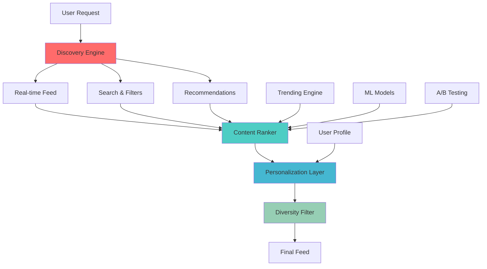

# Content Discovery & Recommendation Engine

## Overview

Advanced content discovery and recommendation system that personalizes the political engagement experience through machine learning-driven algorithms, real-time trend analysis, and sophisticated user behavior modeling.

## Architecture Overview



## Real-Time Content Discovery

### Dynamic Feed Generation

```typescript
// services/discovery.service.ts
import { Pool } from 'pg';
import { RecommendationService } from './recommendation.service';
import { PersonalizationService } from './personalization.service';
import { TrendingService } from './trending.service';

interface FeedRequest {
  userId: string;
  contentTypes: ContentType[];
  filters: FeedFilters;
  pagination: PaginationParams;
  context: FeedContext;
}

interface FeedFilters {
  tagIds?: string[];
  organizationIds?: string[];
  locations?: LocationFilter[];
  dateRange?: DateRange;
  engagementTypes?: EngagementType[];
  difficulty?: 'beginner' | 'intermediate' | 'advanced';
  timeCommitment?: TimeCommitmentFilter;
}

interface FeedContext {
  sessionId: string;
  deviceType: 'mobile' | 'desktop' | 'tablet';
  location?: GeolocationData;
  timeOfDay: number;
  dayOfWeek: number;
  previousInteractions: string[]; // Recently viewed content IDs
}

interface DiscoveryResult {
  items: FeedItem[];
  metadata: FeedMetadata;
  experiments: ActiveExperiment[];
  nextCursor?: string;
}

interface FeedItem {
  id: string;
  type: ContentType;
  data: any;
  score: number;
  reasons: RecommendationReason[];
  position: number;
  experimentId?: string;
  personalizedRanking: PersonalizedRanking;
}

interface PersonalizedRanking {
  relevanceScore: number;
  diversityBonus: number;
  trendinessBonus: number;
  locationRelevance: number;
  temporalRelevance: number;
  socialProofScore: number;
  qualityScore: number;
  finalScore: number;
}

export class DiscoveryService {
  constructor(
    private pool: Pool,
    private recommendationService: RecommendationService,
    private personalizationService: PersonalizationService,
    private trendingService: TrendingService,
    private abTestingService: ABTestingService,
    private redis: RedisClient // For caching and real-time data
  ) {}

  async generateDiscoveryFeed(request: FeedRequest): Promise<DiscoveryResult> {
    // Get user profile and context
    const userProfile = await this.personalizationService.getUserProfile(request.userId);
    const activeExperiments = await this.abTestingService.getActiveExperiments(request.userId);

    // Generate content candidates from multiple sources
    const [
      personalizedContent,
      trendingContent,
      locationBasedContent,
      followedOrgsContent,
      diversityContent
    ] = await Promise.all([
      this.getPersonalizedContent(request, userProfile),
      this.getTrendingContent(request, userProfile),
      this.getLocationBasedContent(request, userProfile),
      this.getFollowedOrganizationsContent(request),
      this.getDiversityContent(request, userProfile)
    ]);

    // Merge and rank all content
    const allCandidates = [
      ...personalizedContent,
      ...trendingContent,
      ...locationBasedContent,
      ...followedOrgsContent,
      ...diversityContent
    ];

    // Apply ranking algorithm
    const rankedItems = await this.rankContent(allCandidates, userProfile, request.context);

    // Apply diversity and freshness filters
    const diversifiedItems = this.applyDiversityFilters(rankedItems, userProfile);

    // Apply experimental treatments
    const experimentalItems = await this.applyExperimentalTreatments(
      diversifiedItems,
      activeExperiments,
      request.userId
    );

    // Paginate results
    const paginatedResults = this.paginate(experimentalItems, request.pagination);

    // Log for analytics and learning
    await this.logDiscoveryResults(request.userId, paginatedResults, request.context);

    return {
      items: paginatedResults.items,
      metadata: {
        totalCount: experimentalItems.length,
        algorithms: ['personalized', 'trending', 'location', 'social', 'diversity'],
        personalizationStrength: this.calculatePersonalizationStrength(userProfile),
        diversityScore: this.calculateDiversityScore(paginatedResults.items),
        freshnessScore: this.calculateFreshnessScore(paginatedResults.items)
      },
      experiments: activeExperiments,
      nextCursor: paginatedResults.nextCursor
    };
  }

  private async getPersonalizedContent(
    request: FeedRequest,
    userProfile: UserProfile
  ): Promise<FeedCandidate[]> {
    if (userProfile.tagAffinities.length === 0) {
      // For new users, use popular content from their location or similar demographics
      return this.getPopularContentForNewUsers(request);
    }

    const topTags = userProfile.tagAffinities.slice(0, 10).map(ta => ta.tagId);

    const query = `
      WITH user_interests AS (
        SELECT unnest($1::text[]) as tag_id,
               unnest($2::float[]) as affinity_score
      ),
      relevant_content AS (
        SELECT
          CASE
            WHEN e.id IS NOT NULL THEN 'event'
            WHEN f.id IS NOT NULL THEN 'fundraiser'
            WHEN o.id IS NOT NULL THEN 'organization'
          END as content_type,
          COALESCE(e.id, f.id, o.id) as content_id,
          COALESCE(e.title, f.title, o.name) as title,
          COALESCE(e.description, f.description, o.mission_statement) as description,
          COALESCE(e.start_date, f.end_date, o.created_at) as date_field,
          COALESCE(e.location, f.location, o.address) as location,
          COALESCE(e.created_at, f.created_at, o.created_at) as created_at,
          SUM(ct.relevance_score * ui.affinity_score) as relevance_score,
          COUNT(ct.tag_id) as matching_tags,
          ARRAY_AGG(DISTINCT t.name) as matched_tag_names
        FROM content_tags ct
        JOIN user_interests ui ON ct.tag_id = ui.tag_id
        JOIN tags t ON ct.tag_id = t.id
        LEFT JOIN events e ON ct.content_type = 'event' AND ct.content_id = e.id AND e.status = 'published' AND e.start_date > NOW()
        LEFT JOIN fundraisers f ON ct.content_type = 'fundraiser' AND ct.content_id = f.id AND f.status = 'active'
        LEFT JOIN organizations o ON ct.content_type = 'organization' AND ct.content_id = o.id AND o.status = 'active'
        WHERE ct.content_type = ANY($3)
          AND (e.id IS NOT NULL OR f.id IS NOT NULL OR o.id IS NOT NULL)
          -- Exclude recently viewed content
          AND NOT EXISTS (
            SELECT 1 FROM user_interactions ui2
            WHERE ui2.user_id = $4
              AND ui2.content_type = ct.content_type
              AND ui2.content_id = ct.content_id
              AND ui2.created_at >= NOW() - INTERVAL '24 hours'
          )
        GROUP BY content_type, content_id, title, description, date_field, location, created_at
        HAVING SUM(ct.relevance_score * ui.affinity_score) > 0.3
      )
      SELECT
        *,
        -- Boost recent content
        relevance_score * (1 + GREATEST(0, 1 - EXTRACT(epoch FROM (NOW() - created_at)) / 86400.0 / 7)) as boosted_score
      FROM relevant_content
      ORDER BY boosted_score DESC
      LIMIT 50
    `;

    const tagIds = topTags;
    const affinityScores = userProfile.tagAffinities.slice(0, 10).map(ta => ta.affinityScore);

    const { rows } = await this.pool.query(query, [
      tagIds,
      affinityScores,
      request.contentTypes,
      request.userId
    ]);

    return rows.map(row => ({
      id: row.content_id,
      type: row.content_type,
      title: row.title,
      description: row.description,
      score: parseFloat(row.boosted_score),
      data: {
        dateField: row.date_field,
        location: row.location,
        createdAt: row.created_at
      },
      reasons: [{
        type: 'tag_match',
        weight: 0.8,
        description: `Matches your interests in ${row.matched_tag_names.slice(0, 3).join(', ')}`,
        data: { matchingTags: row.matching_tags, tagNames: row.matched_tag_names }
      }],
      source: 'personalized'
    }));
  }

  private async getTrendingContent(
    request: FeedRequest,
    userProfile: UserProfile
  ): Promise<FeedCandidate[]> {
    const trendingItems = await this.trendingService.getTrendingContent(
      request.contentTypes,
      {
        timeframe: '24hours',
        minInteractions: 5,
        minUniqueUsers: 3,
        location: request.context.location,
        userProfile
      }
    );

    return trendingItems.map(item => ({
      id: item.contentId,
      type: item.contentType,
      title: item.title,
      description: item.description,
      score: item.trendingScore * 0.6, // Lower weight for trending
      data: item.data,
      reasons: [{
        type: 'trending',
        weight: 0.4,
        description: `Trending with ${item.uniqueUsers} people engaging recently`,
        data: { uniqueUsers: item.uniqueUsers, velocity: item.velocity }
      }],
      source: 'trending'
    }));
  }

  private async getLocationBasedContent(
    request: FeedRequest,
    userProfile: UserProfile
  ): Promise<FeedCandidate[]> {
    if (!request.context.location) return [];

    const { latitude, longitude } = request.context.location;

    const query = `
      WITH nearby_content AS (
        SELECT
          CASE
            WHEN e.id IS NOT NULL THEN 'event'
            WHEN f.id IS NOT NULL THEN 'fundraiser'
            WHEN o.id IS NOT NULL THEN 'organization'
          END as content_type,
          COALESCE(e.id, f.id, o.id) as content_id,
          COALESCE(e.title, f.title, o.name) as title,
          COALESCE(e.description, f.description, o.mission_statement) as description,
          COALESCE(e.location, f.location, o.address) as location_data,
          ST_Distance(
            ST_Point($1, $2)::geography,
            ST_Point(
              CAST(COALESCE(e.location, f.location, o.address)->>'longitude' as float),
              CAST(COALESCE(e.location, f.location, o.address)->>'latitude' as float)
            )::geography
          ) / 1000.0 as distance_km
        FROM events e
        FULL OUTER JOIN fundraisers f ON false
        FULL OUTER JOIN organizations o ON false
        WHERE
          (e.status = 'published' AND e.start_date > NOW()) OR
          (f.status = 'active') OR
          (o.status = 'active')
        AND COALESCE(e.location, f.location, o.address) IS NOT NULL
        AND ST_DWithin(
          ST_Point($1, $2)::geography,
          ST_Point(
            CAST(COALESCE(e.location, f.location, o.address)->>'longitude' as float),
            CAST(COALESCE(e.location, f.location, o.address)->>'latitude' as float)
          )::geography,
          50000 -- 50km radius
        )
      )
      SELECT
        *,
        -- Score based on inverse distance (closer = higher score)
        GREATEST(0, 1 - (distance_km / 50.0)) as location_score
      FROM nearby_content
      WHERE distance_km <= 50
      ORDER BY distance_km
      LIMIT 20
    `;

    const { rows } = await this.pool.query(query, [longitude, latitude]);

    return rows.map(row => ({
      id: row.content_id,
      type: row.content_type,
      title: row.title,
      description: row.description,
      score: parseFloat(row.location_score) * 0.5,
      data: {
        locationData: row.location_data,
        distanceKm: row.distance_km
      },
      reasons: [{
        type: 'location',
        weight: 0.5,
        description: `${Math.round(row.distance_km)} km from your location`,
        data: { distance: row.distance_km }
      }],
      source: 'location'
    }));
  }

  private async getFollowedOrganizationsContent(request: FeedRequest): Promise<FeedCandidate[]> {
    const query = `
      SELECT
        CASE
          WHEN e.id IS NOT NULL THEN 'event'
          WHEN f.id IS NOT NULL THEN 'fundraiser'
        END as content_type,
        COALESCE(e.id, f.id) as content_id,
        COALESCE(e.title, f.title) as title,
        COALESCE(e.description, f.description) as description,
        o.name as organization_name,
        o.id as organization_id,
        COALESCE(e.created_at, f.created_at) as created_at,
        uf.followed_at
      FROM user_follows uf
      JOIN organizations o ON uf.organization_id = o.id
      LEFT JOIN events e ON o.id = e.organization_id AND e.status = 'published' AND e.start_date > NOW()
      LEFT JOIN fundraisers f ON o.id = f.organization_id AND f.status = 'active'
      WHERE uf.user_id = $1
        AND uf.is_active = true
        AND (e.id IS NOT NULL OR f.id IS NOT NULL)
        AND COALESCE(e.created_at, f.created_at) >= NOW() - INTERVAL '30 days'
      ORDER BY COALESCE(e.created_at, f.created_at) DESC
      LIMIT 30
    `;

    const { rows } = await this.pool.query(query, [request.userId]);

    return rows.map(row => ({
      id: row.content_id,
      type: row.content_type,
      title: row.title,
      description: row.description,
      score: 0.7, // High score for followed organizations
      data: {
        organizationName: row.organization_name,
        organizationId: row.organization_id,
        createdAt: row.created_at
      },
      reasons: [{
        type: 'organization_follow',
        weight: 0.7,
        description: `From ${row.organization_name} that you follow`,
        data: { organizationName: row.organization_name }
      }],
      source: 'followed_orgs'
    }));
  }

  private async getDiversityContent(
    request: FeedRequest,
    userProfile: UserProfile
  ): Promise<FeedCandidate[]> {
    // Get content from categories user hasn't engaged with much
    const userTagCategories = new Set(
      userProfile.tagAffinities
        .filter(ta => ta.affinityScore > 0.3)
        .map(ta => ta.tag?.categoryId)
        .filter(Boolean)
    );

    const query = `
      WITH underexplored_categories AS (
        SELECT tc.id, tc.name
        FROM tag_categories tc
        WHERE tc.id NOT IN (${Array.from(userTagCategories).map((_, i) => `$${i + 2}`).join(',') || 'NULL'})
          AND tc.level = 1
          AND tc.is_active = true
      ),
      diverse_content AS (
        SELECT
          ct.content_type,
          ct.content_id,
          COUNT(DISTINCT ct.tag_id) as tag_diversity,
          AVG(t.usage_count) as avg_popularity
        FROM content_tags ct
        JOIN tags t ON ct.tag_id = t.id
        JOIN underexplored_categories uc ON t.category_id = uc.id
        WHERE ct.content_type = ANY($1)
        GROUP BY ct.content_type, ct.content_id
        HAVING COUNT(DISTINCT ct.tag_id) >= 2
      )
      SELECT
        dc.*,
        CASE dc.content_type
          WHEN 'event' THEN (
            SELECT row_to_json(e.*) FROM events e
            WHERE e.id = dc.content_id AND e.status = 'published' AND e.start_date > NOW()
          )
          WHEN 'fundraiser' THEN (
            SELECT row_to_json(f.*) FROM fundraisers f
            WHERE f.id = dc.content_id AND f.status = 'active'
          )
          WHEN 'organization' THEN (
            SELECT row_to_json(o.*) FROM organizations o
            WHERE o.id = dc.content_id AND o.status = 'active'
          )
        END as content_data
      FROM diverse_content dc
      WHERE content_data IS NOT NULL
      ORDER BY dc.tag_diversity DESC, dc.avg_popularity ASC
      LIMIT 15
    `;

    const params = [request.contentTypes, ...Array.from(userTagCategories)];
    const { rows } = await this.pool.query(query, params);

    return rows.map(row => {
      const content = row.content_data;
      return {
        id: row.content_id,
        type: row.content_type,
        title: content.title || content.name,
        description: content.description || content.mission_statement,
        score: 0.3, // Lower score but important for diversity
        data: content,
        reasons: [{
          type: 'diversity',
          weight: 0.3,
          description: 'Discover new areas you might be interested in',
          data: { tagDiversity: row.tag_diversity }
        }],
        source: 'diversity'
      };
    });
  }

  private async rankContent(
    candidates: FeedCandidate[],
    userProfile: UserProfile,
    context: FeedContext
  ): Promise<FeedItem[]> {
    return candidates.map((candidate, index) => {
      const personalizedRanking = this.calculatePersonalizedRanking(candidate, userProfile, context);

      return {
        id: candidate.id,
        type: candidate.type,
        data: candidate.data,
        score: personalizedRanking.finalScore,
        reasons: candidate.reasons,
        position: index,
        personalizedRanking
      };
    }).sort((a, b) => b.score - a.score);
  }

  private calculatePersonalizedRanking(
    candidate: FeedCandidate,
    userProfile: UserProfile,
    context: FeedContext
  ): PersonalizedRanking {
    // Base relevance from recommendation engines
    const relevanceScore = candidate.score;

    // Diversity bonus - reward content from different sources/types
    const diversityBonus = this.calculateDiversityBonus(candidate, context);

    // Trending bonus based on recent engagement velocity
    const trendinessBonus = candidate.source === 'trending' ? 0.2 : 0;

    // Location relevance bonus
    const locationRelevance = candidate.reasons.find(r => r.type === 'location') ? 0.15 : 0;

    // Temporal relevance - boost content relevant to current time
    const temporalRelevance = this.calculateTemporalRelevance(candidate, context);

    // Social proof - boost content that similar users engaged with
    const socialProofScore = candidate.reasons.find(r => r.type === 'similar_users') ? 0.1 : 0;

    // Quality score based on content completeness and engagement
    const qualityScore = this.calculateQualityScore(candidate);

    // Calculate final weighted score
    const finalScore = (
      relevanceScore * 0.4 +
      diversityBonus * 0.15 +
      trendinessBonus * 0.1 +
      locationRelevance * 0.1 +
      temporalRelevance * 0.1 +
      socialProofScore * 0.1 +
      qualityScore * 0.05
    );

    return {
      relevanceScore,
      diversityBonus,
      trendinessBonus,
      locationRelevance,
      temporalRelevance,
      socialProofScore,
      qualityScore,
      finalScore
    };
  }

  private calculateDiversityBonus(candidate: FeedCandidate, context: FeedContext): number {
    // Reduce score if we've seen similar content recently
    const recentlyViewedSimilar = context.previousInteractions.some(id =>
      id.startsWith(candidate.type)
    );

    return recentlyViewedSimilar ? -0.1 : 0.1;
  }

  private calculateTemporalRelevance(candidate: FeedCandidate, context: FeedContext): number {
    const currentHour = context.timeOfDay;
    const currentDay = context.dayOfWeek;

    // Boost events happening soon or during preferred engagement times
    if (candidate.type === 'event' && candidate.data.dateField) {
      const eventDate = new Date(candidate.data.dateField);
      const hoursUntilEvent = (eventDate.getTime() - Date.now()) / (1000 * 60 * 60);

      // Boost events happening in 24-72 hours
      if (hoursUntilEvent > 24 && hoursUntilEvent < 72) {
        return 0.15;
      }
      // Slight boost for events happening this week
      if (hoursUntilEvent > 0 && hoursUntilEvent < 168) {
        return 0.05;
      }
    }

    // TODO: Use user engagement patterns from profile
    return 0;
  }

  private calculateQualityScore(candidate: FeedCandidate): number {
    let score = 0.5; // Base quality score

    // Boost based on content completeness
    if (candidate.description && candidate.description.length > 100) {
      score += 0.2;
    }

    if (candidate.data.location) {
      score += 0.1;
    }

    // Could add more quality signals like:
    // - Organization verification status
    // - Content moderation scores
    // - Historical engagement rates

    return Math.min(1.0, score);
  }

  private applyDiversityFilters(items: FeedItem[], userProfile: UserProfile): FeedItem[] {
    const diversifiedItems: FeedItem[] = [];
    const seenSources = new Set<string>();
    const seenTypes = new Map<ContentType, number>();
    const seenOrganizations = new Set<string>();

    const maxPerType = Math.ceil(items.length / 3);
    const maxPerSource = Math.ceil(items.length / 5);
    const maxPerOrg = 2;

    for (const item of items) {
      const typeCount = seenTypes.get(item.type) || 0;
      const sourceCount = Array.from(seenSources).filter(s => s === item.source).length;
      const orgId = item.data.organizationId;
      const orgCount = orgId ? (seenOrganizations.has(orgId) ? 1 : 0) : 0;

      // Apply diversity rules
      if (typeCount < maxPerType && sourceCount < maxPerSource && orgCount < maxPerOrg) {
        diversifiedItems.push(item);
        seenTypes.set(item.type, typeCount + 1);
        seenSources.add(item.source);
        if (orgId) seenOrganizations.add(orgId);
      }

      // Stop when we have enough diverse items
      if (diversifiedItems.length >= Math.min(50, items.length)) {
        break;
      }
    }

    return diversifiedItems;
  }

  private async applyExperimentalTreatments(
    items: FeedItem[],
    experiments: ActiveExperiment[],
    userId: string
  ): Promise<FeedItem[]> {
    for (const experiment of experiments) {
      items = await this.abTestingService.applyExperimentalTreatment(
        items,
        experiment,
        userId
      );
    }

    return items;
  }

  private paginate(items: FeedItem[], pagination: PaginationParams): PaginationResult<FeedItem> {
    const { limit = 20, cursor } = pagination;
    const startIndex = cursor ? parseInt(cursor) : 0;
    const endIndex = Math.min(startIndex + limit, items.length);

    const paginatedItems = items.slice(startIndex, endIndex);

    return {
      items: paginatedItems,
      nextCursor: endIndex < items.length ? endIndex.toString() : undefined,
      hasMore: endIndex < items.length,
      total: items.length
    };
  }

  private calculatePersonalizationStrength(userProfile: UserProfile): number {
    // Return a value between 0 and 1 indicating how personalized the feed is
    if (userProfile.tagAffinities.length === 0) return 0;

    const avgAffinityScore = userProfile.tagAffinities.reduce((sum, ta) => sum + ta.affinityScore, 0) / userProfile.tagAffinities.length;
    return Math.min(1, avgAffinityScore * userProfile.tagAffinities.length / 10);
  }

  private calculateDiversityScore(items: FeedItem[]): number {
    const types = new Set(items.map(item => item.type));
    const sources = new Set(items.map(item => item.source));

    return (types.size + sources.size) / (items.length / 5); // Normalize by expected diversity
  }

  private calculateFreshnessScore(items: FeedItem[]): number {
    const now = Date.now();
    const avgAge = items.reduce((sum, item) => {
      const createdAt = new Date(item.data.createdAt || 0).getTime();
      return sum + (now - createdAt);
    }, 0) / items.length;

    const daysOld = avgAge / (1000 * 60 * 60 * 24);
    return Math.max(0, 1 - daysOld / 30); // Fresher content gets higher score
  }

  private async logDiscoveryResults(
    userId: string,
    results: PaginationResult<FeedItem>,
    context: FeedContext
  ): Promise<void> {
    // Log for analytics, A/B testing, and ML training
    await this.pool.query(`
      INSERT INTO feed_generation_logs (
        user_id,
        session_id,
        context_data,
        items_shown,
        generation_timestamp,
        personalization_strength,
        diversity_score,
        freshness_score
      ) VALUES ($1, $2, $3, $4, $5, $6, $7, $8)
    `, [
      userId,
      context.sessionId,
      JSON.stringify(context),
      JSON.stringify(results.items.map(item => ({
        id: item.id,
        type: item.type,
        score: item.score,
        position: item.position,
        reasons: item.reasons.map(r => r.type)
      }))),
      new Date(),
      this.calculatePersonalizationStrength(await this.personalizationService.getUserProfile(userId)),
      this.calculateDiversityScore(results.items),
      this.calculateFreshnessScore(results.items)
    ]);
  }
}

// Supporting interfaces
interface FeedCandidate {
  id: string;
  type: ContentType;
  title: string;
  description: string;
  score: number;
  data: any;
  reasons: RecommendationReason[];
  source: string;
}

interface ActiveExperiment {
  id: string;
  name: string;
  variant: string;
  parameters: Record<string, any>;
}

interface FeedMetadata {
  totalCount: number;
  algorithms: string[];
  personalizationStrength: number;
  diversityScore: number;
  freshnessScore: number;
}

interface PaginationParams {
  limit?: number;
  cursor?: string;
}

interface PaginationResult<T> {
  items: T[];
  nextCursor?: string;
  hasMore: boolean;
  total: number;
}

interface GeolocationData {
  latitude: number;
  longitude: number;
  accuracy: number;
  city?: string;
  state?: string;
  country?: string;
}

type ContentType = 'event' | 'fundraiser' | 'organization';
type EngagementType = 'view' | 'like' | 'share' | 'comment' | 'bookmark' | 'attend' | 'donate';
```

## Advanced Search & Filtering

### Elasticsearch Integration

```typescript
// services/search.service.ts
import { Client as ElasticsearchClient } from '@elastic/elasticsearch';

interface SearchRequest {
  query: string;
  filters: SearchFilters;
  sort: SortOptions;
  pagination: PaginationParams;
  userId?: string;
}

interface SearchFilters {
  contentTypes?: ContentType[];
  tagIds?: string[];
  organizationIds?: string[];
  locationFilter?: LocationSearchFilter;
  dateRange?: DateRange;
  engagementTypes?: EngagementType[];
  verificationType?: 'verified' | 'unverified' | 'all';
}

interface LocationSearchFilter {
  center?: { lat: number; lon: number };
  radius?: string; // e.g., "10km", "50mi"
  city?: string;
  state?: string;
  country?: string;
}

interface SearchResult {
  items: SearchResultItem[];
  aggregations: SearchAggregations;
  suggestions: SearchSuggestion[];
  metadata: SearchMetadata;
}

interface SearchResultItem {
  id: string;
  type: ContentType;
  title: string;
  description: string;
  highlights: { [field: string]: string[] };
  score: number;
  data: any;
}

export class SearchService {
  constructor(
    private elasticsearch: ElasticsearchClient,
    private personalizationService: PersonalizationService
  ) {}

  async search(request: SearchRequest): Promise<SearchResult> {
    const userProfile = request.userId
      ? await this.personalizationService.getUserProfile(request.userId)
      : null;

    // Build Elasticsearch query
    const esQuery = this.buildElasticsearchQuery(request, userProfile);

    // Execute search with aggregations
    const response = await this.elasticsearch.search({
      index: ['events', 'fundraisers', 'organizations'],
      body: {
        query: esQuery.query,
        highlight: esQuery.highlight,
        aggs: esQuery.aggregations,
        sort: esQuery.sort,
        from: request.pagination.cursor ? parseInt(request.pagination.cursor) : 0,
        size: request.pagination.limit || 20
      }
    });

    // Process results
    const items = this.processSearchResults(response.body.hits.hits);
    const aggregations = this.processAggregations(response.body.aggregations);
    const suggestions = await this.generateSearchSuggestions(request.query, userProfile);

    return {
      items,
      aggregations,
      suggestions,
      metadata: {
        totalHits: response.body.hits.total.value,
        took: response.body.took,
        maxScore: response.body.hits.max_score,
        hasPersonalization: !!userProfile
      }
    };
  }

  private buildElasticsearchQuery(request: SearchRequest, userProfile?: UserProfile) {
    const mustQueries = [];
    const filterQueries = [];
    const shouldQueries = [];

    // Main text search
    if (request.query.trim()) {
      mustQueries.push({
        multi_match: {
          query: request.query,
          fields: [
            'title^3',
            'description^2',
            'tags.name^2',
            'organization_name',
            'location.city',
            'location.state'
          ],
          type: 'best_fields',
          fuzziness: 'AUTO',
          operator: 'and'
        }
      });
    }

    // Content type filter
    if (request.filters.contentTypes?.length) {
      filterQueries.push({
        terms: { _index: request.filters.contentTypes }
      });
    }

    // Tag filters
    if (request.filters.tagIds?.length) {
      filterQueries.push({
        terms: { 'tags.id': request.filters.tagIds }
      });
    }

    // Location filter
    if (request.filters.locationFilter) {
      const locationFilter = request.filters.locationFilter;

      if (locationFilter.center && locationFilter.radius) {
        filterQueries.push({
          geo_distance: {
            distance: locationFilter.radius,
            'location.coordinates': {
              lat: locationFilter.center.lat,
              lon: locationFilter.center.lon
            }
          }
        });
      }

      if (locationFilter.city) {
        filterQueries.push({
          match: { 'location.city': locationFilter.city }
        });
      }

      if (locationFilter.state) {
        filterQueries.push({
          match: { 'location.state': locationFilter.state }
        });
      }
    }

    // Date range filter
    if (request.filters.dateRange) {
      filterQueries.push({
        range: {
          start_date: {
            gte: request.filters.dateRange.start,
            lte: request.filters.dateRange.end
          }
        }
      });
    }

    // Personalization boost
    if (userProfile?.tagAffinities.length) {
      const userTags = userProfile.tagAffinities.slice(0, 10);

      shouldQueries.push({
        terms: {
          'tags.id': userTags.map(ta => ta.tagId),
          boost: 2.0
        }
      });

      // Boost content from followed organizations
      if (userProfile.followedOrganizations?.length) {
        shouldQueries.push({
          terms: {
            'organization_id': userProfile.followedOrganizations,
            boost: 1.5
          }
        });
      }
    }

    const query = {
      bool: {
        must: mustQueries,
        filter: filterQueries,
        should: shouldQueries,
        minimum_should_match: shouldQueries.length > 0 ? 1 : 0
      }
    };

    return {
      query,
      highlight: {
        fields: {
          title: {},
          description: { fragment_size: 150, number_of_fragments: 2 },
          'tags.name': {}
        },
        pre_tags: ['<em>'],
        post_tags: ['</em>']
      },
      aggregations: {
        content_types: {
          terms: { field: '_index' }
        },
        tags: {
          nested: {
            path: 'tags'
          },
          aggs: {
            tag_names: {
              terms: { field: 'tags.name', size: 20 }
            }
          }
        },
        organizations: {
          terms: { field: 'organization_id', size: 10 }
        },
        locations: {
          terms: { field: 'location.state', size: 10 }
        },
        date_histogram: {
          date_histogram: {
            field: 'start_date',
            calendar_interval: 'week'
          }
        }
      },
      sort: this.buildSortOptions(request.sort)
    };
  }

  private buildSortOptions(sort: SortOptions) {
    const sortOptions = [];

    switch (sort.by) {
      case 'relevance':
        sortOptions.push({ _score: { order: 'desc' } });
        break;
      case 'date':
        sortOptions.push({ start_date: { order: sort.direction || 'desc' } });
        break;
      case 'popularity':
        sortOptions.push({
          engagement_score: { order: 'desc' },
          _score: { order: 'desc' }
        });
        break;
      case 'location':
        if (sort.location) {
          sortOptions.push({
            _geo_distance: {
              'location.coordinates': {
                lat: sort.location.lat,
                lon: sort.location.lon
              },
              order: 'asc',
              unit: 'km'
            }
          });
        }
        break;
      default:
        sortOptions.push({ _score: { order: 'desc' } });
    }

    return sortOptions;
  }

  private processSearchResults(hits: any[]): SearchResultItem[] {
    return hits.map(hit => ({
      id: hit._id,
      type: hit._index,
      title: hit._source.title || hit._source.name,
      description: hit._source.description || hit._source.mission_statement,
      highlights: hit.highlight || {},
      score: hit._score,
      data: hit._source
    }));
  }

  private processAggregations(aggregations: any): SearchAggregations {
    return {
      contentTypes: aggregations.content_types?.buckets || [],
      tags: aggregations.tags?.tag_names?.buckets || [],
      organizations: aggregations.organizations?.buckets || [],
      locations: aggregations.locations?.buckets || [],
      dateDistribution: aggregations.date_histogram?.buckets || []
    };
  }

  private async generateSearchSuggestions(
    query: string,
    userProfile?: UserProfile
  ): Promise<SearchSuggestion[]> {
    const suggestions: SearchSuggestion[] = [];

    // Generate suggestions based on popular searches, user history, and trending topics
    if (query.length >= 2) {
      const response = await this.elasticsearch.search({
        index: ['search_suggestions'],
        body: {
          suggest: {
            autocomplete: {
              prefix: query,
              completion: {
                field: 'suggest',
                size: 5,
                contexts: userProfile ? {
                  user_tags: userProfile.tagAffinities.slice(0, 5).map(ta => ta.tagId)
                } : {}
              }
            }
          }
        }
      });

      if (response.body.suggest?.autocomplete?.[0]?.options) {
        response.body.suggest.autocomplete[0].options.forEach((option: any) => {
          suggestions.push({
            text: option.text,
            type: 'autocomplete',
            score: option._score
          });
        });
      }
    }

    return suggestions;
  }
}

// Supporting interfaces
interface SortOptions {
  by: 'relevance' | 'date' | 'popularity' | 'location';
  direction?: 'asc' | 'desc';
  location?: { lat: number; lon: number };
}

interface SearchAggregations {
  contentTypes: Array<{ key: string; doc_count: number }>;
  tags: Array<{ key: string; doc_count: number }>;
  organizations: Array<{ key: string; doc_count: number }>;
  locations: Array<{ key: string; doc_count: number }>;
  dateDistribution: Array<{ key: string; doc_count: number }>;
}

interface SearchSuggestion {
  text: string;
  type: 'autocomplete' | 'trending' | 'related';
  score: number;
}

interface SearchMetadata {
  totalHits: number;
  took: number;
  maxScore: number;
  hasPersonalization: boolean;
}
```

## Trending & Real-Time Analytics

### Trending Algorithm Implementation

```typescript
// services/trending.service.ts
import { Pool } from 'pg';
import { RedisClient } from 'redis';

interface TrendingRequest {
  contentTypes: ContentType[];
  timeframe: '1hour' | '6hours' | '24hours' | '7days';
  location?: GeolocationData;
  userProfile?: UserProfile;
  minInteractions?: number;
  minUniqueUsers?: number;
}

interface TrendingItem {
  contentId: string;
  contentType: ContentType;
  title: string;
  description: string;
  trendingScore: number;
  velocity: number;
  uniqueUsers: number;
  totalInteractions: number;
  data: any;
}

interface TrendingMetrics {
  interactionCount: number;
  uniqueUserCount: number;
  velocity: number; // interactions per hour
  acceleration: number; // change in velocity
  diversityScore: number;
  qualityScore: number;
}

export class TrendingService {
  constructor(
    private pool: Pool,
    private redis: RedisClient
  ) {}

  async getTrendingContent(
    contentTypes: ContentType[],
    options: TrendingRequest
  ): Promise<TrendingItem[]> {
    // Check cache first
    const cacheKey = `trending:${JSON.stringify({ contentTypes, ...options })}`;
    const cached = await this.redis.get(cacheKey);

    if (cached) {
      return JSON.parse(cached);
    }

    // Calculate trending items
    const trendingItems = await this.calculateTrendingItems(contentTypes, options);

    // Cache results for 5 minutes
    await this.redis.setex(cacheKey, 300, JSON.stringify(trendingItems));

    return trendingItems;
  }

  private async calculateTrendingItems(
    contentTypes: ContentType[],
    options: TrendingRequest
  ): Promise<TrendingItem[]> {
    const timeframe = this.getTimeframeHours(options.timeframe);
    const currentTime = new Date();
    const startTime = new Date(currentTime.getTime() - (timeframe * 60 * 60 * 1000));

    // Get trending candidates with interaction metrics
    const query = `
      WITH interaction_metrics AS (
        SELECT
          ui.content_type,
          ui.content_id,
          COUNT(*) as total_interactions,
          COUNT(DISTINCT ui.user_id) as unique_users,
          COUNT(*) / EXTRACT(EPOCH FROM (CURRENT_TIMESTAMP - $1)) * 3600 as velocity,
          -- Weight different interaction types
          SUM(
            CASE ui.interaction_type
              WHEN 'view' THEN 1
              WHEN 'like' THEN 3
              WHEN 'share' THEN 5
              WHEN 'comment' THEN 4
              WHEN 'bookmark' THEN 6
              WHEN 'attend' THEN 8
              WHEN 'donate' THEN 10
              ELSE 1
            END
          ) as weighted_score,
          -- Calculate engagement diversity
          COUNT(DISTINCT ui.interaction_type) as interaction_diversity
        FROM user_interactions ui
        WHERE ui.created_at >= $1
          AND ui.content_type = ANY($2)
        GROUP BY ui.content_type, ui.content_id
        HAVING COUNT(*) >= $3 AND COUNT(DISTINCT ui.user_id) >= $4
      ),
      content_details AS (
        SELECT
          im.*,
          CASE im.content_type
            WHEN 'event' THEN (
              SELECT row_to_json(e.*) FROM events e
              WHERE e.id = im.content_id
                AND e.status = 'published'
                AND e.start_date > CURRENT_TIMESTAMP
            )
            WHEN 'fundraiser' THEN (
              SELECT row_to_json(f.*) FROM fundraisers f
              WHERE f.id = im.content_id
                AND f.status = 'active'
            )
            WHEN 'organization' THEN (
              SELECT row_to_json(o.*) FROM organizations o
              WHERE o.id = im.content_id
                AND o.status = 'active'
                AND o.verification_status = 'verified'
            )
          END as content_data
        FROM interaction_metrics im
      ),
      trending_scores AS (
        SELECT
          cd.*,
          -- Calculate trending score combining multiple factors
          (
            cd.velocity * 0.4 +                          -- Current velocity
            (cd.weighted_score / cd.total_interactions) * 0.3 +  -- Interaction quality
            (cd.unique_users / cd.total_interactions) * 0.2 +    -- User diversity
            cd.interaction_diversity * 0.1                       -- Engagement diversity
          ) as trending_score
        FROM content_details cd
        WHERE cd.content_data IS NOT NULL
      )
      SELECT * FROM trending_scores
      ORDER BY trending_score DESC
      LIMIT 50
    `;

    const { rows } = await this.pool.query(query, [
      startTime,
      contentTypes,
      options.minInteractions || 5,
      options.minUniqueUsers || 3
    ]);

    // Process results and apply additional filtering/boosting
    const trendingItems = rows.map(row => {
      const content = row.content_data;
      const trendingScore = this.applyAdditionalFactors(
        parseFloat(row.trending_score),
        row,
        options
      );

      return {
        contentId: row.content_id,
        contentType: row.content_type,
        title: content.title || content.name,
        description: content.description || content.mission_statement,
        trendingScore,
        velocity: parseFloat(row.velocity),
        uniqueUsers: row.unique_users,
        totalInteractions: row.total_interactions,
        data: content
      };
    });

    // Sort by final trending score
    return trendingItems.sort((a, b) => b.trendingScore - a.trendingScore);
  }

  private applyAdditionalFactors(
    baseScore: number,
    row: any,
    options: TrendingRequest
  ): number {
    let adjustedScore = baseScore;

    // Location boost - prefer local content
    if (options.location && row.content_data.location) {
      const distance = this.calculateDistance(
        options.location,
        {
          latitude: row.content_data.location.latitude,
          longitude: row.content_data.location.longitude
        }
      );

      // Boost content within 50km
      if (distance < 50) {
        adjustedScore *= 1.2;
      }
    }

    // User profile boost - prefer content aligned with user interests
    if (options.userProfile?.tagAffinities.length) {
      // This would require joining with content_tags - simplified for brevity
      // In practice, you'd check tag overlap and boost accordingly
      adjustedScore *= 1.0; // Placeholder
    }

    // Quality boost - verified organizations get a boost
    if (row.content_data.verification_status === 'verified') {
      adjustedScore *= 1.1;
    }

    // Recency boost - newer content gets slight boost
    const hoursOld = (Date.now() - new Date(row.content_data.created_at).getTime()) / (1000 * 60 * 60);
    if (hoursOld < 24) {
      adjustedScore *= (1 + (24 - hoursOld) / 240); // Up to 10% boost for very recent content
    }

    return adjustedScore;
  }

  private getTimeframeHours(timeframe: string): number {
    switch (timeframe) {
      case '1hour': return 1;
      case '6hours': return 6;
      case '24hours': return 24;
      case '7days': return 168;
      default: return 24;
    }
  }

  private calculateDistance(
    location1: { latitude: number; longitude: number },
    location2: { latitude: number; longitude: number }
  ): number {
    const R = 6371; // Earth's radius in kilometers
    const dLat = (location2.latitude - location1.latitude) * Math.PI / 180;
    const dLon = (location2.longitude - location1.longitude) * Math.PI / 180;

    const a = Math.sin(dLat / 2) * Math.sin(dLat / 2) +
      Math.cos(location1.latitude * Math.PI / 180) * Math.cos(location2.latitude * Math.PI / 180) *
      Math.sin(dLon / 2) * Math.sin(dLon / 2);

    const c = 2 * Math.atan2(Math.sqrt(a), Math.sqrt(1 - a));
    return R * c; // Distance in kilometers
  }

  async trackInteractionForTrending(
    userId: string,
    contentType: ContentType,
    contentId: string,
    interactionType: string
  ): Promise<void> {
    // Update real-time trending metrics in Redis
    const now = Date.now();
    const hourKey = Math.floor(now / (1000 * 60 * 60)); // Current hour

    const trendingKeys = [
      `trending:${contentType}:${contentId}:${hourKey}`,
      `trending:users:${contentType}:${contentId}:${hourKey}`,
      `trending:interactions:${contentType}:${contentId}:${hourKey}`
    ];

    const pipeline = this.redis.pipeline();

    // Increment interaction count
    pipeline.zincrby(trendingKeys[0], 1, `${contentType}:${contentId}`);

    // Track unique users
    pipeline.sadd(trendingKeys[1], userId);

    // Track interaction types
    pipeline.hincrby(trendingKeys[2], interactionType, 1);

    // Set expiry for 7 days
    trendingKeys.forEach(key => pipeline.expire(key, 7 * 24 * 60 * 60));

    await pipeline.exec();

    // Also update database for persistent analytics
    await this.pool.query(`
      INSERT INTO user_interactions (
        user_id, content_type, content_id, interaction_type, created_at
      ) VALUES ($1, $2, $3, $4, $5)
    `, [userId, contentType, contentId, interactionType, new Date()]);
  }
}
```

## A/B Testing Framework

### Experimentation Service

```typescript
// services/ab-testing.service.ts
interface Experiment {
  id: string;
  name: string;
  description: string;
  status: 'draft' | 'active' | 'paused' | 'completed';
  variants: ExperimentVariant[];
  trafficAllocation: number; // Percentage of users to include
  startDate: Date;
  endDate: Date;
  targetingRules: TargetingRule[];
  metrics: ExperimentMetric[];
}

interface ExperimentVariant {
  id: string;
  name: string;
  trafficWeight: number; // Percentage within experiment
  parameters: Record<string, any>;
}

interface TargetingRule {
  type: 'user_tag' | 'location' | 'user_type' | 'device_type' | 'new_user';
  operator: 'equals' | 'contains' | 'in' | 'not_in';
  values: string[];
}

interface ExperimentMetric {
  name: string;
  type: 'engagement' | 'conversion' | 'retention' | 'custom';
  description: string;
  isPrimary: boolean;
}

export class ABTestingService {
  constructor(
    private pool: Pool,
    private redis: RedisClient
  ) {}

  async getActiveExperiments(userId: string): Promise<ActiveExperiment[]> {
    // Get user's experiment assignments from cache first
    const cacheKey = `experiments:${userId}`;
    const cached = await this.redis.get(cacheKey);

    if (cached) {
      return JSON.parse(cached);
    }

    // Calculate experiment assignments
    const activeExperiments = await this.calculateExperimentAssignments(userId);

    // Cache for 1 hour
    await this.redis.setex(cacheKey, 3600, JSON.stringify(activeExperiments));

    return activeExperiments;
  }

  private async calculateExperimentAssignments(userId: string): Promise<ActiveExperiment[]> {
    // Get all active experiments
    const experiments = await this.getActiveExperimentsList();
    const userProfile = await this.getUserForExperimentation(userId);
    const assignments: ActiveExperiment[] = [];

    for (const experiment of experiments) {
      // Check if user matches targeting rules
      if (!this.matchesTargetingRules(userProfile, experiment.targetingRules)) {
        continue;
      }

      // Determine if user is in experiment based on traffic allocation
      const userHash = this.hashUserForExperiment(userId, experiment.id);
      if (userHash < experiment.trafficAllocation) {
        // Assign variant based on weights
        const variant = this.assignVariant(experiment.variants, userHash);

        assignments.push({
          id: experiment.id,
          name: experiment.name,
          variant: variant.id,
          parameters: variant.parameters
        });
      }
    }

    return assignments;
  }

  async applyExperimentalTreatment(
    items: FeedItem[],
    experiment: ActiveExperiment,
    userId: string
  ): Promise<FeedItem[]> {
    const { parameters } = experiment;

    switch (experiment.name) {
      case 'ranking_algorithm':
        return this.applyRankingAlgorithmExperiment(items, parameters);

      case 'diversity_filter':
        return this.applyDiversityFilterExperiment(items, parameters);

      case 'content_type_distribution':
        return this.applyContentTypeDistributionExperiment(items, parameters);

      case 'personalization_strength':
        return this.applyPersonalizationStrengthExperiment(items, parameters, userId);

      default:
        return items;
    }
  }

  private applyRankingAlgorithmExperiment(
    items: FeedItem[],
    parameters: Record<string, any>
  ): FeedItem[] {
    const { relevanceWeight = 0.4, diversityWeight = 0.15, trendinessWeight = 0.1 } = parameters;

    return items.map(item => ({
      ...item,
      score: (
        item.personalizedRanking.relevanceScore * relevanceWeight +
        item.personalizedRanking.diversityBonus * diversityWeight +
        item.personalizedRanking.trendinessBonus * trendinessWeight +
        item.personalizedRanking.locationRelevance * 0.1 +
        item.personalizedRanking.temporalRelevance * 0.1 +
        item.personalizedRanking.socialProofScore * 0.1 +
        item.personalizedRanking.qualityScore * 0.05
      )
    })).sort((a, b) => b.score - a.score);
  }

  private applyDiversityFilterExperiment(
    items: FeedItem[],
    parameters: Record<string, any>
  ): FeedItem[] {
    const { maxPerType = 10, maxPerSource = 8 } = parameters;

    const diversifiedItems: FeedItem[] = [];
    const typeCounts = new Map<string, number>();
    const sourceCounts = new Map<string, number>();

    for (const item of items) {
      const typeCount = typeCounts.get(item.type) || 0;
      const sourceCount = sourceCounts.get(item.source) || 0;

      if (typeCount < maxPerType && sourceCount < maxPerSource) {
        diversifiedItems.push(item);
        typeCounts.set(item.type, typeCount + 1);
        sourceCounts.set(item.source, sourceCount + 1);
      }

      if (diversifiedItems.length >= 50) break;
    }

    return diversifiedItems;
  }

  private hashUserForExperiment(userId: string, experimentId: string): number {
    // Create a consistent hash for user-experiment combination
    const crypto = require('crypto');
    const hash = crypto.createHash('md5').update(`${userId}:${experimentId}`).digest('hex');
    return parseInt(hash.substr(0, 8), 16) / 0xffffffff;
  }

  async trackExperimentEvent(
    userId: string,
    experimentId: string,
    variant: string,
    eventType: string,
    eventData?: Record<string, any>
  ): Promise<void> {
    // Log experiment events for analysis
    await this.pool.query(`
      INSERT INTO experiment_events (
        user_id, experiment_id, variant, event_type, event_data, created_at
      ) VALUES ($1, $2, $3, $4, $5, $6)
    `, [userId, experimentId, variant, eventType, JSON.stringify(eventData), new Date()]);
  }
}
```

This comprehensive content discovery and recommendation engine provides a sophisticated foundation for personalizing the political engagement experience, ensuring users discover the most relevant content while maintaining diversity and fostering democratic participation across different viewpoints and organizations.