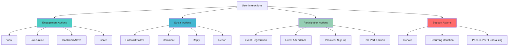

# User Engagement & Interaction Features

## Overview

Comprehensive user engagement system that fosters meaningful political participation through likes, shares, comments, event attendance, donations, and social interactions while maintaining democratic discourse and compliance with political contribution regulations.

## Core Interaction Types

### Interaction Taxonomy



### Interaction Database Schema

```sql
-- User Interactions Table
CREATE TABLE user_interactions (
    id UUID PRIMARY KEY DEFAULT gen_random_uuid(),
    user_id UUID NOT NULL REFERENCES users(id) ON DELETE CASCADE,
    content_type interaction_content_type NOT NULL,
    content_id UUID NOT NULL,
    interaction_type interaction_type NOT NULL,

    -- Engagement metrics
    time_spent INTEGER DEFAULT 0, -- milliseconds
    scroll_depth FLOAT DEFAULT 0, -- percentage
    click_through BOOLEAN DEFAULT false,

    -- Context data
    session_id VARCHAR(255),
    device_type VARCHAR(50),
    location JSONB,
    referrer VARCHAR(500),

    -- Metadata
    interaction_data JSONB,
    created_at TIMESTAMP WITH TIME ZONE DEFAULT CURRENT_TIMESTAMP,
    updated_at TIMESTAMP WITH TIME ZONE DEFAULT CURRENT_TIMESTAMP,

    -- Indexes
    INDEX idx_user_interactions_user_id (user_id),
    INDEX idx_user_interactions_content (content_type, content_id),
    INDEX idx_user_interactions_type (interaction_type),
    INDEX idx_user_interactions_created (created_at),
    INDEX idx_user_interactions_user_content (user_id, content_type, content_id),

    -- Unique constraint to prevent duplicate interactions
    UNIQUE(user_id, content_type, content_id, interaction_type)
    WHERE interaction_type IN ('like', 'bookmark', 'follow', 'attend', 'register')
);

-- Comments and Discussion System
CREATE TABLE user_comments (
    id UUID PRIMARY KEY DEFAULT gen_random_uuid(),
    user_id UUID NOT NULL REFERENCES users(id) ON DELETE CASCADE,
    content_type interaction_content_type NOT NULL,
    content_id UUID NOT NULL,
    parent_comment_id UUID REFERENCES user_comments(id) ON DELETE CASCADE,

    -- Comment content
    content TEXT NOT NULL CHECK (LENGTH(content) > 0 AND LENGTH(content) <= 2000),
    content_html TEXT, -- Sanitized HTML version

    -- Moderation
    status comment_status DEFAULT 'published',
    moderation_reason TEXT,
    moderated_by UUID REFERENCES users(id),
    moderated_at TIMESTAMP WITH TIME ZONE,

    -- Engagement metrics
    like_count INTEGER DEFAULT 0,
    reply_count INTEGER DEFAULT 0,
    report_count INTEGER DEFAULT 0,

    -- Threading
    thread_level INTEGER DEFAULT 0,
    thread_path TEXT, -- For efficient querying of comment threads

    created_at TIMESTAMP WITH TIME ZONE DEFAULT CURRENT_TIMESTAMP,
    updated_at TIMESTAMP WITH TIME ZONE DEFAULT CURRENT_TIMESTAMP,

    -- Indexes
    INDEX idx_comments_content (content_type, content_id),
    INDEX idx_comments_user (user_id),
    INDEX idx_comments_parent (parent_comment_id),
    INDEX idx_comments_thread_path (thread_path),
    INDEX idx_comments_status (status),
    INDEX idx_comments_created (created_at)
);

-- Social Following System
CREATE TABLE user_follows (
    id UUID PRIMARY KEY DEFAULT gen_random_uuid(),
    user_id UUID NOT NULL REFERENCES users(id) ON DELETE CASCADE,
    target_type follow_target_type NOT NULL,
    target_id UUID NOT NULL,

    -- Follow preferences
    notification_preferences JSONB DEFAULT '{"new_content": true, "events": true, "updates": true}',
    is_active BOOLEAN DEFAULT true,

    followed_at TIMESTAMP WITH TIME ZONE DEFAULT CURRENT_TIMESTAMP,
    unfollowed_at TIMESTAMP WITH TIME ZONE,

    -- Indexes
    INDEX idx_follows_user (user_id),
    INDEX idx_follows_target (target_type, target_id),
    UNIQUE(user_id, target_type, target_id)
);

-- User Bookmarks/Saved Items
CREATE TABLE user_bookmarks (
    id UUID PRIMARY KEY DEFAULT gen_random_uuid(),
    user_id UUID NOT NULL REFERENCES users(id) ON DELETE CASCADE,
    content_type interaction_content_type NOT NULL,
    content_id UUID NOT NULL,

    -- Organization
    folder_name VARCHAR(100) DEFAULT 'default',
    notes TEXT,
    tags TEXT[],

    bookmarked_at TIMESTAMP WITH TIME ZONE DEFAULT CURRENT_TIMESTAMP,

    -- Indexes
    INDEX idx_bookmarks_user (user_id),
    INDEX idx_bookmarks_folder (user_id, folder_name),
    UNIQUE(user_id, content_type, content_id)
);

-- Event Participation
CREATE TABLE event_participants (
    id UUID PRIMARY KEY DEFAULT gen_random_uuid(),
    event_id UUID NOT NULL REFERENCES events(id) ON DELETE CASCADE,
    user_id UUID NOT NULL REFERENCES users(id) ON DELETE CASCADE,

    participation_type participation_type NOT NULL,
    status participation_status DEFAULT 'registered',

    -- Registration details
    registration_data JSONB, -- Form responses, accessibility needs, etc.
    confirmation_sent BOOLEAN DEFAULT false,
    reminder_sent BOOLEAN DEFAULT false,

    -- Attendance tracking
    checked_in_at TIMESTAMP WITH TIME ZONE,
    checked_in_by UUID REFERENCES users(id),
    attendance_verified BOOLEAN DEFAULT false,

    registered_at TIMESTAMP WITH TIME ZONE DEFAULT CURRENT_TIMESTAMP,
    updated_at TIMESTAMP WITH TIME ZONE DEFAULT CURRENT_TIMESTAMP,

    -- Indexes
    INDEX idx_participants_event (event_id),
    INDEX idx_participants_user (user_id),
    INDEX idx_participants_status (status),
    UNIQUE(event_id, user_id, participation_type)
);

-- Volunteer Opportunities and Sign-ups
CREATE TABLE volunteer_opportunities (
    id UUID PRIMARY KEY DEFAULT gen_random_uuid(),
    organization_id UUID NOT NULL REFERENCES organizations(id) ON DELETE CASCADE,
    event_id UUID REFERENCES events(id) ON DELETE CASCADE,

    title VARCHAR(200) NOT NULL,
    description TEXT NOT NULL,
    requirements TEXT,
    time_commitment VARCHAR(100),
    location JSONB,

    spots_available INTEGER,
    spots_filled INTEGER DEFAULT 0,

    start_date TIMESTAMP WITH TIME ZONE,
    end_date TIMESTAMP WITH TIME ZONE,
    application_deadline TIMESTAMP WITH TIME ZONE,

    status volunteer_status DEFAULT 'open',

    -- Contact information
    contact_email VARCHAR(255),
    contact_phone VARCHAR(20),
    contact_person VARCHAR(100),

    created_at TIMESTAMP WITH TIME ZONE DEFAULT CURRENT_TIMESTAMP,
    updated_at TIMESTAMP WITH TIME ZONE DEFAULT CURRENT_TIMESTAMP,

    -- Indexes
    INDEX idx_volunteer_org (organization_id),
    INDEX idx_volunteer_event (event_id),
    INDEX idx_volunteer_status (status),
    INDEX idx_volunteer_dates (start_date, end_date)
);

CREATE TABLE volunteer_applications (
    id UUID PRIMARY KEY DEFAULT gen_random_uuid(),
    opportunity_id UUID NOT NULL REFERENCES volunteer_opportunities(id) ON DELETE CASCADE,
    user_id UUID NOT NULL REFERENCES users(id) ON DELETE CASCADE,

    application_data JSONB NOT NULL, -- Form responses, experience, availability
    cover_message TEXT,

    status application_status DEFAULT 'pending',
    reviewed_by UUID REFERENCES users(id),
    reviewed_at TIMESTAMP WITH TIME ZONE,
    review_notes TEXT,

    applied_at TIMESTAMP WITH TIME ZONE DEFAULT CURRENT_TIMESTAMP,

    -- Indexes
    INDEX idx_volunteer_apps_opportunity (opportunity_id),
    INDEX idx_volunteer_apps_user (user_id),
    INDEX idx_volunteer_apps_status (status),
    UNIQUE(opportunity_id, user_id)
);

-- User Sharing and Referrals
CREATE TABLE content_shares (
    id UUID PRIMARY KEY DEFAULT gen_random_uuid(),
    user_id UUID NOT NULL REFERENCES users(id) ON DELETE CASCADE,
    content_type interaction_content_type NOT NULL,
    content_id UUID NOT NULL,

    share_platform VARCHAR(50) NOT NULL, -- 'twitter', 'facebook', 'email', 'link', etc.
    share_url TEXT,
    share_message TEXT,

    -- Tracking
    share_token VARCHAR(100) UNIQUE, -- For click tracking
    clicks_count INTEGER DEFAULT 0,
    conversions_count INTEGER DEFAULT 0,

    shared_at TIMESTAMP WITH TIME ZONE DEFAULT CURRENT_TIMESTAMP,

    -- Indexes
    INDEX idx_shares_user (user_id),
    INDEX idx_shares_content (content_type, content_id),
    INDEX idx_shares_platform (share_platform),
    INDEX idx_shares_token (share_token)
);

-- User Reports and Moderation
CREATE TABLE user_reports (
    id UUID PRIMARY KEY DEFAULT gen_random_uuid(),
    reporter_id UUID NOT NULL REFERENCES users(id) ON DELETE CASCADE,
    reported_type report_target_type NOT NULL,
    reported_id UUID NOT NULL,

    report_reason report_reason NOT NULL,
    description TEXT,
    evidence_urls TEXT[], -- Screenshots, links, etc.

    status report_status DEFAULT 'pending',
    reviewed_by UUID REFERENCES users(id),
    reviewed_at TIMESTAMP WITH TIME ZONE,
    resolution TEXT,

    created_at TIMESTAMP WITH TIME ZONE DEFAULT CURRENT_TIMESTAMP,

    -- Indexes
    INDEX idx_reports_target (reported_type, reported_id),
    INDEX idx_reports_status (status),
    INDEX idx_reports_reporter (reporter_id)
);

-- Enums
CREATE TYPE interaction_content_type AS ENUM ('event', 'fundraiser', 'organization', 'comment', 'user');
CREATE TYPE interaction_type AS ENUM (
    'view', 'like', 'unlike', 'bookmark', 'unbookmark', 'share', 'comment', 'reply',
    'follow', 'unfollow', 'register', 'unregister', 'attend', 'donate', 'volunteer_apply',
    'report', 'click_through', 'scroll_complete'
);
CREATE TYPE comment_status AS ENUM ('published', 'pending', 'hidden', 'removed');
CREATE TYPE follow_target_type AS ENUM ('organization', 'user', 'event', 'fundraiser');
CREATE TYPE participation_type AS ENUM ('attendee', 'volunteer', 'speaker', 'organizer');
CREATE TYPE participation_status AS ENUM ('registered', 'confirmed', 'attended', 'no_show', 'cancelled');
CREATE TYPE volunteer_status AS ENUM ('open', 'closed', 'cancelled', 'completed');
CREATE TYPE application_status AS ENUM ('pending', 'accepted', 'rejected', 'withdrawn');
CREATE TYPE report_target_type AS ENUM ('comment', 'user', 'event', 'fundraiser', 'organization');
CREATE TYPE report_reason AS ENUM (
    'spam', 'harassment', 'inappropriate_content', 'misinformation',
    'hate_speech', 'violence', 'copyright', 'privacy_violation', 'other'
);
CREATE TYPE report_status AS ENUM ('pending', 'investigating', 'resolved', 'dismissed');
```

## Interaction Service Implementation

### Core Interaction Handler

```typescript
// services/interaction.service.ts
import { Pool } from 'pg';
import { NotificationService } from './notification.service';
import { ModerationService } from './moderation.service';
import { ComplianceService } from './compliance.service';

interface InteractionRequest {
  userId: string;
  contentType: ContentType;
  contentId: string;
  interactionType: InteractionType;
  data?: InteractionData;
  context?: InteractionContext;
}

interface InteractionData {
  timeSpent?: number;
  scrollDepth?: number;
  clickThrough?: boolean;
  comment?: string;
  shareMessage?: string;
  sharePlatform?: string;
  bookmarkFolder?: string;
  bookmarkNotes?: string;
  eventRegistrationData?: EventRegistrationData;
  volunteerApplicationData?: VolunteerApplicationData;
}

interface InteractionContext {
  sessionId?: string;
  deviceType?: string;
  location?: GeolocationData;
  referrer?: string;
  userAgent?: string;
}

interface InteractionResult {
  success: boolean;
  interaction?: UserInteraction;
  message?: string;
  restrictions?: ComplianceRestriction[];
}

export class InteractionService {
  constructor(
    private pool: Pool,
    private notificationService: NotificationService,
    private moderationService: ModerationService,
    private complianceService: ComplianceService,
    private redis: RedisClient
  ) {}

  async recordInteraction(request: InteractionRequest): Promise<InteractionResult> {
    try {
      // Validate interaction
      const validation = await this.validateInteraction(request);
      if (!validation.isValid) {
        return { success: false, message: validation.message, restrictions: validation.restrictions };
      }

      // Check for existing interaction (for unique types)
      const existingInteraction = await this.getExistingInteraction(
        request.userId,
        request.contentType,
        request.contentId,
        request.interactionType
      );

      let interaction: UserInteraction;

      if (existingInteraction && this.isUniqueInteractionType(request.interactionType)) {
        // Update existing interaction
        interaction = await this.updateInteraction(existingInteraction.id, request);
      } else {
        // Create new interaction
        interaction = await this.createInteraction(request);
      }

      // Handle interaction-specific logic
      await this.handleInteractionSideEffects(interaction, request);

      // Update engagement metrics
      await this.updateEngagementMetrics(request.contentType, request.contentId, request.interactionType);

      // Track for personalization
      await this.trackForPersonalization(request.userId, interaction);

      return { success: true, interaction };

    } catch (error) {
      console.error('Error recording interaction:', error);
      return { success: false, message: 'Failed to record interaction' };
    }
  }

  private async validateInteraction(request: InteractionRequest): Promise<ValidationResult> {
    // User authentication check
    const user = await this.getUserById(request.userId);
    if (!user || !user.is_active) {
      return { isValid: false, message: 'User not found or inactive' };
    }

    // Content existence check
    const contentExists = await this.verifyContentExists(request.contentType, request.contentId);
    if (!contentExists) {
      return { isValid: false, message: 'Content not found' };
    }

    // Compliance checks (especially for donations)
    if (request.interactionType === 'donate') {
      const complianceCheck = await this.complianceService.validateDonationEligibility(
        request.userId,
        request.contentId,
        request.data?.donationAmount || 0
      );
      if (!complianceCheck.isAllowed) {
        return {
          isValid: false,
          message: complianceCheck.message,
          restrictions: complianceCheck.restrictions
        };
      }
    }

    // Rate limiting checks
    const rateLimitCheck = await this.checkRateLimit(request.userId, request.interactionType);
    if (!rateLimitCheck.allowed) {
      return {
        isValid: false,
        message: `Rate limit exceeded. Try again in ${rateLimitCheck.resetTimeMinutes} minutes.`
      };
    }

    // Content moderation checks (for comments)
    if (request.interactionType === 'comment' && request.data?.comment) {
      const moderationCheck = await this.moderationService.validateComment(request.data.comment);
      if (!moderationCheck.isAllowed) {
        return {
          isValid: false,
          message: 'Comment contains inappropriate content'
        };
      }
    }

    return { isValid: true };
  }

  private async createInteraction(request: InteractionRequest): Promise<UserInteraction> {
    const query = `
      INSERT INTO user_interactions (
        user_id, content_type, content_id, interaction_type,
        time_spent, scroll_depth, click_through,
        session_id, device_type, location, referrer,
        interaction_data
      ) VALUES ($1, $2, $3, $4, $5, $6, $7, $8, $9, $10, $11, $12)
      RETURNING *
    `;

    const { rows } = await this.pool.query(query, [
      request.userId,
      request.contentType,
      request.contentId,
      request.interactionType,
      request.data?.timeSpent || 0,
      request.data?.scrollDepth || 0,
      request.data?.clickThrough || false,
      request.context?.sessionId,
      request.context?.deviceType,
      request.context?.location ? JSON.stringify(request.context.location) : null,
      request.context?.referrer,
      request.data ? JSON.stringify(request.data) : null
    ]);

    return rows[0];
  }

  private async handleInteractionSideEffects(
    interaction: UserInteraction,
    request: InteractionRequest
  ): Promise<void> {
    switch (request.interactionType) {
      case 'like':
        await this.handleLikeInteraction(interaction, request);
        break;

      case 'comment':
        await this.handleCommentInteraction(interaction, request);
        break;

      case 'share':
        await this.handleShareInteraction(interaction, request);
        break;

      case 'follow':
        await this.handleFollowInteraction(interaction, request);
        break;

      case 'bookmark':
        await this.handleBookmarkInteraction(interaction, request);
        break;

      case 'register':
      case 'attend':
        await this.handleEventParticipationInteraction(interaction, request);
        break;

      case 'volunteer_apply':
        await this.handleVolunteerApplicationInteraction(interaction, request);
        break;

      case 'report':
        await this.handleReportInteraction(interaction, request);
        break;

      case 'donate':
        await this.handleDonationInteraction(interaction, request);
        break;
    }
  }

  private async handleCommentInteraction(
    interaction: UserInteraction,
    request: InteractionRequest
  ): Promise<void> {
    if (!request.data?.comment) return;

    // Create comment record
    const comment = await this.createComment({
      userId: request.userId,
      contentType: request.contentType,
      contentId: request.contentId,
      content: request.data.comment,
      parentCommentId: request.data.parentCommentId
    });

    // Notify content owner
    await this.notificationService.sendCommentNotification(
      request.contentType,
      request.contentId,
      comment
    );

    // Notify parent comment author (for replies)
    if (request.data.parentCommentId) {
      await this.notificationService.sendReplyNotification(request.data.parentCommentId, comment);
    }

    // Update comment count
    await this.incrementCommentCount(request.contentType, request.contentId);
  }

  private async handleFollowInteraction(
    interaction: UserInteraction,
    request: InteractionRequest
  ): Promise<void> {
    // Create follow record
    await this.pool.query(`
      INSERT INTO user_follows (user_id, target_type, target_id, notification_preferences)
      VALUES ($1, $2, $3, $4)
      ON CONFLICT (user_id, target_type, target_id) DO UPDATE SET
        is_active = true,
        followed_at = CURRENT_TIMESTAMP
    `, [
      request.userId,
      request.contentType,
      request.contentId,
      JSON.stringify(request.data?.notificationPreferences || {})
    ]);

    // Increment follower count
    await this.incrementFollowerCount(request.contentType, request.contentId);

    // Send follow notification
    await this.notificationService.sendFollowNotification(
      request.contentType,
      request.contentId,
      request.userId
    );
  }

  private async handleEventParticipationInteraction(
    interaction: UserInteraction,
    request: InteractionRequest
  ): Promise<void> {
    const participationType = request.interactionType === 'register' ? 'attendee' : 'attendee';

    // Create or update participation record
    await this.pool.query(`
      INSERT INTO event_participants (
        event_id, user_id, participation_type, status, registration_data
      ) VALUES ($1, $2, $3, $4, $5)
      ON CONFLICT (event_id, user_id, participation_type) DO UPDATE SET
        status = EXCLUDED.status,
        registration_data = EXCLUDED.registration_data,
        updated_at = CURRENT_TIMESTAMP
    `, [
      request.contentId,
      request.userId,
      participationType,
      request.interactionType === 'register' ? 'registered' : 'attended',
      request.data?.eventRegistrationData ? JSON.stringify(request.data.eventRegistrationData) : null
    ]);

    // Update event participant count
    await this.updateEventParticipantCount(request.contentId);

    // Send confirmation notification
    if (request.interactionType === 'register') {
      await this.notificationService.sendEventRegistrationConfirmation(
        request.contentId,
        request.userId
      );
    }
  }

  private async handleBookmarkInteraction(
    interaction: UserInteraction,
    request: InteractionRequest
  ): Promise<void> {
    // Create bookmark record
    await this.pool.query(`
      INSERT INTO user_bookmarks (
        user_id, content_type, content_id, folder_name, notes, tags
      ) VALUES ($1, $2, $3, $4, $5, $6)
      ON CONFLICT (user_id, content_type, content_id) DO UPDATE SET
        folder_name = EXCLUDED.folder_name,
        notes = EXCLUDED.notes,
        tags = EXCLUDED.tags,
        bookmarked_at = CURRENT_TIMESTAMP
    `, [
      request.userId,
      request.contentType,
      request.contentId,
      request.data?.bookmarkFolder || 'default',
      request.data?.bookmarkNotes,
      request.data?.bookmarkTags || []
    ]);
  }

  private async checkRateLimit(userId: string, interactionType: string): Promise<RateLimitResult> {
    const limits = {
      'like': { count: 100, window: 3600 }, // 100 likes per hour
      'comment': { count: 20, window: 3600 }, // 20 comments per hour
      'share': { count: 50, window: 3600 }, // 50 shares per hour
      'follow': { count: 50, window: 3600 }, // 50 follows per hour
      'report': { count: 10, window: 3600 }, // 10 reports per hour
      'bookmark': { count: 200, window: 3600 } // 200 bookmarks per hour
    };

    const limit = limits[interactionType];
    if (!limit) return { allowed: true };

    const key = `ratelimit:${userId}:${interactionType}`;
    const current = await this.redis.get(key);

    if (!current) {
      await this.redis.setex(key, limit.window, '1');
      return { allowed: true };
    }

    const count = parseInt(current);
    if (count >= limit.count) {
      const ttl = await this.redis.ttl(key);
      return {
        allowed: false,
        resetTimeMinutes: Math.ceil(ttl / 60),
        currentCount: count,
        limit: limit.count
      };
    }

    await this.redis.incr(key);
    return { allowed: true, currentCount: count + 1, limit: limit.count };
  }

  // Engagement Analytics and Metrics
  async getContentEngagementMetrics(
    contentType: ContentType,
    contentId: string
  ): Promise<EngagementMetrics> {
    const query = `
      SELECT
        interaction_type,
        COUNT(*) as interaction_count,
        COUNT(DISTINCT user_id) as unique_users,
        AVG(time_spent) as avg_time_spent,
        AVG(scroll_depth) as avg_scroll_depth,
        COUNT(*) FILTER (WHERE click_through = true) as click_throughs
      FROM user_interactions
      WHERE content_type = $1 AND content_id = $2
      GROUP BY interaction_type
    `;

    const { rows } = await this.pool.query(query, [contentType, contentId]);

    const metrics: EngagementMetrics = {
      totalInteractions: 0,
      uniqueUsers: 0,
      avgTimeSpent: 0,
      avgScrollDepth: 0,
      clickThroughRate: 0,
      interactionBreakdown: {}
    };

    let totalUsers = 0;
    let totalTimeSpent = 0;
    let totalScrollDepth = 0;
    let totalClickThroughs = 0;

    rows.forEach(row => {
      const interactionType = row.interaction_type;
      const count = parseInt(row.interaction_count);
      const users = parseInt(row.unique_users);

      metrics.totalInteractions += count;
      totalUsers = Math.max(totalUsers, users); // Use max to avoid double counting
      totalTimeSpent += parseFloat(row.avg_time_spent || 0) * count;
      totalScrollDepth += parseFloat(row.avg_scroll_depth || 0) * count;
      totalClickThroughs += parseInt(row.click_throughs);

      metrics.interactionBreakdown[interactionType] = {
        count,
        uniqueUsers: users,
        avgTimeSpent: parseFloat(row.avg_time_spent || 0),
        avgScrollDepth: parseFloat(row.avg_scroll_depth || 0)
      };
    });

    metrics.uniqueUsers = totalUsers;
    metrics.avgTimeSpent = metrics.totalInteractions > 0 ? totalTimeSpent / metrics.totalInteractions : 0;
    metrics.avgScrollDepth = metrics.totalInteractions > 0 ? totalScrollDepth / metrics.totalInteractions : 0;
    metrics.clickThroughRate = metrics.totalInteractions > 0 ? totalClickThroughs / metrics.totalInteractions : 0;

    return metrics;
  }

  async getUserEngagementHistory(
    userId: string,
    options: EngagementHistoryOptions = {}
  ): Promise<UserEngagementHistory> {
    const {
      limit = 50,
      offset = 0,
      contentTypes,
      interactionTypes,
      dateRange
    } = options;

    let whereConditions = ['user_id = $1'];
    let params: any[] = [userId];
    let paramCount = 1;

    if (contentTypes?.length) {
      paramCount++;
      whereConditions.push(`content_type = ANY($${paramCount})`);
      params.push(contentTypes);
    }

    if (interactionTypes?.length) {
      paramCount++;
      whereConditions.push(`interaction_type = ANY($${paramCount})`);
      params.push(interactionTypes);
    }

    if (dateRange?.start) {
      paramCount++;
      whereConditions.push(`created_at >= $${paramCount}`);
      params.push(dateRange.start);
    }

    if (dateRange?.end) {
      paramCount++;
      whereConditions.push(`created_at <= $${paramCount}`);
      params.push(dateRange.end);
    }

    const query = `
      SELECT
        ui.*,
        CASE ui.content_type
          WHEN 'event' THEN (
            SELECT jsonb_build_object(
              'title', e.title,
              'start_date', e.start_date,
              'organization_name', o.name
            )
            FROM events e
            JOIN organizations o ON e.organization_id = o.id
            WHERE e.id = ui.content_id
          )
          WHEN 'fundraiser' THEN (
            SELECT jsonb_build_object(
              'title', f.title,
              'goal_amount', f.goal_amount,
              'organization_name', o.name
            )
            FROM fundraisers f
            JOIN organizations o ON f.organization_id = o.id
            WHERE f.id = ui.content_id
          )
          WHEN 'organization' THEN (
            SELECT jsonb_build_object(
              'name', o.name,
              'verification_status', o.verification_status
            )
            FROM organizations o
            WHERE o.id = ui.content_id
          )
        END as content_metadata
      FROM user_interactions ui
      WHERE ${whereConditions.join(' AND ')}
      ORDER BY ui.created_at DESC
      LIMIT $${++paramCount} OFFSET $${++paramCount}
    `;

    params.push(limit, offset);

    const { rows } = await this.pool.query(query, params);

    return {
      interactions: rows,
      hasMore: rows.length === limit
    };
  }
}

// Supporting interfaces and types
interface UserInteraction {
  id: string;
  userId: string;
  contentType: ContentType;
  contentId: string;
  interactionType: InteractionType;
  timeSpent: number;
  scrollDepth: number;
  clickThrough: boolean;
  sessionId?: string;
  deviceType?: string;
  location?: any;
  referrer?: string;
  interactionData?: any;
  createdAt: Date;
  updatedAt: Date;
}

interface EngagementMetrics {
  totalInteractions: number;
  uniqueUsers: number;
  avgTimeSpent: number;
  avgScrollDepth: number;
  clickThroughRate: number;
  interactionBreakdown: { [key: string]: InteractionStats };
}

interface InteractionStats {
  count: number;
  uniqueUsers: number;
  avgTimeSpent: number;
  avgScrollDepth: number;
}

interface ValidationResult {
  isValid: boolean;
  message?: string;
  restrictions?: ComplianceRestriction[];
}

interface RateLimitResult {
  allowed: boolean;
  resetTimeMinutes?: number;
  currentCount?: number;
  limit?: number;
}

interface UserEngagementHistory {
  interactions: any[];
  hasMore: boolean;
}

interface EngagementHistoryOptions {
  limit?: number;
  offset?: number;
  contentTypes?: ContentType[];
  interactionTypes?: InteractionType[];
  dateRange?: {
    start: Date;
    end: Date;
  };
}

type ContentType = 'event' | 'fundraiser' | 'organization' | 'comment' | 'user';
type InteractionType = 'view' | 'like' | 'unlike' | 'bookmark' | 'unbookmark' | 'share' | 'comment' | 'reply' | 'follow' | 'unfollow' | 'register' | 'unregister' | 'attend' | 'donate' | 'volunteer_apply' | 'report' | 'click_through' | 'scroll_complete';
```

## Comment System Implementation

### Discussion and Threading

```typescript
// services/comment.service.ts
interface CommentRequest {
  userId: string;
  contentType: ContentType;
  contentId: string;
  content: string;
  parentCommentId?: string;
}

interface Comment {
  id: string;
  userId: string;
  contentType: ContentType;
  contentId: string;
  parentCommentId?: string;
  content: string;
  contentHtml: string;
  status: CommentStatus;
  likeCount: number;
  replyCount: number;
  reportCount: number;
  threadLevel: number;
  threadPath: string;
  createdAt: Date;
  updatedAt: Date;
  user: CommentUser;
  replies?: Comment[];
}

interface CommentUser {
  id: string;
  displayName: string;
  avatarUrl?: string;
  isVerified: boolean;
  badgeType?: 'organization' | 'volunteer' | 'donor';
}

export class CommentService {
  constructor(
    private pool: Pool,
    private moderationService: ModerationService,
    private notificationService: NotificationService
  ) {}

  async createComment(request: CommentRequest): Promise<Comment> {
    // Validate and sanitize content
    const sanitizedContent = await this.moderationService.sanitizeComment(request.content);
    const contentHtml = await this.moderationService.convertToSafeHtml(sanitizedContent);

    // Determine thread path and level
    let threadLevel = 0;
    let threadPath = '';

    if (request.parentCommentId) {
      const parentComment = await this.getCommentById(request.parentCommentId);
      if (!parentComment) {
        throw new Error('Parent comment not found');
      }

      threadLevel = parentComment.threadLevel + 1;
      threadPath = `${parentComment.threadPath}.${parentComment.id}`;

      // Limit thread depth
      if (threadLevel > 5) {
        throw new Error('Maximum thread depth exceeded');
      }
    } else {
      threadPath = 'root';
    }

    // Create comment
    const query = `
      INSERT INTO user_comments (
        user_id, content_type, content_id, parent_comment_id,
        content, content_html, status, thread_level, thread_path
      ) VALUES ($1, $2, $3, $4, $5, $6, $7, $8, $9)
      RETURNING *
    `;

    const { rows } = await this.pool.query(query, [
      request.userId,
      request.contentType,
      request.contentId,
      request.parentCommentId,
      sanitizedContent,
      contentHtml,
      'published', // Auto-publish for now, could be 'pending' for review
      threadLevel,
      threadPath
    ]);

    const comment = rows[0];

    // Update parent comment reply count
    if (request.parentCommentId) {
      await this.incrementReplyCount(request.parentCommentId);
    }

    // Send notifications
    await this.sendCommentNotifications(comment);

    return this.formatComment(comment);
  }

  async getCommentsForContent(
    contentType: ContentType,
    contentId: string,
    options: CommentQueryOptions = {}
  ): Promise<CommentThread[]> {
    const {
      limit = 20,
      offset = 0,
      sortBy = 'newest',
      includeReplies = true,
      maxReplyLevel = 3
    } = options;

    // Build sort clause
    let sortClause: string;
    switch (sortBy) {
      case 'oldest':
        sortClause = 'ORDER BY uc.created_at ASC';
        break;
      case 'popular':
        sortClause = 'ORDER BY uc.like_count DESC, uc.created_at DESC';
        break;
      case 'newest':
      default:
        sortClause = 'ORDER BY uc.created_at DESC';
        break;
    }

    // Get top-level comments
    const topLevelQuery = `
      SELECT
        uc.*,
        u.display_name,
        u.avatar_url,
        u.is_verified,
        CASE
          WHEN o.id IS NOT NULL THEN 'organization'
          WHEN up.volunteer_hours > 0 THEN 'volunteer'
          WHEN d.total_donated > 100 THEN 'donor'
          ELSE NULL
        END as badge_type
      FROM user_comments uc
      JOIN users u ON uc.user_id = u.id
      LEFT JOIN organizations o ON u.id = o.primary_contact_id
      LEFT JOIN user_profiles up ON u.id = up.user_id
      LEFT JOIN (
        SELECT user_id, SUM(amount) as total_donated
        FROM donations
        WHERE status = 'completed'
        GROUP BY user_id
      ) d ON u.id = d.user_id
      WHERE uc.content_type = $1
        AND uc.content_id = $2
        AND uc.parent_comment_id IS NULL
        AND uc.status = 'published'
      ${sortClause}
      LIMIT $3 OFFSET $4
    `;

    const { rows: topLevelComments } = await this.pool.query(topLevelQuery, [
      contentType,
      contentId,
      limit,
      offset
    ]);

    const commentThreads: CommentThread[] = [];

    for (const comment of topLevelComments) {
      const thread: CommentThread = {
        comment: this.formatComment(comment),
        replies: []
      };

      // Get replies if requested
      if (includeReplies && comment.reply_count > 0) {
        thread.replies = await this.getCommentReplies(comment.id, maxReplyLevel);
      }

      commentThreads.push(thread);
    }

    return commentThreads;
  }

  private async getCommentReplies(
    parentCommentId: string,
    maxLevel: number,
    currentLevel: number = 1
  ): Promise<Comment[]> {
    if (currentLevel > maxLevel) return [];

    const query = `
      SELECT
        uc.*,
        u.display_name,
        u.avatar_url,
        u.is_verified,
        CASE
          WHEN o.id IS NOT NULL THEN 'organization'
          WHEN up.volunteer_hours > 0 THEN 'volunteer'
          WHEN d.total_donated > 100 THEN 'donor'
          ELSE NULL
        END as badge_type
      FROM user_comments uc
      JOIN users u ON uc.user_id = u.id
      LEFT JOIN organizations o ON u.id = o.primary_contact_id
      LEFT JOIN user_profiles up ON u.id = up.user_id
      LEFT JOIN (
        SELECT user_id, SUM(amount) as total_donated
        FROM donations
        WHERE status = 'completed'
        GROUP BY user_id
      ) d ON u.id = d.user_id
      WHERE uc.parent_comment_id = $1
        AND uc.status = 'published'
      ORDER BY uc.created_at ASC
      LIMIT 50
    `;

    const { rows } = await this.pool.query(query, [parentCommentId]);

    const replies: Comment[] = [];

    for (const row of rows) {
      const comment = this.formatComment(row);

      // Recursively get nested replies
      if (row.reply_count > 0 && currentLevel < maxLevel) {
        comment.replies = await this.getCommentReplies(row.id, maxLevel, currentLevel + 1);
      }

      replies.push(comment);
    }

    return replies;
  }

  async likeComment(commentId: string, userId: string): Promise<boolean> {
    try {
      // Check if already liked
      const existingLike = await this.pool.query(
        'SELECT id FROM user_interactions WHERE user_id = $1 AND content_type = $2 AND content_id = $3 AND interaction_type = $4',
        [userId, 'comment', commentId, 'like']
      );

      if (existingLike.rows.length > 0) {
        // Unlike
        await this.pool.query(
          'DELETE FROM user_interactions WHERE user_id = $1 AND content_type = $2 AND content_id = $3 AND interaction_type = $4',
          [userId, 'comment', commentId, 'like']
        );

        await this.pool.query(
          'UPDATE user_comments SET like_count = like_count - 1 WHERE id = $1',
          [commentId]
        );

        return false; // Unliked
      } else {
        // Like
        await this.pool.query(
          'INSERT INTO user_interactions (user_id, content_type, content_id, interaction_type) VALUES ($1, $2, $3, $4)',
          [userId, 'comment', commentId, 'like']
        );

        await this.pool.query(
          'UPDATE user_comments SET like_count = like_count + 1 WHERE id = $1',
          [commentId]
        );

        return true; // Liked
      }
    } catch (error) {
      console.error('Error toggling comment like:', error);
      throw error;
    }
  }

  async reportComment(commentId: string, reporterId: string, reason: string, description?: string): Promise<void> {
    // Create report
    await this.pool.query(`
      INSERT INTO user_reports (
        reporter_id, reported_type, reported_id, report_reason, description
      ) VALUES ($1, $2, $3, $4, $5)
    `, [reporterId, 'comment', commentId, reason, description]);

    // Increment report count
    await this.pool.query(
      'UPDATE user_comments SET report_count = report_count + 1 WHERE id = $1',
      [commentId]
    );

    // Check if comment should be automatically hidden
    const comment = await this.getCommentById(commentId);
    if (comment && comment.reportCount >= 5) {
      await this.moderateComment(commentId, 'hidden', 'Automatically hidden due to multiple reports');
    }
  }

  private async moderateComment(commentId: string, status: string, reason: string): Promise<void> {
    await this.pool.query(`
      UPDATE user_comments
      SET status = $1, moderation_reason = $2, moderated_at = CURRENT_TIMESTAMP
      WHERE id = $3
    `, [status, reason, commentId]);
  }

  private formatComment(row: any): Comment {
    return {
      id: row.id,
      userId: row.user_id,
      contentType: row.content_type,
      contentId: row.content_id,
      parentCommentId: row.parent_comment_id,
      content: row.content,
      contentHtml: row.content_html,
      status: row.status,
      likeCount: row.like_count || 0,
      replyCount: row.reply_count || 0,
      reportCount: row.report_count || 0,
      threadLevel: row.thread_level || 0,
      threadPath: row.thread_path,
      createdAt: row.created_at,
      updatedAt: row.updated_at,
      user: {
        id: row.user_id,
        displayName: row.display_name,
        avatarUrl: row.avatar_url,
        isVerified: row.is_verified || false,
        badgeType: row.badge_type
      }
    };
  }
}

// Supporting interfaces
interface CommentQueryOptions {
  limit?: number;
  offset?: number;
  sortBy?: 'newest' | 'oldest' | 'popular';
  includeReplies?: boolean;
  maxReplyLevel?: number;
}

interface CommentThread {
  comment: Comment;
  replies: Comment[];
}

type CommentStatus = 'published' | 'pending' | 'hidden' | 'removed';
```

This comprehensive user engagement and interaction system provides the foundation for meaningful democratic participation while maintaining quality discourse and compliance with political regulations. The system supports various interaction types, real-time engagement tracking, threaded discussions, and robust moderation capabilities.